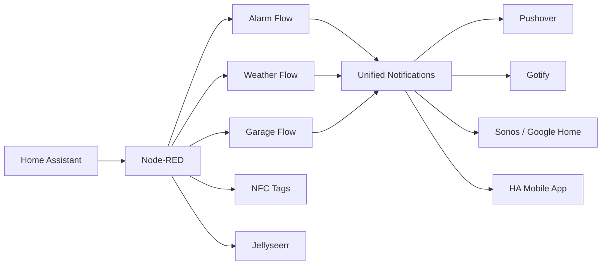
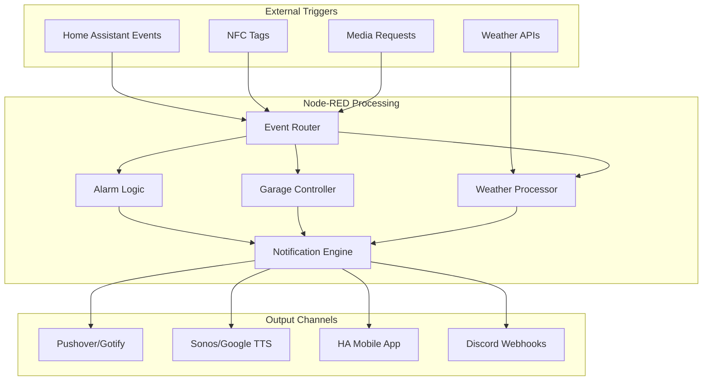

# Node-RED Home Automation: The Ultimate Smart Home Brain

[](LICENSE)


Welcome to Quentin's Node-RED automation suite—a comprehensive, modular, and highly customized smart home system. This repository powers advanced alarm logic, garage automation, weather alerting, lighting, and rich notifications. It's built for flexibility, reliability, and deep Home Assistant integration.

<div align="center">



</div>

---

## Table of Contents

* [Features](#features)
* [What's Inside](#whats-inside)
* [Directory Structure](#directory-structure)
* [Requirements](#requirements)
* [Installation](#installation)
* [Configuration](#configuration)
* [Examples](#examples)
* [Troubleshooting](#troubleshooting)
* [Architecture](#architecture)
* [Roadmap](#roadmap)
* [Contributing](#contributing)
* [License](#license)
* [Author](#author)

---

## Features

* **🚨 Alarm System:** Robust state machine, duress code support, lock-based disarming, instant push/TTS, failure handling
* **🚗 Garage Automation:** Auto-close timers, motion-activated lighting, safety checks, detailed docs
* **🌩️ Weather Alerts:** Priority scoring, TTL-based deduplication, time-aware delivery, rich formatting
* **📱 Unified Notifications:** Pushover, Gotify, HA Mobile App with HTML formatting; TTS for Sonos/Google Home
* **⚙️ Config & Utilities:** Centralized global config, migration helpers, per-flow documentation

---

## What's Inside?

* **Alarm System:**  
  Stateful logic with Home Assistant integration, duress handling, lock disarm triggers, and multi-channel notifications (push + TTS).

* **Garage Automation:**  
  Smart timers for auto-closing, motion-activated lighting with SunCalc integration, and comprehensive safety checks with per-path documentation.

* **Weather Alerts:**  
  Severity + certainty scoring, TTL-based duplicate filtering, county-aware highlighting, scheduled quiet hours, and rich notification formatting.

* **NFC Tag Processing:**  
  Tag-based alarm control, notification routing, and context-aware actions.

* **Request Management:**  
  Jellyseerr webhook processing with TTS notifications and authentication gating.

* **General Notifications:**  
  Unified push and TTS system for all critical events using Home Assistant events as the backbone.

---

## Directory Structure

```
.
├─ alarm_flow/              # Alarm logic, duress handling, lock disarm, notifications
│  ├─ alarm_event_group/    # Failure event processing and mobile notifications  
│  ├─ alarm_state_group/    # Core alarm state management and routing
│  ├─ locks_to_alarm_group/ # Lock-based disarming and retry logic
│  └─ automatic_night_arming/ # Scheduled arming automation
├─ north_garage_flow/       # Garage door + lighting automations with SunCalc
├─ weather_flow/            # Weather alert processing, priority scoring, notifications
├─ nfc_tags_flow/           # NFC tag processing and routing  
├─ requests_flow/           # Jellyseerr webhook handling and TTS notifications
├─ update_flow/             # DDNS updates and global config management
├─ config/                  # Global settings, context, and credentials
│  ├─ node-red_global.json  # Main global context configuration
│  ├─ duress_discord_id.json # Emergency Discord channel mappings
│  └─ duress_sms_numbers.json # Emergency SMS contact list
├─ docs/                    # Comprehensive documentation
│  ├─ modules/              # Library usage guides (date-fns, SunCalc)
│  └─ notifications/        # Payload templates and API references
└─ sync_global_json.py      # Utility for syncing Node-RED global config
```

---

## Requirements

### Core Platform

* **Node-RED** 3.x+ (latest recommended)
* **Home Assistant** 2024.x+ (WebSocket/Event integration required)

### Required Node-RED Palettes

Install these via **Manage Palette → Install**:

* `node-red-contrib-home-assistant-websocket` - HA integration
* `node-red-contrib-sun-position` - Sun calculations (alternative to SunCalc)

### Required Node.js Modules

Add these in Function node **Setup** tabs (requires `functionExternalModules: true` in settings.js):

* `date-fns` (v3.6.0+) - Modern date formatting
* `date-fns-tz` (v2.0.0+) - Timezone support
* `suncalc` (v1.9.0+) - Sun position calculations
* `axios` (optional) - HTTP requests for Pushover API

### Optional Services

* **Pushover** - Rich push notifications with priorities
* **Gotify** - Self-hosted push notifications  
* **Sonos** - Multi-room TTS announcements
* **Google Home/Nest** - Voice announcements

---

## Installation

1. **Clone this repository:**

   ```bash
   git clone https://github.com/H2OKing89/node-red_home_automation.git
   cd node-red_home_automation
   ```

2. **Install required palettes** in Node-RED:
   * Go to **Menu → Manage Palette → Install**
   * Install `node-red-contrib-home-assistant-websocket`
   * Install `node-red-contrib-sun-position` (if not using SunCalc)

3. **Enable external modules** in Node-RED `settings.js`:

   ```javascript
   functionExternalModules: true,
   ```

4. **Import flows:**
   * Copy JSON from each flow directory
   * **Import → Clipboard** in Node-RED
   * Deploy after configuration

5. **Configure credentials** (see Configuration section)

---

## Configuration

### Global Context Setup

This project relies on Node-RED global context for centralized configuration. Key areas:

<details>
<summary><strong>Example: Global Context Structure</strong></summary>

```javascript
// Node-RED Global Context (accessible via global.get/set)
{
  // Pushover Configuration
  "pushoverTokens": {
    "alarmToken": "your_alarm_app_token_here",
    "weatherToken": "your_weather_app_token_here"
  },
  "pushoverUserKeys": {
    "quentinUserKey": "your_user_key_here"
  },
  
  // Speaker Configuration  
  "speakers": {
    "sonos": [
      "media_player.sonos_1", 
      "media_player.bedroom_sonos_amp",
      "media_player.era_100"
    ],
    "google": ["media_player.house_google_speakers"]
  },
  
  // Weather Settings
  "weatherConfig": {
    "preferredCounties": ["Lancaster", "Douglas"],
    "quietHours": {"start": "22:00", "end": "07:00"},
    "alertTTL": 3600000,
    "maxStoredAlerts": 50
  },
  
  // Alarm Configuration
  "alarmConfig": {
    "duressCode": "****",
    "lockEntities": ["lock.front_door", "lock.back_door"],
    "knownUsers": {
      "Quentin King": "person.quentin",
      "Family Member": "person.family"
    }
  }
}
```

</details>

### Secrets Management

**DO NOT commit credentials!** Use one of these approaches:

1. **Node-RED Credentials Store** (recommended):

   ```javascript
   // In function nodes:
   const token = node.credentials.pushoverToken;
   ```

2. **Environment Variables:**

   ```javascript
   // In function nodes:
   const token = env.get('PUSHOVER_TOKEN');
   ```

3. **External JSON** (not tracked in git):

   ```javascript
   // Load from external file
   const secrets = global.get('secrets') || {};
   ```

### Home Assistant Setup

1. **Create Long-Lived Access Token** in HA Profile
2. **Configure HA WebSocket nodes** with your HA URL and token
3. **Update entity IDs** in flows to match your devices
4. **Test connection** and deploy

---

## Examples

<details>
<summary><strong>Sample: Weather Alert Payload</strong></summary>

```json
{
  "Alerts": [
    {
      "ID": "NWS-IDP-PROD-4963767-4421687-001",
      "Event": "Severe Thunderstorm Warning", 
      "Severity": "Severe",
      "Certainty": "Likely",
      "Areas": ["Lancaster", "Douglas"],
      "Effective": "2025-07-30T20:15:00Z",
      "Expires": "2025-07-30T21:00:00Z", 
      "Headline": "60 mph winds and quarter-sized hail",
      "Description": "Doppler radar indicated severe thunderstorm..."
    }
  ]
}
```

</details>

<details>
<summary><strong>Sample: Alarm State Payload</strong></summary>

```json
{
  "topic": "alarm_control_panel.house_alarm",
  "payload": {
    "state": "armed_away",
    "attributes": {
      "friendly_name": "House Alarm",
      "code_arm_required": false
    }
  }
}
```

</details>

<details>
<summary><strong>Sample: Pushover Notification</strong></summary>

```javascript
// Rich HTML notification for Android
const pushoverPayload = {
  token: "your_app_token",
  user: "your_user_key", 
  title: "🚨 Alarm Triggered",
  message: "<b>Motion detected</b> in <font color='#1565c0'>Living Room</font><br><small>July 30th, 2025 8:45 PM CDT</small>",
  html: 1,
  priority: 1,
  sound: "siren"
};
```

</details>

---

## Troubleshooting

### Common Issues

* **❌ No TTS announcements?**  
  Check speaker entity IDs, ensure devices aren't in DND mode, verify Home Assistant media_player integration

* **❌ Weather alerts not arriving?**  
  Verify county filters in `weatherConfig.preferredCounties`, check TTL deduplication settings

* **❌ Date/time formatting errors?**  
  Ensure `date-fns` and `date-fns-tz` are added in Function node Setup tabs, verify timezone settings

* **❌ Home Assistant connection failed?**  
  Re-authenticate WebSocket nodes, check long-lived token validity, verify HA URL accessibility

* **❌ Global context not loading?**  
  Check Node-RED context storage settings, ensure global.json file permissions, verify context isn't reset on deploy

* **❌ SunCalc errors in garage automation?**  
  Add `suncalc` module in Function node Setup, verify latitude/longitude coordinates

### Debug Tips

1. **Enable debug output** in Function nodes using `node.warn()`
2. **Check Node-RED logs** for startup errors and module loading issues  
3. **Test individual flows** using Inject nodes with sample payloads
4. **Verify Home Assistant events** in HA Developer Tools → Events
5. **Monitor global context** via Debug nodes: `msg.payload = global.get()`

---

## Architecture

The system follows a **hub-and-spoke** model with Node-RED as the central automation engine:



**Key Design Principles:**

* **Event-driven architecture** - All triggers flow through HA events
* **Modular flows** - Each automation is self-contained with clear interfaces
* **Centralized config** - Global context provides single source of truth
* **Redundant notifications** - Critical alerts use multiple channels
* **Graceful degradation** - Failures in one channel don't stop others

---

## Roadmap

* [ ] **Enhanced User Presence** - Per-user quiet hours and notification escalation
* [ ] **Adaptive Alert Scoring** - Machine learning based on false-positive history  
* [ ] **Rich Media Notifications** - HTML templates with icons and images for Gotify/Pushover
* [ ] **Auto-Discovery** - Automatic detection of HA entities and device capabilities
* [ ] **Metrics Dashboard** - Grafana/Prometheus integration for event analytics
* [ ] **Voice Control** - Integration with Assist/Rhasspy for voice commands
* [ ] **Mobile Companion App** - React Native app for advanced controls

---

## Contributing

PRs and issues welcome! Please:

* **Keep flows modular** with clear input/output contracts
* **Include/update documentation** for any new nodes or global config changes
* **Add example payloads** for new flows and test cases
* **Follow existing patterns** for error handling and logging
* **Update CHANGELOG.md** with your changes

### Development Setup

1. Fork this repository
2. Create feature branch: `git checkout -b feature/amazing-feature`
3. Test thoroughly with sample payloads
4. Update relevant documentation
5. Submit pull request with detailed description

---

## License

MIT License - see [LICENSE](LICENSE) for details.

---

## Author

### Quentin King

*If it beeps, blinks, or blows up your phone at 2AM, it probably came from here.*
*Open an issue or PR—let's automate everything!*
