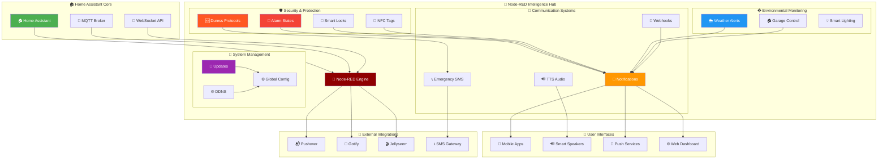

<!-- markdownlint-disable MD033 MD041 MD036 MD022 MD032 MD013 MD031 -->

<div align="center">

# 🏠 Node-RED Home Automation System

### **🚀 The Ultimate Smart Home Intelligence Platform**


<br>


<br>

**� Enterprise-grade security system • 🌦️ Intelligent weather monitoring • 🔔 Multi-platform notifications • 🏠 Complete home automation**

</div>

---

## 🎯 **Quick Navigation**

<div align="center">

<table>
<tr>
<td align="center" width="16.66%">

**🛡️ [Security](./alarm_flow/README.md)**<br>
*Advanced alarm system*<br>
*Emergency protocols*<br>
*Duress protection*

</td>
<td align="center" width="16.66%">

**🌦️ [Weather](./weather_flow/README.md)**<br>
*Alert monitoring*<br>
*Priority notifications*<br>
*TTS announcements*

</td>
<td align="center" width="16.66%">

**🏠 [Garage](./north_garage_flow/README.md)**<br>
*Automated control*<br>
*Status monitoring*<br>
*Smart lighting*

</td>
<td align="center" width="16.66%">

**📱 [Requests](./requests_flow/README.md)**<br>
*Jellyseerr integration*<br>
*Media notifications*<br>
*Webhook handling*

</td>
<td align="center" width="16.66%">

**🔄 [Updates](./update_flow/)**<br>
*DDNS management*<br>
*Global settings*<br>
*System maintenance*

</td>
<td align="center" width="16.66%">

**📖 [Docs](./docs/)**<br>
*Technical guides*<br>
*API references*<br>
*Configuration*

</td>
</tr>
</table>

</div>

---

## 🌟 System Architecture

<div align="center">



</div>

---

## 🏆 **Core Features & Capabilities**

<table>
<tr>
<td width="50%" align="center">

### 🛡️ **Advanced Security System**


✅ **Multi-State Alarm Management**
- Pending, Armed, Triggered, Disabled states
- Intelligent state transitions
- Automated recovery protocols

✅ **Emergency Response Protocols**
- Duress code detection & silent alarms
- Emergency SMS notifications
- Covert security signaling

✅ **Smart Lock Integration**
- Code-based alarm disarming
- Lock status monitoring
- Automated security responses

✅ **Advanced Notifications**
- Multi-platform push alerts
- TTS audio announcements
- Location-aware messaging

</td>
<td width="50%" align="center">

### 🌦️ **Intelligent Environmental Control**


✅ **Weather Alert System**
- Priority-based alert processing
- Severe weather notifications
- Automated TTS announcements

✅ **Garage Automation**
- Automated door control
- Left-open notifications
- Interior lighting management

✅ **NFC Tag Processing**
- Tag-based automation triggers
- Instant notifications
- Smart routing logic

✅ **Media Integration**
- Jellyseerr webhook handling
- Request notifications
- Media server alerts

</td>
</tr>
</table>

---

## 📁 **System Components Overview**

<div align="center">

<table border="1" style="border-collapse: collapse; margin: 20px auto;">
<tr style="background-color: #f0f0f0;">
<th width="20%">🏷️ Component</th>
<th width="30%">🎯 Primary Function</th>
<th width="25%">📊 Key Features</th>
<th width="25%">🔗 Documentation</th>
</tr>
<tr>
<td align="center">
<b>🚨 alarm_flow</b><br>
<small>Security System</small>
</td>
<td>Complete alarm state management with emergency protocols</td>
<td>• Multi-state handling<br>• Duress protection<br>• Smart lock integration<br>• Emergency notifications</td>
<td align="center"><a href="./alarm_flow/README.md">📚 Full Docs</a><br><a href="./alarm_flow/alarm_state_group/README.md">🛡️ State Mgmt</a></td>
</tr>
<tr style="background-color: #f0f8ff;">
<td align="center">
<b>🌦️ weather_flow</b><br>
<small>Weather Monitoring</small>
</td>
<td>Intelligent weather alert processing and notifications</td>
<td>• Priority alerts<br>• TTS announcements<br>• Time-based conditions<br>• Multi-channel notifications</td>
<td align="center"><a href="./weather_flow/README.md">📚 Weather Docs</a></td>
</tr>
<tr style="background-color: #fff8f0;">
<td align="center">
<b>🏠 north_garage_flow</b><br>
<small>Garage Automation</small>
</td>
<td>Automated garage control and monitoring system</td>
<td>• Cover state handling<br>• Left-open alerts<br>• Interior lighting<br>• Status monitoring</td>
<td align="center"><a href="./north_garage_flow/README.md">📚 Garage Docs</a></td>
</tr>
<tr style="background-color: #f8fff0;">
<td align="center">
<b>🎬 requests_flow</b><br>
<small>Media Integration</small>
</td>
<td>Jellyseerr webhook processing and media notifications</td>
<td>• Webhook handling<br>• Request processing<br>• TTS notifications<br>• Authentication gating</td>
<td align="center"><a href="./requests_flow/README.md">📚 Requests Docs</a></td>
</tr>
<tr style="background-color: #fff0f8;">
<td align="center">
<b>📱 nfc_tags_flow</b><br>
<small>NFC Processing</small>
</td>
<td>NFC tag automation and notification routing</td>
<td>• Tag identification<br>• Action routing<br>• Instant notifications<br>• Cover processing</td>
<td align="center">📱 NFC System</td>
</tr>
<tr style="background-color: #f0fff8;">
<td align="center">
<b>🔄 update_flow</b><br>
<small>System Management</small>
</td>
<td>Dynamic DNS updates and global configuration</td>
<td>• DDNS management<br>• Global settings<br>• Authentication gating<br>• System maintenance</td>
<td align="center">🔄 Update System</td>
</tr>
</table>

</div>

---

## 🔄 **System Integration Flow**

<div align="center">

### **📊 Data Flow Architecture**

```
┌─────────────────────────────────────────────────────────────┐
│                    🏠 HOME ASSISTANT                        │
│           ┌─────────────┬─────────────┬─────────────┐       │
│           │  Sensors    │   States    │  Services   │       │
│           │     📊      │      📈     │      ⚙️     │       │
└───────────┼─────────────┼─────────────┼─────────────┼───────┘
            │             │             │             │
            ▼             ▼             ▼             ▼
┌───────────────────────────────────────────────────────────────┐
│                   🧠 NODE-RED INTELLIGENCE                    │
│  ┌─────────────┐ ┌─────────────┐ ┌─────────────┐ ┌─────────┐  │
│  │🛡️ Security │ │🌦️ Weather  │ │🏠 Automation│ │📱 Notify│  │
│  │   System    │ │  Monitoring │ │   Control   │ │ System  │  │
│  └─────────────┘ └─────────────┘ └─────────────┘ └─────────┘  │
└───────────┬─────────────┬─────────────┬─────────────┬─────────┘
            │             │             │             │
            ▼             ▼             ▼             ▼
┌─────────────┐ ┌─────────────┐ ┌─────────────┐ ┌─────────────┐
│📱 Mobile    │ │🔊 Audio     │ │📞 Emergency │ │🌐 External  │
│   Apps      │ │   System    │ │    SMS      │ │  Services   │
└─────────────┘ └─────────────┘ └─────────────┘ └─────────────┘
```

</div>

---

## 🚀 **Quick Start Guide**

### 1️⃣ **Prerequisites & Setup**

<details>
<summary><b>🔧 System Requirements (Click to expand)</b></summary>

```bash
# Core Platform Requirements
✅ Home Assistant 2023.1+
✅ Node-RED 3.0+
✅ MQTT Broker (Mosquitto recommended)
✅ JavaScript ES6+ support

# External Service Integrations
✅ Pushover account (notifications)
✅ SMS gateway service (emergency alerts)
✅ TTS service (Sonos/Google/etc.)
✅ DDNS service (dynamic DNS)

# Optional Media Integration
✅ Jellyseerr (media requests)
✅ Gotify (self-hosted notifications)
```

</details>

### 2️⃣ **Installation Process**

```javascript
// 1. Import Node-RED flows
Import each flow directory into Node-RED:
- alarm_flow/        (Security system)
- weather_flow/      (Weather monitoring)
- north_garage_flow/ (Garage automation)
- requests_flow/     (Media integration)
- nfc_tags_flow/     (NFC processing)
- update_flow/       (System management)

// 2. Configure environment variables
Copy .env templates and configure:
- Notification device mappings
- Emergency contact information
- Service API keys and tokens
- Custom message templates

// 3. Set up Home Assistant integration
Enable Node-RED integration in Home Assistant
Configure MQTT broker connection
Set up service calls and entity monitoring
```

### 3️⃣ **Configuration & Testing**

<details>
<summary><b>🧪 System Testing Checklist (Click to expand)</b></summary>

```bash
# Security System Testing
✅ Test all alarm state transitions
✅ Verify notification delivery (safely test duress codes)
✅ Check smart lock integration
✅ Validate emergency SMS system

# Environmental Monitoring
✅ Test weather alert processing
✅ Verify garage automation responses
✅ Check NFC tag recognition
✅ Validate TTS announcements

# Communication Systems
✅ Test push notification delivery
✅ Verify multi-platform messaging
✅ Check emergency contact system
✅ Validate external service integration

# Media & Updates
✅ Test Jellyseerr webhook processing
✅ Verify DDNS update functionality
✅ Check global configuration updates
✅ Validate authentication gating
```

</details>

---

## 🔐 **Security & Privacy Features**

<div align="center">

<table border="1" style="border-collapse: collapse; margin: 20px auto;">
<tr style="background-color: #f0f0f0;">
<th width="25%">🛡️ Security Layer</th>
<th width="35%">🔒 Implementation</th>
<th width="40%">✅ Protection Features</th>
</tr>
<tr>
<td align="center"><b>🔐 Authentication</b></td>
<td>Multi-factor verification with duress detection</td>
<td>• Code validation systems<br>• Duress code detection<br>• Silent alarm protocols<br>• Access logging & monitoring</td>
</tr>
<tr>
<td align="center"><b>📡 Communication</b></td>
<td>Encrypted channels and secure APIs</td>
<td>• TLS/SSL encryption<br>• Token-based authentication<br>• Secure webhook handling<br>• API key management</td>
</tr>
<tr>
<td align="center"><b>🚨 Emergency Response</b></td>
<td>Multi-channel emergency protocols</td>
<td>• Silent alarm activation<br>• Emergency SMS dispatch<br>• Covert signaling methods<br>• Fail-safe operations</td>
</tr>
<tr>
<td align="center"><b>📊 Monitoring & Audit</b></td>
<td>Comprehensive logging and tracking</td>
<td>• Event logging system<br>• Security audit trails<br>• Performance monitoring<br>• Failure detection & recovery</td>
</tr>
</table>

</div>

---

## 📊 **Performance Metrics & Monitoring**

### 🎯 **System Performance Standards**

<table>
<tr>
<td width="25%" align="center">

**⚡ Response Times**
- Alarm triggers: < 2 seconds
- Notifications: < 5 seconds
- State changes: < 1 second
- Emergency alerts: < 3 seconds

</td>
<td width="25%" align="center">

**📈 Reliability Metrics**
- System uptime: > 99.5%
- Notification delivery: > 99%
- State accuracy: > 99.9%
- Recovery time: < 30 seconds

</td>
<td width="25%" align="center">

**🔒 Security Monitoring**
- Failed auth attempts logged
- Emergency activations tracked
- System access audited
- Configuration changes logged

</td>
<td width="25%" align="center">

**📱 Communication Health**
- Multi-platform delivery
- Fallback mechanisms
- Service status monitoring
- Error rate tracking

</td>
</tr>
</table>

---

## 🛠️ **Development & Customization**

### 🔧 **Architecture Principles**

<div align="center">

<table>
<tr>
<td width="33%" align="center">

**🧩 Modular Design**
- Independent flow components
- Reusable function nodes
- Standardized interfaces
- Easy integration points

</td>
<td width="33%" align="center">

**🔄 Event-Driven**
- Reactive state management
- Asynchronous processing
- Event correlation
- Real-time responses

</td>
<td width="33%" align="center">

**🛡️ Fail-Safe Operation**
- Graceful degradation
- Error recovery mechanisms
- Redundant communication paths
- System health monitoring

</td>
</tr>
</table>

</div>

### 📝 **Development Guidelines**

<details>
<summary><b>🏗️ Coding Standards & Best Practices (Click to expand)</b></summary>

```javascript
// Function Node Structure
/**
 * @fileoverview Brief description of the function's purpose
 * @author System Administrator
 * @version 1.0.0
 */

// Standard error handling pattern
try {
    // Main logic here
    node.log(`Operation successful: ${operationType}`);
} catch (error) {
    node.error(`Operation failed: ${error.message}`, msg);
    return null;
}

// Consistent logging levels
node.log("Info: Normal operation details");
node.warn("Warning: Non-critical issues");
node.error("Error: Critical failures requiring attention");
node.debug("Debug: Detailed diagnostic information");

// Environment variable usage
const config = global.get("homeautomation") || {};
const deviceMap = config.NOTIFY_MAP_ANDROID || {};
```

</details>

---

## 📚 **Documentation & Resources**

<div align="center">

<table>
<tr>
<td align="center" width="20%">

**🛡️ [Security System](./alarm_flow/README.md)**<br>
*Complete alarm management*<br>
*Emergency protocols*<br>
*Multi-state handling*

</td>
<td align="center" width="20%">

**🌦️ [Weather Monitoring](./weather_flow/README.md)**<br>
*Alert processing*<br>
*Priority notifications*<br>
*TTS integration*

</td>
<td align="center" width="20%">

**🏠 [Garage Control](./north_garage_flow/README.md)**<br>
*Automated management*<br>
*Status monitoring*<br>
*Smart lighting*

</td>
<td align="center" width="20%">

**🎬 [Media Integration](./requests_flow/README.md)**<br>
*Jellyseerr webhooks*<br>
*Request processing*<br>
*Notification handling*

</td>
<td align="center" width="20%">

**📖 [Technical Docs](./docs/)**<br>
*API references*<br>
*Configuration guides*<br>
*Module documentation*

</td>
</tr>
</table>

</div>

### 🔗 **External Resources**

- **[Node-RED Documentation](https://nodered.org/docs/)** - Official Node-RED guides
- **[Home Assistant Integration](https://www.home-assistant.io/integrations/nodered/)** - HA + Node-RED setup
- **[Pushover API](https://pushover.net/api)** - Push notification service
- **[Jellyseerr Webhooks](https://docs.jellyseerr.dev/using-jellyseerr/webhooks)** - Media request integration

---

## 🤝 **Contributing & Support**

### 📋 **How to Contribute**

1. **🔍 Review Documentation** - Understand system architecture
2. **🧪 Test Changes** - Validate in safe environment
3. **📝 Document Updates** - Maintain comprehensive docs
4. **🔒 Security First** - Prioritize security in all changes

### 🆘 **Getting Help**

- **📖 Check Documentation** - Most questions answered in docs
- **🔍 Review Logs** - Node-RED debug panel shows detailed info
- **🧪 Test Environment** - Use safe testing protocols
- **🔒 Security Issues** - Report security concerns immediately

---

<div align="center">

## 🚨 **Important Security Notice**

<table border="0">
<tr>
<td align="center">

**🆘 Emergency Testing**<br>
Always test duress codes and emergency protocols in a safe, controlled environment

</td>
<td align="center">

**🔐 Credential Security**<br>
Secure all API keys, tokens, and emergency contact information

</td>
<td align="center">

**📱 Regular Validation**<br>
Test notification delivery and system responses monthly

</td>
</tr>
</table>

---


**🏠 Complete home intelligence platform • 🛡️ Enterprise-grade security • 🌦️ Environmental monitoring • 🔔 Multi-platform notifications**

*Protecting and automating your home with intelligent, reliable, and secure systems*

</div>
