# ⏰ Alarm Clock TTS Scheduler + Light Control

<div align="center">
  
  
  
  
  
  <br>
  
  
  
  
</div>

<div align="center">
  <h3>🗣️ Intelligent Wake-Up System with TTS Announcements & Automated Lighting</h3>
  <p><em>A sophisticated Node-RED flow that transforms cron schedules into personalized wake-up experiences via Sonos speakers and smart lighting</em></p>
</div>

## 📋 **Table of Contents**

- [🚀 Quick Start](#-quick-start)
- [🎯 Overview](#-overview)
- [🏗️ Implementation Details](#️-implementation-details)
- [📦 Node Configuration](#-node-configuration)
- [⚙️ Environment Configuration](#️-environment-configuration)
- [🛠️ Installation & Setup](#️-installation--setup)
- [🎮 Usage Examples](#-usage-examples)
- [🚨 Troubleshooting](#-troubleshooting)
- [📈 Monitoring & Analytics](#-monitoring--analytics)
- [🔧 Advanced Features](#-advanced-features)

---

## 🚀 **Quick Start**

> [!TIP]
> **Get running in 5 minutes!**

1. **Install Required Nodes**
   - `node-red-contrib-cronplus`
   - `node-red-contrib-home-assistant-websocket`
   - `date-fns-tz` (optional but recommended)

2. **Set Environment Variable**
   ```json
   {
     "alarm_clock": {
       "sonos": {
         "entity_id": "media_player.your_sonos_amp",
         "volume": 85
       },
       "light": {
         "entity_id": "light.your_bedroom_light",
         "brightness_pct": 100,
         "transition": 300
       },
       "timezone": "America/Chicago"
     }
   }
   ```

3. **Import Flow → Configure Function Node with 2 outputs → Deploy**

4. **Test with inject payload:**
   ```json
   {
     "topic": "07:00",
     "payload": {
       "triggerTimestamp": 1735200000000,
       "status": {"count": 1, "description": "Test alarm"}
     }
   }
   ```

---

## 🎯 **Overview**

This advanced alarm clock system intelligently processes scheduled cron jobs and converts them into natural, timezone-aware TTS announcements through your Sonos sound system, while simultaneously controlling smart lighting for a complete wake-up experience. Perfect for creating gentle, personalized morning routines that announce the current time with variety and gradually illuminate your space.

**Key Benefits:**

- 🌅 **Smart Wake-Up**: Multiple TTS message variations prevent monotony
- 💡 **Automated Lighting**: Synchronized light control with configurable brightness and transitions
- 🌍 **Timezone Aware**: Accurate time formatting for any location
- 🔊 **Sonos Integration**: High-quality audio announcements
- ⚙️ **Environment Driven**: Fully configurable via environment variables
- 🏗️ **Professional Node-RED**: Follows Node-RED best practices and standards
- 🛡️ **Error Resilience**: Advanced error handling with catch node integration and graceful fallbacks
- 📊 **Status Monitoring**: Comprehensive node status indicators with color-coded feedback
- 🧹 **Resource Management**: Proper cleanup and lifecycle management for reliable operation
- 🔍 **Advanced Debugging**: Structured logging system with detailed debug capabilities
- 📈 **Analytics Ready**: Built-in alarm history tracking and performance monitoring

```mermaid
flowchart TD
    A[🕕 Cron Scheduler] --> B[⚙️ TTS + Light Processor]
    B --> C[🔊 Sonos Speaker]
    B --> D[💡 Smart Lights]
    B --> E[📊 Debug Output]
    F[🌍 Environment Config] --> B
    G[📝 Alarm History] --> B
```



> [!IMPORTANT]
> **Prerequisites**: Requires Home Assistant with TTS service configured and Sonos integration active.

---

## 🏗️ **Implementation Details**

> [!INFO]
> **Built Following Node-RED Best Practices**  
> This function implements professional Node-RED standards from [function.node.md](../docs/function.node.md)

### **🔧 Advanced Node-RED Features**

| **Feature** | **Implementation** | **Benefit** |
|-------------|-------------------|-------------|
| 🔍 **Professional Logging** | Structured logger with `[Wake Alarm]` prefix | Consistent, searchable logs with debug data |
| 📊 **Node Status Management** | Color-coded status indicators throughout processing | Visual feedback in Node-RED editor |
| 🛡️ **Error Handling** | Critical errors trigger catch nodes via `node.error(msg)` | Proper error flow integration |
| 🧹 **Lifecycle Management** | `node.on('close')` cleanup handler | Resource management and memory leak prevention |
| 🎯 **Status Conventions** | Standard Node-RED colors and shapes | Professional UX following Node-RED guidelines |
| 🔍 **Debug Capabilities** | Rich debug information with structured data | Enhanced troubleshooting and development |

### **📋 Node Status Indicators**

| Indicator | Meaning | Description |
|-----------|---------|-------------|
| ⚪ **Grey Ring** | Ready State | Waiting for alarm messages |
| 🔵 **Blue Dot** | Processing | Actively processing alarm |
| 🟢 **Green Dot** | Success | Alarm processed successfully |
| 🟡 **Yellow Dot** | Warning | Using default configuration |
| 🔴 **Red Ring** | Error | Processing or configuration error (see logs) |

### **📝 Professional Logging Examples**

```javascript
// Structured logging with debug data
logger.debug('Environment configuration loaded', {
    alarm_config_structure: Object.keys(alarmConfig),
    sonos_configured: !!alarmConfig.sonos?.entity_id,
    light_configured: !!alarmConfig.light?.entity_id,
    timezone: TIME_ZONE,
    dateFns_available: !!formatInTimeZone
});

// Error handling with stack traces
logger.error('Error processing alarm time', error, msg);

// Information logging with context
logger.info(`Alarm triggered: ${timeData.formattedTimes.display}`);
```

---

## 🏗️ **Architecture**

<div align="center">

### **Flow Diagram**

```html
<div style="background: linear-gradient(135deg, #667eea 0%, #764ba2 100%); padding: 20px; border-radius: 15px; color: white; margin: 20px 0;">
  <h4 style="margin: 0; text-align: center;">🔄 Data Flow Pipeline</h4>
</div>
```

</div>

| **Component** | **Function** | **Input** | **Output** |
|---------------|--------------|-----------|------------|
| 🗓️ **Cronplus Node** | Schedule Management | Cron Expressions | Trigger Messages |
| ⚙️ **Function Node** | TTS + Light Processing | Timestamp Data | HA Service Calls |
| 🔊 **API Call Service** | Home Assistant TTS | Media Commands | Sonos Playback |
| 💡 **API Call Service** | Home Assistant Light | Light Commands | Smart Light Control |
| 🐛 **Debug Node** | Monitoring | Flow Data | Console Logs |

---

## 📦 **Node Configuration**

### **1. Cronplus Scheduler**

<details>
<summary><strong>📅 Click to expand cron schedule configuration</strong></summary>

```html
<table style="width: 100%; border-collapse: collapse; margin: 15px 0;">
  <thead style="background-color: #f8f9fa;">
    <tr>
      <th style="padding: 12px; border: 1px solid #dee2e6;">Schedule Name</th>
      <th style="padding: 12px; border: 1px solid #dee2e6;">Topic</th>
      <th style="padding: 12px; border: 1px solid #dee2e6;">Cron Expression</th>
      <th style="padding: 12px; border: 1px solid #dee2e6;">Description</th>
    </tr>
  </thead>
  <tbody>
    <tr>
      <td style="padding: 10px; border: 1px solid #dee2e6;">schedule1</td>
      <td style="padding: 10px; border: 1px solid #dee2e6; font-family: monospace;">06:30</td>
      <td style="padding: 10px; border: 1px solid #dee2e6; font-family: monospace;">30 6 * * *</td>
      <td style="padding: 10px; border: 1px solid #dee2e6;">Early morning alarm</td>
    </tr>
    <tr style="background-color: #f8f9fa;">
      <td style="padding: 10px; border: 1px solid #dee2e6;">schedule2</td>
      <td style="padding: 10px; border: 1px solid #dee2e6; font-family: monospace;">07:00</td>
      <td style="padding: 10px; border: 1px solid #dee2e6; font-family: monospace;">00 7 * * *</td>
      <td style="padding: 10px; border: 1px solid #dee2e6;">Standard wake-up time</td>
    </tr>
    <tr>
      <td style="padding: 10px; border: 1px solid #dee2e6;">schedule3</td>
      <td style="padding: 10px; border: 1px solid #dee2e6; font-family: monospace;">07:05</td>
      <td style="padding: 10px; border: 1px solid #dee2e6; font-family: monospace;">05 7 * * *</td>
      <td style="padding: 10px; border: 1px solid #dee2e6;">First snooze reminder</td>
    </tr>
    <tr style="background-color: #f8f9fa;">
      <td style="padding: 10px; border: 1px solid #dee2e6;">schedule4</td>
      <td style="padding: 10px; border: 1px solid #dee2e6; font-family: monospace;">07:10</td>
      <td style="padding: 10px; border: 1px solid #dee2e6; font-family: monospace;">10 7 * * *</td>
      <td style="padding: 10px; border: 1px solid #dee2e6;">Second snooze reminder</td>
    </tr>
    <tr>
      <td style="padding: 10px; border: 1px solid #dee2e6;">schedule5</td>
      <td style="padding: 10px; border: 1px solid #dee2e6; font-family: monospace;">07:15</td>
      <td style="padding: 10px; border: 1px solid #dee2e6; font-family: monospace;">15 7 * * *</td>
      <td style="padding: 10px; border: 1px solid #dee2e6;">Final wake-up call</td>
    </tr>
    <tr style="background-color: #f8f9fa;">
      <td style="padding: 10px; border: 1px solid #dee2e6;">schedule6</td>
      <td style="padding: 10px; border: 1px solid #dee2e6; font-family: monospace;">12:44</td>
      <td style="padding: 10px; border: 1px solid #dee2e6; font-family: monospace;">44 12 * * *</td>
      <td style="padding: 10px; border: 1px solid #dee2e6;">Afternoon test alarm</td>
    </tr>
  </tbody>
</table>
```

</details>

### **2. TTS Processing Function**

> [!TIP]
> **Intelligent TTS Processor**  
> Advanced JavaScript function with multiple TTS variations and timezone handling

**Key Features:**

- ✅ **Environment-driven configuration**
- ✅ **Multiple TTS message variations (5 different wake-up messages)**
- ✅ **Synchronized smart light control with configurable brightness and transitions**
- ✅ **Dual output system (TTS + Light control)**
- ✅ **Timezone-aware time formatting**
- ✅ **Professional Node-RED compliance with function.node.md standards**
- ✅ **Advanced error handling with catch node integration**
- ✅ **Comprehensive node status indicators and lifecycle management**
- ✅ **Structured logging system with debug capabilities**
- ✅ **Alarm history tracking and analytics**
- ✅ **Resource cleanup and memory management**

---

## ⚙️ **Environment Configuration**

> [!IMPORTANT]
> **Required Environment Variable**  
> Set the `ALARM_CLOCK` environment variable in your Node-RED flow

```json
{
  "alarm_clock": {
    "sonos": {
      "entity_id": "media_player.bedroom_sonos_amp",
      "volume": 100
    },
    "timezone": "America/Chicago",
    "tts_variations": 5
  }
}
```

### **📋 Configuration Parameters**

| Parameter | Description | Default Value | Required |
|-----------|-------------|---------------|----------|
| `sonos.entity_id` | Home Assistant Sonos entity ID | `media_player.bedroom_sonos_amp` | ✅ Yes |
| `sonos.volume` | Audio volume level (0-100) | `85` | ⭕ No |
| `timezone` | IANA timezone identifier | `America/Chicago` | ⭕ No |
| `tts_variations` | Number of TTS message variations | `5` | ⭕ No |

---

## 🗣️ **TTS Message Variations**

The system randomly selects from 5 different wake-up messages to keep the experience natural and engaging:

> [!NOTE]
> **Message Variation 1**  
> *"Good morning! The time is [TIME]. This is your scheduled wake up alarm."*

> [!NOTE]
> **Message Variation 2**  
> *"Wake up! It's [TIME]. Your alarm is now active."*

> [!NOTE]
> **Message Variation 3**  
> *"Good morning! Your [TIME] alarm is going off. Time to start your day."*

> [!NOTE]
> **Message Variation 4**  
> *"It's [TIME]. This is your wake up call. Good morning!"*

> [!NOTE]
> **Message Variation 5**  
> *"Good morning! The current time is [TIME]. Your alarm has been triggered."*

The `[TIME]` placeholder is automatically replaced with the formatted alarm time in your configured timezone.

---

## 📊 **Data Flow Structure**

### **📥 Input Message Format**

```javascript
{
  "topic": "07:00",
  "payload": {
    "triggerTimestamp": 1756227660000,
    "status": {
      "count": 1,
      "description": "At 07:00"
    }
  }
}
```

### **📤 Output Message Format**

<details>
<summary><strong>🎯 Click to expand complete output structure</strong></summary>

```javascript
{
  "payload": {
    "action": "media_player.play_media",
    "target": { 
      "entity_id": ["media_player.bedroom_sonos_amp"] 
    },
    "data": {
      "media_content_id": "media-source://tts/google_translate?message=...",
      "media_content_type": "music",
      "announce": true,
      "extra": { 
        "volume": 100 
      }
    }
  },
  "alarm_data": {
    "original_topic": "07:00",
    "trigger_timestamp": 1756227660000,
    "cron_description": "At 07:00",
    "alarm_count": 1,
    "scheduled_time": "07:00"
  },
  "tts_data": {
    "primary_message": "Good morning! The time is 7:00 AM...",
    "backup_message": "Good morning! It's 7:00 AM. Wake up!",
    "formatted_time": "7:00 AM",
    "message_variation": 1
  },
  "time_data": {
    "formatted_display": "August 26th, 2025 at 7:00 AM CDT",
    "formatted_iso": "2025-08-26T07:00:00-05:00",
    "timezone": "America/Chicago",
    "date_fns_available": true
  }
}
```

</details>

---

## 🛠️ **Installation & Setup**

### **📋 Prerequisites**

> [!WARNING]
> **Required Components**
>
> - ✅ Node-RED installation
> - ✅ Home Assistant with Sonos integration
> - ✅ `node-red-contrib-cronplus` node
> - ✅ `node-red-contrib-home-assistant-websocket` nodes
> - ✅ `date-fns-tz` library

### **🚀 Quick Setup Steps**

1. **Import the Flow**

   ```html
   <ol style="background-color: #e8f4fd; padding: 15px; border-radius: 8px; border-left: 4px solid #007bff;">
     <li>Copy the provided Node-RED flow JSON</li>
     <li>Import into your Node-RED instance</li>
     <li>Configure Home Assistant server connection</li>
     <li>Deploy the flow</li>
   </ol>
   ```

2. **Environment Configuration**
   - Set the `ALARM_CLOCK` environment variable in the flow
   - Update Sonos entity ID to match your setup
   - Adjust timezone and volume preferences

3. **Test & Validate**
   - Trigger a test alarm from the cronplus node
   - Verify TTS announcements on your Sonos speaker
   - Check debug output for proper message formatting

---

## 🎮 **Usage Examples**

### **📱 Manual Trigger**

> [!TIP]
> **Inject a test message to simulate cron trigger:**

```javascript
{
  "topic": "08:30",
  "payload": {
    "triggerTimestamp": Date.now(),
    "status": {
      "count": 1,
      "description": "Manual Test"
    }
  }
}
```

### **🔧 Customization Examples**

<details>
<summary><strong>🎨 Advanced Customization Options</strong></summary>

```html
<div style="background-color: #f8f9fa; padding: 20px; border-radius: 8px; border: 1px solid #dee2e6;">
  <h4>Custom TTS Messages</h4>
  <p>Modify the <code>createTTSMessages()</code> function to add your own wake-up phrases:</p>
  
  <pre style="background-color: #272822; color: #f8f8f2; padding: 15px; border-radius: 5px; overflow-x: auto;">
const customVariations = [
  `Rise and shine! It's ${time}. Coffee time!`,
  `Good morning sunshine! It's ${time}. Let's make today amazing!`,
  `Wakey wakey! It's ${time}. Time to conquer the day!`,
  // Add your own creative messages here
];
  </pre>
</div>
```

</details>

---

## 📈 **Monitoring & Analytics**

### **📊 Built-in Tracking Features**

| Feature | Description | Storage |
|---------|-------------|---------|
| 🕰️ **Alarm History** | Tracks last 10 alarm triggers with timestamps | `context.alarm_history` |
| 📊 **Alarm Counter** | Total count of triggered alarms | `context.alarm_counter` |
| 🎯 **Success Tracking** | Monitors successful vs failed alarm processing | `alarm_data.success` |
| 🗣️ **Message Variations** | Cycles through TTS variations for variety | `tts_data.message_variation` |

---

## 🚨 **Troubleshooting**

### **❗ Common Issues & Solutions**

> [!CAUTION]
> **🔴 No TTS Audio**
>
> - Verify Sonos entity ID is correct
> - Check Home Assistant TTS service
> - Confirm volume is not set to 0
> - Test manual TTS call in HA
> - Check node status indicators

> [!WARNING]
> **🟡 Wrong Time Zone**
>
> - Update `timezone` in environment config
> - Verify IANA timezone format
> - Check `date-fns-tz` library installation
> - Test with manual timestamp

> [!NOTE]
> **🔵 Environment Errors**
>
> - Check JSON syntax in `ALARM_CLOCK` variable
> - Ensure nested object structure is correct
> - Verify environment variable accessibility
> - Review Node-RED debug logs

> [!TIP]
> **🟢 Debug Tips**
>
> - Enable debug node to monitor data flow
> - Check Node-RED console for `[Wake Alarm]` logs
> - Monitor node status colors and messages
> - Use structured logging output for troubleshooting
> - Verify cron expressions are valid
> - Test with simplified TTS messages

---
</div>

</div>

### **🔍 Professional Debugging**

<div style="background-color: #f8f9fa; padding: 20px; border-radius: 8px; border: 1px solid #dee2e6; margin: 20px 0;">

**Leverage the enhanced logging system:**

```javascript
// Check Node-RED console for structured logs:
[Wake Alarm] Environment configuration loaded
[Wake Alarm] Alarm triggered: August 26th, 2025 at 7:00 AM CDT
[Wake Alarm] TTS Message: "Good morning! The time is 7:00 AM..."
[Wake Alarm] Payloads created successfully
```

**Monitor node status indicators:**

- 🔵 **Blue processing dot**: Function is actively processing alarm
- 🟢 **Green success dot**: Alarm processed and messages sent
- 🔴 **Red error ring**: Check logs for detailed error information
- 🟡 **Yellow warning**: Using default configuration values

**Debug environment configuration:**

```javascript
// Enable debug logging to see:
{
  "alarm_config_structure": ["sonos", "light", "timezone"],
  "sonos_configured": true,
  "light_configured": true,
  "timezone": "America/Chicago",
  "dateFns_available": true
}
```

</div>

---

## 🔧 **Advanced Features**

### **🎛️ Professional Customizations**

> [!TIP]
> **🚀 Extend Your Alarm System**  
> Take your alarm functionality to the next level with these enhancement ideas

**🌟 Enhancement Ideas:**

- 🌡️ **Weather Integration**: Include weather info in morning announcements
- 📅 **Calendar Events**: Announce today's schedule
- 🎵 **Music Integration**: Follow TTS with morning playlist
- 📱 **Mobile Notifications**: Send push notifications as backup
- 🏠 **Smart Home Integration**: Trigger lights, coffee maker, etc.
- 🗓️ **Weekend Detection**: Different messages for weekdays vs weekends

---

## 📄 **License & Credits**

> [!NOTE]
> **🏆 Project Information**

| **📝 License** | **👤 Author** | **🔄 Version** |
|----------------|---------------|----------------|
| MIT License | H2OKing89 | 2.0.0 - Professional Node-RED |

Built with ❤️ for the Node-RED and Home Assistant communities

---

<div align="center">

### 🌟 **Happy Wake-Ups!** 🌟

Transform your mornings with intelligent, personalized alarm announcements

[](https://nodered.org/)
[](https://www.home-assistant.io/)
[](https://www.sonos.com/)

</div>
