# ⏰ Alarm Clock TTS Scheduler + Light Control

<div align="center">
  
  
  
  
  
</div>

<div align="center">
  <h3>🗣️ Intelligent Wake-Up System with TTS Announcements & Automated Lighting</h3>
  <p><em>A sophisticated Node-RED flow that transforms cron schedules into personalized wake-up experiences via Sonos speakers and smart lighting</em></p>
</div>

---

## 🎯 **Overview**

<table>
<tr>
<td width="60%">

This advanced alarm clock system intelligently processes scheduled cron jobs and converts them into natural, timezone-aware TTS announcements through your Sonos sound system, while simultaneously controlling smart lighting for a complete wake-up experience. Perfect for creating gentle, personalized morning routines that announce the current time with variety and gradually illuminate your space.

**Key Benefits:**

- 🌅 **Smart Wake-Up**: Multiple TTS message variations prevent monotony
- 💡 **Automated Lighting**: Synchronized light control with configurable brightness and transitions
- 🌍 **Timezone Aware**: Accurate time formatting for any location
- 🔊 **Sonos Integration**: High-quality audio announcements
- ⚙️ **Environment Driven**: Fully configurable via environment variables
- 🏗️ **Professional Node-RED**: Follows function.node.md best practices and standards
- �️ **Error Resilience**: Advanced error handling with catch node integration and graceful fallbacks
- 📊 **Status Monitoring**: Comprehensive node status indicators with color-coded feedback
- 🧹 **Resource Management**: Proper cleanup and lifecycle management for reliable operation
- 🔍 **Advanced Debugging**: Structured logging system with detailed debug capabilities
- 📈 **Analytics Ready**: Built-in alarm history tracking and performance monitoring

```mermaid
flowchart TD
    A[🕕 Cron Scheduler] --> B[⚙️ TTS + Light Processor]
    B --> C[🔊 Sonos Speaker]
    B --> D[💡 Smart Lights]
    B --> E[📊 Debug Output]
    F[🌍 Environment Config] --> B
    G[📝 Alarm History] --> B
```

</td>
<td width="40%">



</td>
</tr>
</table>

---

## 🏗️ **Professional Node-RED Implementation**

<div style="background: linear-gradient(135deg, #667eea, #764ba2); padding: 20px; border-radius: 15px; color: white; margin: 20px 0;">
  <h3 style="margin: 0; text-align: center;">🎯 Built Following Node-RED Best Practices</h3>
  <p style="margin: 10px 0 0 0; text-align: center;">This function implements professional Node-RED standards from function.node.md</p>
</div>

### **🔧 Advanced Node-RED Features**

| **Feature** | **Implementation** | **Benefit** |
|-------------|-------------------|-------------|
| 🔍 **Professional Logging** | Structured logger with `[Wake Alarm]` prefix | Consistent, searchable logs with debug data |
| 📊 **Node Status Management** | Color-coded status indicators throughout processing | Visual feedback in Node-RED editor |
| 🛡️ **Error Handling** | Critical errors trigger catch nodes via `node.error(msg)` | Proper error flow integration |
| 🧹 **Lifecycle Management** | `node.on('close')` cleanup handler | Resource management and memory leak prevention |
| 🎯 **Status Conventions** | Standard Node-RED colors and shapes | Professional UX following Node-RED guidelines |
| 🔍 **Debug Capabilities** | Rich debug information with structured data | Enhanced troubleshooting and development |

### **📋 Node Status Indicators**

<div style="display: grid; grid-template-columns: repeat(auto-fit, minmax(250px, 1fr)); gap: 15px; margin: 20px 0;">

<div style="border: 2px solid #6c757d; border-radius: 8px; padding: 15px; background-color: #f8f9fa;">
  <h4 style="color: #6c757d; margin: 0 0 10px 0;">⚪ Grey Ring</h4>
  <p style="margin: 0; font-size: 14px;"><strong>Ready State:</strong> Waiting for alarm messages</p>
</div>

<div style="border: 2px solid #007bff; border-radius: 8px; padding: 15px; background-color: #e3f2fd;">
  <h4 style="color: #007bff; margin: 0 0 10px 0;">🔵 Blue Dot</h4>
  <p style="margin: 0; font-size: 14px;"><strong>Processing:</strong> Actively processing alarm</p>
</div>

<div style="border: 2px solid #28a745; border-radius: 8px; padding: 15px; background-color: #d4edda;">
  <h4 style="color: #28a745; margin: 0 0 10px 0;">🟢 Green Dot</h4>
  <p style="margin: 0; font-size: 14px;"><strong>Success:</strong> Alarm processed successfully</p>
</div>

<div style="border: 2px solid #ffc107; border-radius: 8px; padding: 15px; background-color: #fff3cd;">
  <h4 style="color: #ffc107; margin: 0 0 10px 0;">🟡 Yellow Dot</h4>
  <p style="margin: 0; font-size: 14px;"><strong>Warning:</strong> Using default configuration</p>
</div>

<div style="border: 2px solid #dc3545; border-radius: 8px; padding: 15px; background-color: #f8d7da;">
  <h4 style="color: #dc3545; margin: 0 0 10px 0;">🔴 Red Ring</h4>
  <p style="margin: 0; font-size: 14px;"><strong>Error:</strong> Processing or configuration error</p>
</div>

</div>

### **📝 Professional Logging Examples**

```javascript
// Structured logging with debug data
logger.debug('Environment configuration loaded', {
    alarm_config_structure: Object.keys(alarmConfig),
    sonos_configured: !!alarmConfig.sonos?.entity_id,
    light_configured: !!alarmConfig.light?.entity_id,
    timezone: TIME_ZONE,
    dateFns_available: !!formatInTimeZone
});

// Error handling with stack traces
logger.error('Error processing alarm time', error, msg);

// Information logging with context
logger.info(`Alarm triggered: ${timeData.formattedTimes.display}`);
```

---

## 🏗️ **Architecture**

<div align="center">

### **Flow Diagram**

```html
<div style="background: linear-gradient(135deg, #667eea 0%, #764ba2 100%); padding: 20px; border-radius: 15px; color: white; margin: 20px 0;">
  <h4 style="margin: 0; text-align: center;">🔄 Data Flow Pipeline</h4>
</div>
```

</div>

| **Component** | **Function** | **Input** | **Output** |
|---------------|--------------|-----------|------------|
| 🗓️ **Cronplus Node** | Schedule Management | Cron Expressions | Trigger Messages |
| ⚙️ **Function Node** | TTS + Light Processing | Timestamp Data | HA Service Calls |
| 🔊 **API Call Service** | Home Assistant TTS | Media Commands | Sonos Playback |
| 💡 **API Call Service** | Home Assistant Light | Light Commands | Smart Light Control |
| 🐛 **Debug Node** | Monitoring | Flow Data | Console Logs |

---

## 📦 **Node Configuration**

### **1. Cronplus Scheduler**

<details>
<summary><strong>📅 Click to expand cron schedule configuration</strong></summary>

```html
<table style="width: 100%; border-collapse: collapse; margin: 15px 0;">
  <thead style="background-color: #f8f9fa;">
    <tr>
      <th style="padding: 12px; border: 1px solid #dee2e6;">Schedule Name</th>
      <th style="padding: 12px; border: 1px solid #dee2e6;">Topic</th>
      <th style="padding: 12px; border: 1px solid #dee2e6;">Cron Expression</th>
      <th style="padding: 12px; border: 1px solid #dee2e6;">Description</th>
    </tr>
  </thead>
  <tbody>
    <tr>
      <td style="padding: 10px; border: 1px solid #dee2e6;">schedule1</td>
      <td style="padding: 10px; border: 1px solid #dee2e6; font-family: monospace;">06:30</td>
      <td style="padding: 10px; border: 1px solid #dee2e6; font-family: monospace;">30 6 * * *</td>
      <td style="padding: 10px; border: 1px solid #dee2e6;">Early morning alarm</td>
    </tr>
    <tr style="background-color: #f8f9fa;">
      <td style="padding: 10px; border: 1px solid #dee2e6;">schedule2</td>
      <td style="padding: 10px; border: 1px solid #dee2e6; font-family: monospace;">07:00</td>
      <td style="padding: 10px; border: 1px solid #dee2e6; font-family: monospace;">00 7 * * *</td>
      <td style="padding: 10px; border: 1px solid #dee2e6;">Standard wake-up time</td>
    </tr>
    <tr>
      <td style="padding: 10px; border: 1px solid #dee2e6;">schedule3</td>
      <td style="padding: 10px; border: 1px solid #dee2e6; font-family: monospace;">07:05</td>
      <td style="padding: 10px; border: 1px solid #dee2e6; font-family: monospace;">05 7 * * *</td>
      <td style="padding: 10px; border: 1px solid #dee2e6;">First snooze reminder</td>
    </tr>
    <tr style="background-color: #f8f9fa;">
      <td style="padding: 10px; border: 1px solid #dee2e6;">schedule4</td>
      <td style="padding: 10px; border: 1px solid #dee2e6; font-family: monospace;">07:10</td>
      <td style="padding: 10px; border: 1px solid #dee2e6; font-family: monospace;">10 7 * * *</td>
      <td style="padding: 10px; border: 1px solid #dee2e6;">Second snooze reminder</td>
    </tr>
    <tr>
      <td style="padding: 10px; border: 1px solid #dee2e6;">schedule5</td>
      <td style="padding: 10px; border: 1px solid #dee2e6; font-family: monospace;">07:15</td>
      <td style="padding: 10px; border: 1px solid #dee2e6; font-family: monospace;">15 7 * * *</td>
      <td style="padding: 10px; border: 1px solid #dee2e6;">Final wake-up call</td>
    </tr>
    <tr style="background-color: #f8f9fa;">
      <td style="padding: 10px; border: 1px solid #dee2e6;">schedule6</td>
      <td style="padding: 10px; border: 1px solid #dee2e6; font-family: monospace;">12:44</td>
      <td style="padding: 10px; border: 1px solid #dee2e6; font-family: monospace;">44 12 * * *</td>
      <td style="padding: 10px; border: 1px solid #dee2e6;">Afternoon test alarm</td>
    </tr>
  </tbody>
</table>
```

</details>

### **2. TTS Processing Function**

<div style="background: linear-gradient(135deg, #FF6B6B, #4ECDC4); padding: 15px; border-radius: 10px; color: white; margin: 15px 0;">
  <h4 style="margin: 0;">🧠 Intelligent TTS Processor</h4>
  <p style="margin: 5px 0 0 0;">Advanced JavaScript function with multiple TTS variations and timezone handling</p>
</div>

**Key Features:**

- ✅ **Environment-driven configuration**
- ✅ **Multiple TTS message variations (5 different wake-up messages)**
- ✅ **Synchronized smart light control with configurable brightness and transitions**
- ✅ **Dual output system (TTS + Light control)**
- ✅ **Timezone-aware time formatting**
- ✅ **Professional Node-RED compliance with function.node.md standards**
- ✅ **Advanced error handling with catch node integration**
- ✅ **Comprehensive node status indicators and lifecycle management**
- ✅ **Structured logging system with debug capabilities**
- ✅ **Alarm history tracking and analytics**
- ✅ **Resource cleanup and memory management**

---

## ⚙️ **Environment Configuration**

<div style="border: 2px solid #007bff; border-radius: 8px; padding: 20px; background-color: #f8f9ff; margin: 20px 0;">

### **🔧 Required Environment Variable**

Set the `ALARM_CLOCK` environment variable in your Node-RED flow:

```json
{
  "alarm_clock": {
    "sonos": {
      "entity_id": "media_player.bedroom_sonos_amp",
      "volume": 100
    },
    "timezone": "America/Chicago",
    "tts_variations": 5
  }
}
```

</div>

### **📋 Configuration Parameters**

<table style="width: 100%; border-collapse: collapse;">
  <thead>
    <tr style="background-color: #e9ecef;">
      <th style="padding: 12px; border: 1px solid #adb5bd; text-align: left;">Parameter</th>
      <th style="padding: 12px; border: 1px solid #adb5bd; text-align: left;">Description</th>
      <th style="padding: 12px; border: 1px solid #adb5bd; text-align: left;">Default Value</th>
      <th style="padding: 12px; border: 1px solid #adb5bd; text-align: left;">Required</th>
    </tr>
  </thead>
  <tbody>
    <tr>
      <td style="padding: 10px; border: 1px solid #adb5bd; font-family: monospace;">sonos.entity_id</td>
      <td style="padding: 10px; border: 1px solid #adb5bd;">Home Assistant Sonos entity ID</td>
      <td style="padding: 10px; border: 1px solid #adb5bd; font-family: monospace;">media_player.bedroom_sonos_amp</td>
      <td style="padding: 10px; border: 1px solid #adb5bd; color: #dc3545;">✓ Yes</td>
    </tr>
    <tr style="background-color: #f8f9fa;">
      <td style="padding: 10px; border: 1px solid #adb5bd; font-family: monospace;">sonos.volume</td>
      <td style="padding: 10px; border: 1px solid #adb5bd;">Audio volume level (0-100)</td>
      <td style="padding: 10px; border: 1px solid #adb5bd; font-family: monospace;">85</td>
      <td style="padding: 10px; border: 1px solid #adb5bd; color: #28a745;">○ No</td>
    </tr>
    <tr>
      <td style="padding: 10px; border: 1px solid #adb5bd; font-family: monospace;">timezone</td>
      <td style="padding: 10px; border: 1px solid #adb5bd;">IANA timezone identifier</td>
      <td style="padding: 10px; border: 1px solid #adb5bd; font-family: monospace;">America/Chicago</td>
      <td style="padding: 10px; border: 1px solid #adb5bd; color: #28a745;">○ No</td>
    </tr>
    <tr style="background-color: #f8f9fa;">
      <td style="padding: 10px; border: 1px solid #adb5bd; font-family: monospace;">tts_variations</td>
      <td style="padding: 10px; border: 1px solid #adb5bd;">Number of TTS message variations</td>
      <td style="padding: 10px; border: 1px solid #adb5bd; font-family: monospace;">5</td>
      <td style="padding: 10px; border: 1px solid #adb5bd; color: #28a745;">○ No</td>
    </tr>
  </tbody>
</table>

---

## 🗣️ **TTS Message Variations**

<div style="display: grid; grid-template-columns: 1fr 1fr; gap: 20px; margin: 20px 0;">

<div style="background: linear-gradient(135deg, #FFA726, #FB8C00); padding: 15px; border-radius: 10px; color: white;">
  <h4 style="margin: 0 0 10px 0;">📢 Message Variation 1</h4>
  <em>"Good morning! The time is [TIME]. This is your scheduled wake up alarm."</em>
</div>

<div style="background: linear-gradient(135deg, #66BB6A, #4CAF50); padding: 15px; border-radius: 10px; color: white;">
  <h4 style="margin: 0 0 10px 0;">📢 Message Variation 2</h4>
  <em>"Wake up! It's [TIME]. Your alarm is now active."</em>
</div>

<div style="background: linear-gradient(135deg, #42A5F5, #2196F3); padding: 15px; border-radius: 10px; color: white;">
  <h4 style="margin: 0 0 10px 0;">📢 Message Variation 3</h4>
  <em>"Good morning! Your [TIME] alarm is going off. Time to start your day."</em>
</div>

<div style="background: linear-gradient(135deg, #AB47BC, #9C27B0); padding: 15px; border-radius: 10px; color: white;">
  <h4 style="margin: 0 0 10px 0;">📢 Message Variation 4</h4>
  <em>"It's [TIME]. This is your wake up call. Good morning!"</em>
</div>

</div>

<div style="background: linear-gradient(135deg, #EF5350, #F44336); padding: 15px; border-radius: 10px; color: white; margin: 10px 0;">
  <h4 style="margin: 0 0 10px 0;">📢 Message Variation 5</h4>
  <em>"Good morning! The current time is [TIME]. Your alarm has been triggered."</em>
</div>

---

## 📊 **Data Flow Structure**

### **📥 Input Message Format**

```javascript
{
  "topic": "07:00",
  "payload": {
    "triggerTimestamp": 1756227660000,
    "status": {
      "count": 1,
      "description": "At 07:00"
    }
  }
}
```

### **📤 Output Message Format**

<details>
<summary><strong>🎯 Click to expand complete output structure</strong></summary>

```javascript
{
  "payload": {
    "action": "media_player.play_media",
    "target": { 
      "entity_id": ["media_player.bedroom_sonos_amp"] 
    },
    "data": {
      "media_content_id": "media-source://tts/google_translate?message=...",
      "media_content_type": "music",
      "announce": true,
      "extra": { 
        "volume": 100 
      }
    }
  },
  "alarm_data": {
    "original_topic": "07:00",
    "trigger_timestamp": 1756227660000,
    "cron_description": "At 07:00",
    "alarm_count": 1,
    "scheduled_time": "07:00"
  },
  "tts_data": {
    "primary_message": "Good morning! The time is 7:00 AM...",
    "backup_message": "Good morning! It's 7:00 AM. Wake up!",
    "formatted_time": "7:00 AM",
    "message_variation": 1
  },
  "time_data": {
    "formatted_display": "August 26th, 2025 at 7:00 AM CDT",
    "formatted_iso": "2025-08-26T07:00:00-05:00",
    "timezone": "America/Chicago",
    "date_fns_available": true
  }
}
```

</details>

---

## 🛠️ **Installation & Setup**

### **📋 Prerequisites**

<div style="background-color: #fff3cd; border: 1px solid #ffeaa7; border-radius: 5px; padding: 15px; margin: 15px 0;">
  <strong>⚠️ Required Components:</strong>
  <ul style="margin: 10px 0;">
    <li>✅ Node-RED installation</li>
    <li>✅ Home Assistant with Sonos integration</li>
    <li>✅ <code>node-red-contrib-cronplus</code> node</li>
    <li>✅ <code>node-red-contrib-home-assistant-websocket</code> nodes</li>
    <li>✅ <code>date-fns-tz</code> library</li>
  </ul>
</div>

### **🚀 Quick Setup Steps**

1. **Import the Flow**

   ```html
   <ol style="background-color: #e8f4fd; padding: 15px; border-radius: 8px; border-left: 4px solid #007bff;">
     <li>Copy the provided Node-RED flow JSON</li>
     <li>Import into your Node-RED instance</li>
     <li>Configure Home Assistant server connection</li>
     <li>Deploy the flow</li>
   </ol>
   ```

2. **Environment Configuration**
   - Set the `ALARM_CLOCK` environment variable in the flow
   - Update Sonos entity ID to match your setup
   - Adjust timezone and volume preferences

3. **Test & Validate**
   - Trigger a test alarm from the cronplus node
   - Verify TTS announcements on your Sonos speaker
   - Check debug output for proper message formatting

---

## 🎮 **Usage Examples**

### **📱 Manual Trigger**

<div style="background: linear-gradient(135deg, #6C5CE7, #A29BFE); padding: 20px; border-radius: 12px; color: white; margin: 20px 0;">

**Inject a test message to simulate cron trigger:**

```javascript
{
  "topic": "08:30",
  "payload": {
    "triggerTimestamp": Date.now(),
    "status": {
      "count": 1,
      "description": "Manual Test"
    }
  }
}
```

</div>

### **🔧 Customization Examples**

<details>
<summary><strong>🎨 Advanced Customization Options</strong></summary>

```html
<div style="background-color: #f8f9fa; padding: 20px; border-radius: 8px; border: 1px solid #dee2e6;">
  <h4>Custom TTS Messages</h4>
  <p>Modify the <code>createTTSMessages()</code> function to add your own wake-up phrases:</p>
  
  <pre style="background-color: #272822; color: #f8f8f2; padding: 15px; border-radius: 5px; overflow-x: auto;">
const customVariations = [
  `Rise and shine! It's ${time}. Coffee time!`,
  `Good morning sunshine! It's ${time}. Let's make today amazing!`,
  `Wakey wakey! It's ${time}. Time to conquer the day!`,
  // Add your own creative messages here
];
  </pre>
</div>
```

</details>

---

## 📈 **Monitoring & Analytics**

### **📊 Built-in Tracking Features**

<table style="width: 100%; border-collapse: collapse; margin: 20px 0;">
  <thead>
    <tr style="background: linear-gradient(135deg, #667eea, #764ba2); color: white;">
      <th style="padding: 15px; border: none;">Feature</th>
      <th style="padding: 15px; border: none;">Description</th>
      <th style="padding: 15px; border: none;">Storage</th>
    </tr>
  </thead>
  <tbody>
    <tr>
      <td style="padding: 12px; border: 1px solid #dee2e6; background-color: #f8f9fa;">🕰️ <strong>Alarm History</strong></td>
      <td style="padding: 12px; border: 1px solid #dee2e6;">Tracks last 10 alarm triggers with timestamps</td>
      <td style="padding: 12px; border: 1px solid #dee2e6;"><code>context.alarm_history</code></td>
    </tr>
    <tr>
      <td style="padding: 12px; border: 1px solid #dee2e6; background-color: #f8f9fa;">📊 <strong>Alarm Counter</strong></td>
      <td style="padding: 12px; border: 1px solid #dee2e6;">Total count of triggered alarms</td>
      <td style="padding: 12px; border: 1px solid #dee2e6;"><code>context.alarm_counter</code></td>
    </tr>
    <tr>
      <td style="padding: 12px; border: 1px solid #dee2e6; background-color: #f8f9fa;">🎯 <strong>Success Tracking</strong></td>
      <td style="padding: 12px; border: 1px solid #dee2e6;">Monitors successful vs failed alarm processing</td>
      <td style="padding: 12px; border: 1px solid #dee2e6;"><code>alarm_data.success</code></td>
    </tr>
    <tr>
      <td style="padding: 12px; border: 1px solid #dee2e6; background-color: #f8f9fa;">🗣️ <strong>Message Variations</strong></td>
      <td style="padding: 12px; border: 1px solid #dee2e6;">Cycles through TTS variations for variety</td>
      <td style="padding: 12px; border: 1px solid #dee2e6;"><code>tts_data.message_variation</code></td>
    </tr>
  </tbody>
</table>

---

## 🚨 **Troubleshooting**

### **❗ Common Issues & Solutions**

<div style="display: grid; grid-template-columns: 1fr 1fr; gap: 20px; margin: 20px 0;">

<div style="border: 2px solid #dc3545; border-radius: 8px; padding: 15px; background-color: #f8d7da;">
  <h4 style="color: #721c24; margin: 0 0 10px 0;">🔴 No TTS Audio</h4>
  <ul style="color: #721c24; margin: 0;">
    <li>Verify Sonos entity ID is correct</li>
    <li>Check Home Assistant TTS service</li>
    <li>Confirm volume is not set to 0</li>
    <li>Test manual TTS call in HA</li>
    <li>Check node status indicators</li>
  </ul>
</div>

<div style="border: 2px solid #ffc107; border-radius: 8px; padding: 15px; background-color: #fff3cd;">
  <h4 style="color: #856404; margin: 0 0 10px 0;">🟡 Wrong Time Zone</h4>
  <ul style="color: #856404; margin: 0;">
    <li>Update <code>timezone</code> in environment config</li>
    <li>Verify IANA timezone format</li>
    <li>Check <code>date-fns-tz</code> library installation</li>
    <li>Test with manual timestamp</li>
  </ul>
</div>

<div style="border: 2px solid #17a2b8; border-radius: 8px; padding: 15px; background-color: #d1ecf1;">
  <h4 style="color: #0c5460; margin: 0 0 10px 0;">🔵 Environment Errors</h4>
  <ul style="color: #0c5460; margin: 0;">
    <li>Check JSON syntax in <code>ALARM_CLOCK</code> variable</li>
    <li>Ensure nested object structure is correct</li>
    <li>Verify environment variable accessibility</li>
    <li>Review Node-RED debug logs</li>
  </ul>
</div>

<div style="border: 2px solid #28a745; border-radius: 8px; padding: 15px; background-color: #d4edda;">
  <h4 style="color: #155724; margin: 0 0 10px 0;">🟢 Debug Tips</h4>
  <ul style="color: #155724; margin: 0;">
    <li>Enable debug node to monitor data flow</li>
    <li>Check Node-RED console for <code>[Wake Alarm]</code> logs</li>
    <li>Monitor node status colors and messages</li>
    <li>Use structured logging output for troubleshooting</li>
    <li>Verify cron expressions are valid</li>
    <li>Test with simplified TTS messages</li>
  </ul>
</div>

</div>

### **🔍 Professional Debugging**

<div style="background-color: #f8f9fa; padding: 20px; border-radius: 8px; border: 1px solid #dee2e6; margin: 20px 0;">

**Leverage the enhanced logging system:**

```javascript
// Check Node-RED console for structured logs:
[Wake Alarm] Environment configuration loaded
[Wake Alarm] Alarm triggered: August 26th, 2025 at 7:00 AM CDT
[Wake Alarm] TTS Message: "Good morning! The time is 7:00 AM..."
[Wake Alarm] Payloads created successfully
```

**Monitor node status indicators:**

- 🔵 **Blue processing dot**: Function is actively processing alarm
- 🟢 **Green success dot**: Alarm processed and messages sent
- 🔴 **Red error ring**: Check logs for detailed error information
- 🟡 **Yellow warning**: Using default configuration values

**Debug environment configuration:**

```javascript
// Enable debug logging to see:
{
  "alarm_config_structure": ["sonos", "light", "timezone"],
  "sonos_configured": true,
  "light_configured": true,
  "timezone": "America/Chicago",
  "dateFns_available": true
}
```

</div>

---

## 🔧 **Advanced Features**

### **🎛️ Professional Customizations**

<div style="background: linear-gradient(45deg, #FF6B6B, #4ECDC4, #45B7D1, #96CEB4, #FFEAA7); background-size: 400% 400%; animation: gradient 15s ease infinite; padding: 20px; border-radius: 15px; color: white; text-align: center; margin: 20px 0;">
  <h3 style="margin: 0; text-shadow: 2px 2px 4px rgba(0,0,0,0.3);">🚀 Extend Your Alarm System</h3>
</div>

<style>
@keyframes gradient {
  0% { background-position: 0% 50%; }
  50% { background-position: 100% 50%; }
  100% { background-position: 0% 50%; }
}
</style>

**🌟 Enhancement Ideas:**

- 🌡️ **Weather Integration**: Include weather info in morning announcements
- 📅 **Calendar Events**: Announce today's schedule
- 🎵 **Music Integration**: Follow TTS with morning playlist
- 📱 **Mobile Notifications**: Send push notifications as backup
- 🏠 **Smart Home Integration**: Trigger lights, coffee maker, etc.
- 🗓️ **Weekend Detection**: Different messages for weekdays vs weekends

---

## 📄 **License & Credits**

<div style="text-align: center; background-color: #f8f9fa; padding: 20px; border-radius: 10px; border: 1px solid #dee2e6; margin: 20px 0;">
  <h3 style="margin: 0 0 15px 0;">🏆 Project Information</h3>
  
  <div style="display: grid; grid-template-columns: 1fr 1fr 1fr; gap: 20px; margin: 20px 0;">
    <div>
      <strong>📝 License</strong><br>
      <span style="color: #666;">MIT License</span>
    </div>
    <div>
      <strong>👤 Author</strong><br>
      <span style="color: #666;">H2OKing89</span>
    </div>
    <div>
      <strong>🔄 Version</strong><br>
      <span style="color: #666;">2.0.0 - Professional Node-RED</span>
    </div>
  </div>
  
  <p style="margin: 15px 0 0 0; color: #666; font-style: italic;">
    Built with ❤️ for the Node-RED and Home Assistant communities
  </p>
</div>

---

<div align="center">
  <h3>🌟 **Happy Wake-Ups!** 🌟</h3>
  <p><em>Transform your mornings with intelligent, personalized alarm announcements</em></p>
  
  <div style="margin: 20px 0;">
    
    
    
  </div>
</div>
