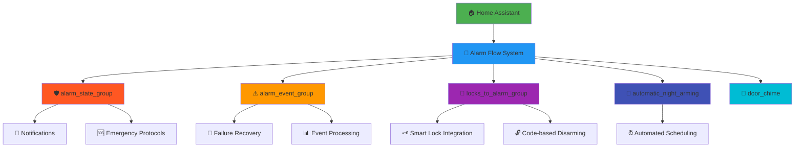

<!-- markdownlint-disable MD033 MD041 MD036 MD022 MD032 MD013 MD031 -->

<div align="center">

# 🚨 Alarm Flow System


<br>

**🏠 Complete home security automation system with intelligent state management, emergency protocols, and multi-platform notifications**

<p align="center">
  
  
  
  
</p>

</div>

---

## 🏗️ System Architecture

<div align="center">



</div>

---

## 🎯 Core Features

<table>
<tr>
<td width="50%" align="center">

### 🛡️ **Security & Protection**


✅ **Multi-State Management**
- Pending, Armed, Triggered, Disabled
- Intelligent state transitions
- Failure recovery protocols

✅ **Emergency Systems**
- Duress code detection
- Silent alarm activation
- Emergency contact integration

✅ **Smart Lock Integration**
- Code-based disarming
- Lock status monitoring
- Automated notifications

</td>
<td width="50%" align="center">

### 📡 **Communications & Automation**


✅ **Multi-Platform Notifications**
- Push notifications (Android/iOS)
- TTS audio announcements
- SMS emergency alerts

✅ **Intelligent Automation**
- Automatic night arming
- Retry mechanisms
- Failure event handling

✅ **Extensible Architecture**
- Modular component design
- Easy integration points
- Comprehensive documentation

</td>
</tr>
</table>

---

## 📁 System Components

<div align="center">

<table border="1" style="border-collapse: collapse; margin: 20px auto;">
<tr style="background-color: #f0f0f0;">
<th width="25%">🏷️ Component</th>
<th width="35%">🎯 Purpose</th>
<th width="40%">🔧 Key Features</th>
</tr>
<tr>
<td align="center">
<b>🛡️ alarm_state_group</b><br>
<small><a href="./alarm_state_group/README.md">📚 Docs</a></small>
</td>
<td>Core state management and emergency protocols</td>
<td>• State routing & transitions<br>• Duress code handling<br>• Multi-platform notifications<br>• Emergency SMS system</td>
</tr>
<tr style="background-color: #fff8f0;">
<td align="center">
<b>⚠️ alarm_event_group</b><br>
<small><a href="./alarm_event_group/README.md">📚 Docs</a></small>
</td>
<td>Event processing and failure management</td>
<td>• Failure event detection<br>• Automatic retry logic<br>• Event categorization<br>• Recovery protocols</td>
</tr>
<tr style="background-color: #f8f0ff;">
<td align="center">
<b>🔐 locks_to_alarm_group</b><br>
<small><a href="./locks_to_alarm_group/docs/">📚 Docs</a></small>
</td>
<td>Smart lock integration and code-based control</td>
<td>• Lock code disarming<br>• Status notifications<br>• Integration monitoring<br>• Automated responses</td>
</tr>
<tr style="background-color: #f0f8ff;">
<td align="center">
<b>🌙 automatic_night_arming</b><br>
<small>Scheduled automation</small>
</td>
<td>Automated scheduling and retry logic</td>
<td>• Time-based arming<br>• Retry mechanisms<br>• Condition checking<br>• Schedule management</td>
</tr>
<tr style="background-color: #f0fff8;">
<td align="center">
<b>🔔 door_chime</b><br>
<small>Audio feedback</small>
</td>
<td>Entry/exit audio notifications</td>
<td>• Door sensor integration<br>• Audio cue generation<br>• State-aware responses<br>• Customizable sounds</td>
</tr>
</table>

</div>

---

## 🔄 Alarm State Flow

<div align="center">

<table border="1" style="border-collapse: collapse; margin: 20px auto;">
<tr style="background-color: #f0f0f0;">
<th width="15%">🔹 State</th>
<th width="20%">🎯 Trigger</th>
<th width="25%">📱 Notifications</th>
<th width="20%">👥 Recipients</th>
<th width="20%">⚡ Actions</th>
</tr>
<tr>
<td align="center"><b style="color: #2196F3;">🔷 DISARMED</b></td>
<td>Manual disable<br>Lock code entry</td>
<td>• Welcome message<br>• Status confirmation</td>
<td><b>Home users</b></td>
<td>• System reset<br>• Status update</td>
</tr>
<tr style="background-color: #fff9c4;">
<td align="center"><b style="color: #FF9800;">🟡 PENDING</b></td>
<td>Arming command<br>Exit delay</td>
<td>• Countdown timer<br>• TTS announcements</td>
<td><b>Home users</b></td>
<td>• Entry/exit delay<br>• Cancel opportunity</td>
</tr>
<tr style="background-color: #e8f5e8;">
<td align="center"><b style="color: #4CAF50;">🟢 ARMED</b></td>
<td>Pending timeout<br>Manual arm</td>
<td>• Armed confirmation<br>• Status notification</td>
<td><b>All users</b></td>
<td>• Sensor monitoring<br>• Breach detection</td>
</tr>
<tr style="background-color: #ffebee;">
<td align="center"><b style="color: #F44336;">🔴 TRIGGERED</b></td>
<td>Sensor breach<br>Entry timeout</td>
<td>• Critical alerts<br>• Urgent notifications</td>
<td><b>ALL users</b><br>(location agnostic)</td>
<td>• Audio alarms<br>• Emergency protocols</td>
</tr>
<tr style="background-color: #fff3e0;">
<td align="center"><b style="color: #FF5722;">🆘 DURESS</b></td>
<td>Duress code entry<br>Panic activation</td>
<td>• Silent SMS alerts<br>• Covert signaling</td>
<td><b>Emergency contacts</b></td>
<td>• Silent protocols<br>• Emergency services</td>
</tr>
</table>

</div>

---

## 🚀 Quick Start Guide

### 1️⃣ **System Installation**

```javascript
// Import flows into Node-RED
1. Import alarm_state_group flows
2. Import alarm_event_group flows  
3. Import locks_to_alarm_group flows
4. Configure automatic_night_arming
5. Set up door_chime integration
```

### 2️⃣ **Configuration Setup**

<details>
<summary><b>🔧 Environment Configuration (Click to expand)</b></summary>

```bash
# Core alarm settings
ALARM_PENDING_TIMEOUT=30
ALARM_ENTRY_DELAY=45
ALARM_EXIT_DELAY=60

# Emergency contacts
EMERGENCY_SMS_NUMBERS="+1234567890,+0987654321"
DURESS_CODE_PRIMARY="9999"

# Notification settings
NOTIFY_ALL_USERS_ON_TRIGGER=true
QUIET_HOURS_START=22:00
QUIET_HOURS_END=07:00
```

</details>

### 3️⃣ **Integration Testing**

```javascript
// Test each component
1. Test alarm state transitions
2. Verify notification delivery
3. Test emergency protocols (safely)
4. Validate smart lock integration
5. Check automation schedules
```

---

## 🎛️ Use Case Examples

<div align="center">

<table>
<tr>
<td width="50%" align="center">

### 🏠 **Daily Operations**

**📱 Morning Routine**
- Automatic disarm via lock code
- Welcome TTS announcement
- Status confirmation notifications

**🌙 Evening Routine**
- Automatic night arming
- Countdown notifications
- Armed confirmation alerts

**🚪 Entry/Exit Management**
- Door chime audio cues
- Entry delay notifications
- Exit delay countdowns

</td>
<td width="50%" align="center">

### 🚨 **Emergency Scenarios**

**🔴 Breach Detection**
- Immediate critical alerts
- Multi-platform notifications
- Audio alarm activation

**🆘 Duress Situations**
- Silent alarm activation
- Covert SMS messaging
- Emergency contact alerts

**⚠️ System Failures**
- Automatic retry logic
- Failure event processing
- Recovery notifications

</td>
</tr>
</table>

</div>

---

## 🔗 Integration Ecosystem

<div align="center">

```
┌─────────────────────────────────────────────────────────────┐
│                    🏠 HOME ASSISTANT                        │
└───────────────────┬─────────────────────────────────────────┘
                    │
         ┌──────────┼──────────┐
         ▼          ▼          ▼
    ┌─────────┐ ┌─────────┐ ┌─────────┐
    │🛡️ Alarm │ │🔐 Locks │ │📱 Mobile│
    │ Panel   │ │ & Codes │ │  Apps   │
    └─────────┘ └─────────┘ └─────────┘
         │          │          │
    ┌─────────┐ ┌─────────┐ ┌─────────┐
    │📊 State │ │🔓 Access│ │🔊 Audio │
    │Monitor  │ │Control  │ │ TTS     │
    └─────────┘ └─────────┘ └─────────┘
         │          │          │
    ┌─────────┐ ┌─────────┐ ┌─────────┐
    │🚨 Events│ │📞 SMS   │ │📱 Push  │
    │Process  │ │Emergency│ │ Notify  │
    └─────────┘ └─────────┘ └─────────┘
```

</div>

---

## 🛠️ Development & Maintenance

### 📋 **System Requirements**

<table>
<tr>
<td width="33%" align="center">

**🔧 Core Platform**
- Node-RED 3.0+
- Home Assistant 2023.1+
- JavaScript ES6+
- JSON configuration

</td>
<td width="33%" align="center">

**📱 Integrations**
- Home Assistant Mobile App
- Pushover API
- SMS Gateway
- TTS Services (Sonos/Google)

</td>
<td width="33%" align="center">

**🔐 Security**
- Encrypted communications
- Secure credential storage
- Access control
- Audit logging

</td>
</tr>
</table>

### 🧪 **Testing Protocols**

<details>
<summary><b>🔍 Component Testing Checklist (Click to expand)</b></summary>

```bash
# State Management Testing
✅ Test all alarm state transitions
✅ Verify notification delivery
✅ Check timeout handling
✅ Validate error recovery

# Emergency Protocol Testing  
✅ Test duress codes (safe environment)
✅ Verify SMS delivery
✅ Check silent alarm operation
✅ Test emergency contact system

# Integration Testing
✅ Smart lock code integration
✅ Home Assistant connectivity
✅ Mobile app notifications
✅ TTS system functionality

# Automation Testing
✅ Night arming schedules
✅ Retry mechanisms
✅ Failure recovery
✅ Door chime operation
```

</details>

### 📊 **Performance Monitoring**

```javascript
// Key metrics to monitor
- Notification delivery time < 5 seconds
- State transition accuracy 99.9%
- Emergency response time < 2 seconds
- System uptime > 99.5%
```

---

## 📚 Documentation Hub

<div align="center">

<table>
<tr>
<td align="center" width="20%">

**🛡️ [State Management](./alarm_state_group/README.md)**<br>
*Core alarm logic*<br>
*Emergency protocols*<br>
*Notification system*

</td>
<td align="center" width="20%">

**⚠️ [Event Processing](./alarm_event_group/README.md)**<br>
*Failure handling*<br>
*Event categorization*<br>
*Recovery automation*

</td>
<td align="center" width="20%">

**🔐 [Lock Integration](./locks_to_alarm_group/docs/)**<br>
*Smart lock control*<br>
*Code-based disarming*<br>
*Access management*

</td>
<td align="center" width="20%">

**📱 [Notifications](./alarm_state_group/notify/README.md)**<br>
*Multi-platform alerts*<br>
*TTS announcements*<br>
*Emergency messaging*

</td>
<td align="center" width="20%">

**🔧 [Technical Docs](./doc/)**<br>
*Function documentation*<br>
*API references*<br>
*Configuration guides*

</td>
</tr>
</table>

</div>

---

## 🔐 Security & Privacy

<div align="center">

<table border="1" style="border-collapse: collapse; margin: 20px auto;">
<tr style="background-color: #f0f0f0;">
<th width="25%">🛡️ Security Layer</th>
<th width="35%">🔒 Implementation</th>
<th width="40%">✅ Features</th>
</tr>
<tr>
<td align="center"><b>Authentication</b></td>
<td>Multi-factor code validation</td>
<td>• Duress code detection<br>• User verification<br>• Access logging</td>
</tr>
<tr>
<td align="center"><b>Communication</b></td>
<td>Encrypted channels</td>
<td>• TLS/SSL encryption<br>• Secure API calls<br>• Token authentication</td>
</tr>
<tr>
<td align="center"><b>Emergency</b></td>
<td>Silent alarm protocols</td>
<td>• Covert signaling<br>• Emergency contacts<br>• Fail-safe operations</td>
</tr>
<tr>
<td align="center"><b>Monitoring</b></td>
<td>Comprehensive logging</td>
<td>• Event tracking<br>• Security audits<br>• Performance metrics</td>
</tr>
</table>

</div>

---

<div align="center">

## 🚨 Emergency Notice

<table border="0">
<tr>
<td align="center">

**🆘 Duress Systems**<br>
Test emergency protocols safely in controlled environment

</td>
<td align="center">

**🔐 Secure Configuration**<br>
Protect all credentials and emergency contact information

</td>
<td align="center">

**📱 Regular Testing**<br>
Verify system functionality and notification delivery monthly

</td>
</tr>
</table>

---


**🏠 Comprehensive home security automation • 🔒 Enterprise-grade security • 🚨 Emergency-ready protocols • 🤖 Intelligent automation**

</div>
