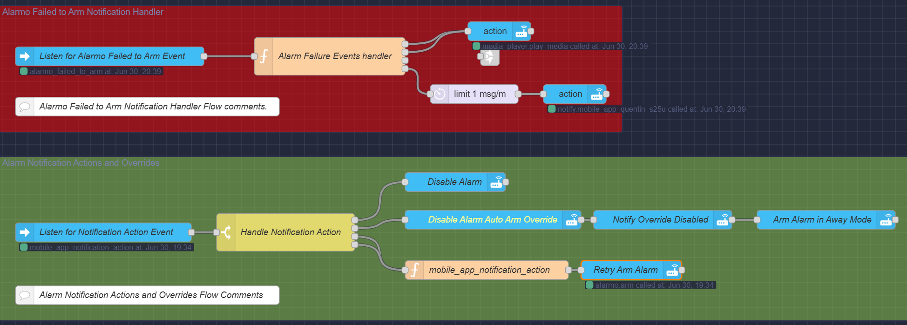
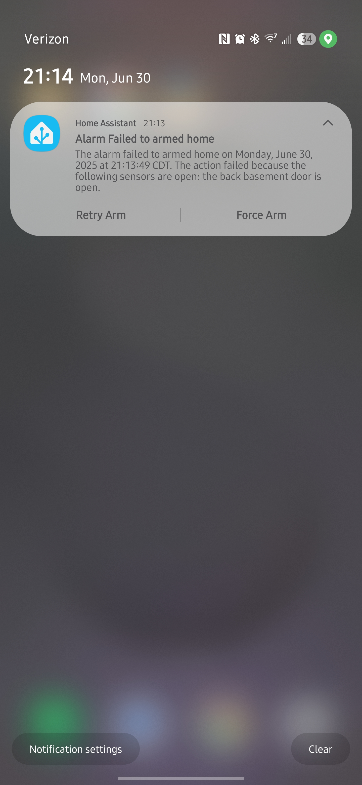

# Alarm Failure Events Handler

## Overview

This function node handles events when an alarm system fails to arm or disarm, formatting appropriate messages for both TTS announcements (Sonos and Google) and mobile push notifications.

## Features

- Multi-platform TTS support (Sonos and Google speakers)
- Configurable speaker groups
- Push notifications with detailed information
- Actionable notifications with retry/force buttons for arm failures
- Robust error handling and dependency checking
- Timezone-aware date formatting

## Dependencies

This function requires the following modules to be added in the Node-RED function node's "Setup" tab:

- `date-fns` (Variable name: `dateFns`)
- `date-fns-tz` (Variable name: `dateFnsTz`)

## Configuration Options

The script includes several configuration sections at the top:

### Speaker Configuration

```javascript
const SONOS_SPEAKERS = [
    "media_player.sonos_1",
    "media_player.bedroom_sonos_amp",
    "media_player.era_100"
];

const GOOGLE_SPEAKERS = [
    "media_player.house_google_speakers"
];
```

Modify these arrays to include the entity IDs of your Sonos and Google speakers.

### TTS Configuration

```javascript
const TTS_VOLUME = 100; // 0-100 for Sonos speakers
const TTS_CACHE = false; // Whether to cache TTS messages for Google speakers
```

### Mobile Notification Configuration

```javascript
const MOBILE_DEVICES = {
    primary: "notify.mobile_app_quentin_s25u",
    others: [] // Add additional device services here if needed
};
```

Replace the primary value with your mobile app notification service.

### Message Configuration

```javascript
const MESSAGE_OPTIONS = {
    includeTimeInTTS: false,  // Whether to include the full timestamp in TTS announcements
    includeTimeInPush: true   // Whether to include the full timestamp in push notifications
};
```

## Outputs

This function node has 4 outputs:

1. **Sonos TTS**: Message formatted for Sonos speakers using `media_player.play_media` service
2. **Google TTS**: Message formatted for Google speakers using `tts.google_say` service
3. **Push Notification**: Simple push notification message
4. **Actionable Notification**: Enhanced notification with actionable buttons (for arm failures)

## Integration

To use this handler effectively:

1. Add the function node to your flow and configure the dependencies
2. Connect the 4 outputs to appropriate service call nodes
3. Send alarm failure events to the input with the correct payload structure

## Expected Input Payload Structure

```json
{
  "event_type": "alarmo_failed_to_arm",
  "event": {
    "command": "arm_home", // or other arm states
    "reason": "open_sensors",
    "sensors": ["binary_sensor.front_door", "binary_sensor.kitchen_window"],
    "time_fired": "2023-06-30T12:34:56.789Z"
  }
}
```

## Version History

See the changelog section at the top of the script for detailed version history.

---

## Integration with Mobile App Notification Action Processor

This Alarm Failure Events Handler works in conjunction with the **Mobile App Notification Action Processor** (`alarm_failure_events_processor.js`) to create a complete alarm failure management system.

### Flow Architecture

1. **Alarm Failure Events Handler** (this script) - Generates notifications when alarm systems fail to arm/disarm
2. **Mobile App Notification Action Processor** - Processes user responses from actionable notifications

### How They Work Together

#### Step 1: Failure Detection & Notification

When an alarm fails to arm, this handler:

- Formats TTS announcements for speakers
- Sends push notifications to mobile devices
- **Creates actionable notifications** with "Retry" and "Force" buttons for arm failures

#### Step 2: User Action Processing

When a user taps an action button in the mobile notification:

- The Mobile App Notification Action Processor receives the `mobile_app_notification_action` event
- It retrieves the original arm command from flow context
- It maps the command to the appropriate alarm mode (home, away, night, etc.)
- It processes the action type (retry or force) and formats the payload for the alarm system

### Data Flow

```text
Alarm Failure → Handler → Actionable Notification → User Taps Button → 
Action Processor → Formatted Command → Alarm System
```

### Required Flow Context

The Action Processor relies on flow context to maintain state between the two scripts:

- `command`: The original alarm command (ARM_HOME, ARM_AWAY, etc.) stored by the failure handler

### Supported Actions

The Action Processor handles these notification actions:

- `ALARMO_RETRY_ARM`: Attempts to arm with the same parameters
- `ALARMO_FORCE_ARM`: Forces arming, bypassing open sensors

### Dependencies Between Scripts

- **This Handler** stores the alarm command in flow context when generating actionable notifications
- **Action Processor** reads the command from flow context and maps it to the correct alarm mode
- Both scripts use consistent error handling with Node-RED's built-in logging methods

---

## Example Screenshots

### Actionable Notification



### Mobile App Notification


