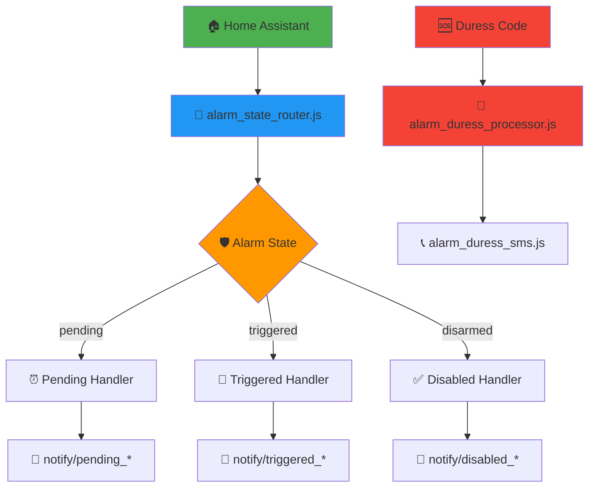

<!-- markdownlint-disable MD033 MD041 MD036 MD022 MD032 MD013 MD031 -->

<div align="center">

# 🛡️ Alarm State Management System


<br>

**🏠 Comprehensive home security alarm management with intelligent state routing and emergency protocols**

<p align="center">
  
  
  
</p>

</div>

---

## 🏗️ System Architecture

<div align="center">



</div>

---

## 🎯 Core Components

<table>
<tr>
<td width="50%" align="center">

### 🧠 **State Management**


**`alarm_state_router.js`**
- Central state coordinator
- Intelligent flow routing
- Event orchestration

**`alarm_handler.js`**
- State transition logic
- Business rule enforcement
- Integration management

</td>
<td width="50%" align="center">

### 🆘 **Emergency Protocols**


**`alarm_duress_processor.js`**
- Silent alarm activation
- Covert emergency signaling
- Security protocol execution

**`alarm_duress_sms.js`**
- Emergency SMS dispatch
- Silent communication channels
- Critical contact alerting

</td>
</tr>
</table>

---

## 🔄 State Flow Diagram

<div align="center">

<table border="1" style="border-collapse: collapse; margin: 20px auto;">
<tr style="background-color: #f0f0f0;">
<th width="20%">🔹 State</th>
<th width="25%">📱 Notifications</th>
<th width="25%">👥 Target Users</th>
<th width="30%">🎯 Actions</th>
</tr>
<tr>
<td align="center"><b>🟡 PENDING</b><br><small>Arming delay</small></td>
<td>• Push notification<br>• TTS announcement</td>
<td><b>Home users only</b></td>
<td>• Countdown timer<br>• Disarm opportunity<br>• Status updates</td>
</tr>
<tr style="background-color: #fff2f2;">
<td align="center"><b>🔴 TRIGGERED</b><br><small>Active alarm</small></td>
<td>• Critical push alerts<br>• Urgent TTS broadcast</td>
<td><b>ALL users</b><br>(regardless of location)</td>
<td>• Immediate notifications<br>• Emergency protocols<br>• Audio alerts</td>
</tr>
<tr style="background-color: #f2fff2;">
<td align="center"><b>🟢 DISABLED</b><br><small>System off</small></td>
<td>• Confirmation push<br>• Welcome TTS</td>
<td><b>Home users only</b></td>
<td>• Status confirmation<br>• Welcome messages<br>• System reset</td>
</tr>
<tr style="background-color: #fff2cc;">
<td align="center"><b>🆘 DURESS</b><br><small>Silent alarm</small></td>
<td>• Silent SMS alerts<br>• No visible notifications</td>
<td><b>Emergency contacts</b></td>
<td>• Covert signaling<br>• Emergency services<br>• Silent protocols</td>
</tr>
</table>

</div>

---

## 📁 File Structure & Responsibilities

<div align="center">

<table>
<tr>
<th width="40%">📄 File</th>
<th width="25%">🎯 Purpose</th>
<th width="35%">🔧 Key Features</th>
</tr>
<tr>
<td><code>🔄 alarm_state_router.js</code></td>
<td>Central dispatcher</td>
<td>• State routing logic<br>• Flow orchestration<br>• Event coordination</td>
</tr>
<tr>
<td><code>🛡️ alarm_handler.js</code></td>
<td>Business logic</td>
<td>• State transitions<br>• Rule enforcement<br>• Integration management</td>
</tr>
<tr>
<td><code>🆘 alarm_duress_processor.js</code></td>
<td>Emergency handling</td>
<td>• Duress code detection<br>• Silent alarm activation<br>• Emergency protocols</td>
</tr>
<tr>
<td><code>📞 alarm_duress_sms.js</code></td>
<td>Emergency communication</td>
<td>• SMS dispatch<br>• Emergency contacts<br>• Silent channels</td>
</tr>
<tr>
<td><code>🧪 alarm_duress_test.js</code></td>
<td>Emergency testing</td>
<td>• Test protocols<br>• System validation<br>• Safety checks</td>
</tr>
<tr style="background-color: #f0f8ff;">
<td><code>📁 notify/</code></td>
<td>Notification system</td>
<td>• Multi-platform alerts<br>• TTS announcements<br>• Rich notifications</td>
</tr>
</table>

</div>

---

## 🚦 Integration Flow

### 📥 **Input Sources**

<div align="center">

<table>
<tr>
<td width="33%" align="center">

**🏠 Home Assistant**
- Alarm panel state changes
- Sensor triggers
- Manual commands
- Automation events

</td>
<td width="33%" align="center">

**👤 User Actions**
- Keypad entries
- Mobile app commands
- Voice commands
- Physical controls

</td>
<td width="33%" align="center">

**🆘 Emergency Inputs**
- Duress codes
- Panic buttons
- Silent triggers
- Emergency protocols

</td>
</tr>
</table>

</div>

### 📤 **Output Actions**

<div align="center">

```
┌─────────────────────────────────────────────────────────────┐
│                    🔄 ALARM STATE ROUTER                    │
└───────────────────┬─────────────────────────────────────────┘
                    │
         ┌──────────┼──────────┐
         ▼          ▼          ▼
    ┌─────────┐ ┌─────────┐ ┌─────────┐
    │📱 Push  │ │🔊 TTS   │ │📞 SMS   │
    │Alerts   │ │Audio    │ │Emergency│
    └─────────┘ └─────────┘ └─────────┘
         │          │          │
    ┌─────────┐ ┌─────────┐ ┌─────────┐
    │Android  │ │Speakers │ │Contacts │
    │   iOS   │ │  Media  │ │Services │
    └─────────┘ └─────────┘ └─────────┘
```

</div>

---

## ⚙️ Configuration

### 🌍 **Environment Variables**

<details>
<summary><b>🔧 Core System Configuration (Click to expand)</b></summary>

```bash
# Alarm State Timeouts
ALARM_PENDING_TIMEOUT=30
ALARM_ENTRY_DELAY=45
ALARM_EXIT_DELAY=60

# Emergency Settings
DURESS_CODE_ENABLED=true
EMERGENCY_SMS_NUMBERS="+1234567890,+0987654321"
SILENT_ALARM_MODE=true

# Notification Preferences
NOTIFY_ALL_USERS_ON_TRIGGER=true
QUIET_HOURS_START=22:00
QUIET_HOURS_END=07:00
```

</details>

<details>
<summary><b>🆘 Emergency Contact Configuration (Click to expand)</b></summary>

```bash
# Emergency Contacts
EMERGENCY_CONTACT_1="+1234567890"
EMERGENCY_CONTACT_2="+0987654321"
EMERGENCY_SERVICES="911"

# Duress Settings
DURESS_CODE_PRIMARY="9999"
DURESS_CODE_SECONDARY="0000"
DURESS_SMS_TEMPLATE="Silent alarm activated at {address}. Require assistance."
```

</details>

---

## 🔐 Security Features

<table>
<tr>
<td width="50%">

### 🛡️ **Protection Mechanisms**

- ✅ **Duress Code Detection**
  - Silent alarm activation
  - Covert emergency signaling
  - No visible indicators

- ✅ **Multi-Layer Authentication**
  - Code validation
  - User verification
  - Access control

- ✅ **Fail-Safe Operations**
  - Network resilience
  - Offline capabilities
  - Backup protocols

</td>
<td width="50%">

### 📊 **Monitoring & Logging**

- ✅ **Event Tracking**
  - State change logs
  - User action history
  - System health metrics

- ✅ **Security Auditing**
  - Access attempts
  - Configuration changes
  - Emergency activations

- ✅ **Performance Monitoring**
  - Response times
  - Notification delivery
  - System reliability

</td>
</tr>
</table>

---

## 🚀 Quick Start Guide

### 1️⃣ **System Setup**

```javascript
// Import alarm state router into Node-RED
[Home Assistant] → [alarm_state_router.js] → [notification handlers]
```

### 2️⃣ **Configure Environment**

```bash
# Copy .env template to Node-RED settings
cp notify/.env /path/to/node-red/settings.js
```

### 3️⃣ **Test Emergency Systems**

```javascript
// Use alarm_duress_test.js to validate emergency protocols
msg.payload = {
  "test_mode": true,
  "duress_code": "9999"
}
```

### 4️⃣ **Monitor & Maintain**

- 📊 Check Node-RED debug panel
- 📱 Verify notification delivery
- 🔍 Review system logs
- 🧪 Test emergency protocols regularly

---

## 🔮 System Capabilities

<div align="center">

| 🎯 **Feature** | 📱 **Mobile** | 🔊 **Audio** | 📞 **SMS** | 🆘 **Emergency** |
|:---:|:---:|:---:|:---:|:---:|
| **Pending Alerts** | ✅ Rich Push | ✅ TTS | ❌ | ❌ |
| **Triggered Alarms** | ✅ Critical | ✅ Urgent | ❌ | ✅ Auto |
| **Disabled Confirmations** | ✅ Status | ✅ Welcome | ❌ | ❌ |
| **Duress Activation** | ❌ Silent | ❌ Silent | ✅ Emergency | ✅ Protocol |

</div>

---

## 🧪 Development & Testing

### 🛠️ **Development Workflow**

1. **Code Changes** → Update individual handlers
2. **Local Testing** → Use Node-RED debug tools  
3. **Integration Testing** → Test full alarm flows
4. **Security Testing** → Validate duress protocols
5. **Production Deploy** → Update live system

### 📝 **Best Practices**

- ✅ Always test emergency protocols in safe environment
- ✅ Validate notification delivery before production
- ✅ Keep emergency contact information current
- ✅ Document all configuration changes
- ✅ Regular security audits and penetration testing

### 🔍 **Debugging Tips**

```javascript
// Enable debug logging in Node-RED
node.log(`Alarm state: ${currentState}`);
node.debug(`User: ${entityId}, State: ${userState}`);
node.warn(`Emergency protocol activated: ${protocolType}`);
```

---

## 📚 Related Documentation

<div align="center">

<table>
<tr>
<td align="center" width="25%">

**📱 [Notifications](./notify/README.md)**<br>
*Multi-platform alerts*<br>
*TTS system*<br>
*Push notifications*

</td>
<td align="center" width="25%">

**🔧 [Configuration](./notify/.env)**<br>
*Environment variables*<br>
*Device mappings*<br>
*Message templates*

</td>
<td align="center" width="25%">

**🚀 [Improvements](./notify/IMPROVEMENT_ROADMAP.md)**<br>
*Enhancement plans*<br>
*ChatGPT feedback*<br>
*Future features*

</td>
<td align="center" width="25%">

**🏠 [Home Assistant](../../README.md)**<br>
*Overall system*<br>
*Integration guides*<br>
*Architecture*

</td>
</tr>
</table>

</div>

---

<div align="center">

## 🛡️ Security Notice

<table border="0">
<tr>
<td align="center">

**🚨 Emergency Systems**<br>
Test duress codes safely in isolated environment

</td>
<td align="center">

**🔐 Access Control**<br>
Secure all configuration files and credentials

</td>
<td align="center">

**📱 Communication**<br>
Verify emergency contact information regularly

</td>
</tr>
</table>

---


**🏠 Protecting homes with intelligent automation • 🔒 Security-first design • 🚨 Emergency-ready protocols**

</div>
