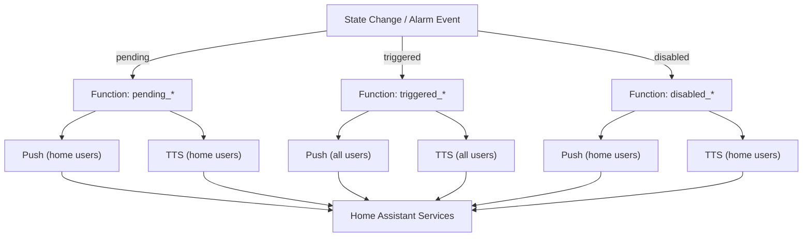

<!-- markdownlint-disable MD033 MD041 MD036 MD022 MD032 MD013 MD031 -->

<div align="center">

<h1>🔔 Node-RED Alarm Notifications</h1>

<p><strong>⚡ Smart, multi-platform notification system for home security alarms</strong></p>

<p>
  
  
  
</p>

<p>
  
  
  
</p>

<p>
  <a href="#features">Features</a> •
  <a href="#alarm-states--notifications">States</a> •
  <a href="#file-structure">Files</a> •
  <a href="#configuration">Config</a> •
  <a href="#node-red-integration">Integration</a> •
  <a href="#usage-examples">Examples</a> •
  <a href="#development">Development</a> •
  <a href="#support">Support</a>
</p>

</div>

---

## 🚀 Features

<table>
<tr>
<td width="50%" valign="top">

<h3>📱 <strong>Multi-Platform Support</strong></h3>

- ✅ <strong>Android</strong> notifications with rich formatting  
- ✅ <strong>iOS</strong> notifications with <em>critical</em> alerts  
- ✅ Cross-platform HTML/plain-text handling  
- ✅ Device arrays for multi-device users

</td>
<td width="50%" valign="top">

<h3>🔊 <strong>Smart TTS System</strong></h3>

- ✅ Text-to-Speech for immediate alerts  
- ✅ Audio streaming with priority levels  
- ✅ Home state awareness  
- ✅ Quiet hours support (<em>planned</em>)

</td>
</tr>
<tr>
<td width="50%" valign="top">

<h3>⚙️ <strong>Environment Driven</strong></h3>

- ✅ JSON config via environment variables  
- ✅ Hot-swappable notification maps  
- ✅ Centralized settings management  
- ✅ No hard-coded device IDs

</td>
<td width="50%" valign="top">

<h3>🛡️ <strong>Robust & Reliable</strong></h3>

- ✅ Error handling with comprehensive logging  
- ✅ State validation & graceful failures  
- ✅ Duplicate prevention (<em>planned</em>)  
- ✅ Performance-optimized

</td>
</tr>
</table>

---

## 📋 Alarm States & Notifications

<div align="center">

| 🟡 **Pending** | 🔴 **Triggered** | 🟢 **Disabled** |
|:---:|:---:|:---:|
| System is arming<br><em>Disarm now</em> | <strong>ALARM ACTIVATED</strong><br><em>Immediate attention</em> | System is safe<br><em>Welcome home</em> |
| Push + TTS | Push + TTS | Push + TTS |
| Home users only | <strong>All users</strong> | Home users only |

</div>

<details>
<summary><b>👀 Visual Flow (Mermaid)</b> — click to expand</summary>


</details>

---

## 🗂️ File Structure

```
notify/
├── 📄 disabled_push_mobile.js      # Push notifications when alarm disabled
├── 📄 disabled_tts_mobile.js       # TTS announcements when alarm disabled
├── 📄 pending_push_mobile.js       # Push notifications when alarm pending
├── 📄 pending_tts_mobile.js        # TTS announcements when alarm pending
├── 📄 triggered_push_mobile.js     # Push notifications when alarm triggered
├── 📄 triggered_tts_mobile.js      # TTS announcements when alarm triggered
├── 📄 pending_tts_startup.js       # [DEPRECATED] Legacy global setup
├── 🔧 .env                         # Environment variables configuration
└── 📖 README.md                    # This file
```

<details>
<summary><b>📂 Example Files (Development)</b></summary>

```
├── 📄 disabled_push_mobile_improved.js    # Enhanced version with better error handling
├── 📄 example_cached_notification.js      # Performance caching example
└── 📄 settings_helper_example.js          # functionGlobalContext helper functions
```

</details>

---

## ⚙️ Configuration

### 🌍 Environment Variables
Configure via your `.env` or Node-RED environment settings.  
<sub><em>Note: In Function nodes, retrieve with <code>env.get("KEY")</code> and <code>JSON.parse</code> if the value is JSON.</em></sub>

<details>
<summary><b>🔧 Device Mapping (Click to expand)</b></summary>

```json
{
  "NOTIFY_MAP_ANDROID": {
    "person.quentin": [
      "notify.mobile_app_quentin_s25u",
      "notify.mobile_app_quentin_g7u"
    ],
    "person.alana": "notify.mobile_app_alana_s22u",
    "person.betty": "notify.mobile_app_betty_s24u"
  },
  "NOTIFY_MAP_IOS": {
    "person.quentin": "notify.mobile_app_quentin_ipad_pro_13",
    "garage_notify": "notify.mobile_app_quentin_ipad_pro_13"
  }
}
```
</details>

<details>
<summary><b>💬 Message Templates (Click to expand)</b></summary>

```json
{
  "ALARM_TRIGGERED_PUSH": "🚨 SECURITY SYSTEM TRIGGERED! Check immediately!",
  "ALARM_TRIGGERED_TTS": "Attention! The security system has been triggered!",
  "ALARM_PENDING_PUSH": "⏰ DISARM THE ALARM NOW",
  "ALARM_PENDING_TTS": "The security system is armed. Please disarm the alarm.",
  "ALARM_DISABLED_PUSH": "✅ Security system disabled. Welcome home!",
  "ALARM_DISABLED_TTS": "The security system has been disabled. You can relax now."
}
```
</details>

---

## 🔌 Node-RED Integration

### 📥 Input Message Format

```javascript
{
  "data": {
    "entity_id": "person.quentin",
    "state": "home"
  },
  "push_text": "Custom notification text (optional)",
  "tts_text": "Custom TTS text (optional)",
  "alarm": {
    "message": "Additional context (optional)"
  }
}
```

### 📤 Output Message Format

```javascript
[
  {
    "payload": {
      "action": "notify.mobile_app_quentin_s25u",
      "data": {
        "message": "🚨 SECURITY SYSTEM TRIGGERED!",
        "title": "ALARM ACTIVATED",
        "data": {
          "priority": "high",
          "persistent": true,
          "clickAction": "/lovelace-kiosk/Alarm"
          // ... platform-specific options
        }
      }
    }
  }
]
```

---

## 🎯 Platform Differences

<details>
<summary><b>🤖 Android specifics</b></summary>

```javascript
// Rich HTML formatting
message: "🚨<b>ALARM TRIGGERED</b>🚨"

// Android-specific features
data: {
  sticky: true,
  chronometer: true,
  notification_icon: "mdi:alarm-light",
  color: "#ff0000"
}
```
</details>

<details>
<summary><b>🍎 iOS specifics</b></summary>

```javascript
// Plain text only
message: "🚨ALARM TRIGGERED🚨"

// iOS-specific features
data: {
  push: {
    sound: { critical: 1, volume: 1.0 },
    "interruption-level": "time-sensitive"
  }
}
```
</details>

---

## 🚦 Usage Examples

### 🟡 Pending Alarm Flow

```
[State Change] → [Function: pending_push_mobile.js] → [Home Assistant Service Call]
      ↓
  person.quentin 
  state: "home"
      ↓
  Sends push notification:
  "⏰ DISARM THE ALARM NOW"
```

### 🔴 Triggered Alarm Flow

```
[Alarm Trigger] → [Function: triggered_tts_mobile.js] → [TTS Service Call]
      ↓
  person.* (ALL USERS)
      ↓
  Plays TTS announcement:
  "Attention! Security system triggered!"
```

---

## 🔧 Development

### 🧪 Testing Your Changes

1. **Copy** a script into a Node-RED Function node  
2. **Configure** environment variables in flow settings  
3. **Test** with sample input message:
   ```javascript
   {
     "data": {
       "entity_id": "person.test_user",
       "state": "home"
     }
   }
   ```
4. **Check** the Node-RED Debug panel for output

### 📝 Best Practices

- ✅ Always validate `msg.data` exists  
- ✅ Use `try/catch` for error handling  
- ✅ Log meaningful debug info  
- ✅ Follow JSDoc comment standards  
- ✅ Test on both Android and iOS

---

<div align="center">

## 📞 Support

<table>
<tr>
<td align="center" width="33%">

**🐛 Found a Bug?**<br>
Open an issue with repro steps

</td>
<td align="center" width="33%">

**💡 Have an Idea?**<br>
Open a feature request

</td>
<td align="center" width="33%">

**🤝 Want to Contribute?**<br>
PRs welcome — follow coding standards

</td>
</tr>
</table>

<hr>

<p>
  
</p>

<strong>Built for reliable home automation • Tested in production • Continuously improved</strong>

</div>
