<!-- markdownlint-disable MD033 MD041 MD036 MD022 MD032 MD013 MD031 -->

<div align="center">

# 🧠 Node-RED Function Nodes Guide

### **💻 Advanced JavaScript Programming in Home Automation Flows**


<br>


<br>

**⚡ Powerful JavaScript execution • 🔄 Message processing • 💾 Context storage • 🎯 Home automation logic**

</div>

---

## 🌟 Function Node Overview

```mermaid
graph TD
    subgraph "📥 Input Processing"
        MSG[📨 Incoming Message]
        PROP[🏷️ Message Properties]
        PAYLOAD[📦 Payload Data]
    end
    
    subgraph "🧠 Function Execution"
        JS[💻 JavaScript Code]
        LOGIC[🎯 Custom Logic]
        CONTEXT[💾 Context Access]
        API[🔧 Node-RED API]
    end
    
    subgraph "📤 Output Generation"
        RETURN[↩️ Return Messages]
        SEND[📨 Send Async]
        MULTI[🔀 Multiple Outputs]
        DONE[✅ Completion Signal]
    end
    
    subgraph "💾 Data Storage"
        LOCAL[🏠 Node Context]
        FLOW[🌊 Flow Context]
        GLOBAL[🌍 Global Context]
    end
    
    MSG --> JS
    PROP --> LOGIC
    PAYLOAD --> LOGIC
    
    JS --> CONTEXT
    LOGIC --> API
    CONTEXT --> LOCAL
    CONTEXT --> FLOW
    CONTEXT --> GLOBAL
    
    API --> RETURN
    API --> SEND
    RETURN --> MULTI
    SEND --> DONE
    
    style MSG fill:#4CAF50,color:#fff
    style JS fill:#F7DF1E,color:#000
    style CONTEXT fill:#2196F3,color:#fff
    style RETURN fill:#FF9800,color:#fff
```

<div align="center">



</div>

---

## 🎯 Core Concepts & Message Handling

<table>
<tr>
<td width="50%" align="center">

### 📨 **Message Structure**


✅ **Standard Message Format**
- `msg.payload` - Primary message content
- `msg.topic` - Message classification
- `msg.timestamp` - Processing time
- Custom properties for specific needs

✅ **Message Flow Principles**
- Objects passed by reference
- Immutable best practices
- Property preservation
- Chain compatibility

✅ **Home Automation Context**
- Entity state changes
- Sensor data processing
- Device command formatting
- Event correlation logic

</td>
<td width="50%" align="center">

### 🔄 **Function Processing**


✅ **Execution Model**
- Synchronous by default
- Asynchronous support
- Error handling protocols
- Performance optimization

✅ **Return Mechanisms**
- Direct return for simple cases
- `node.send()` for async operations
- Multiple output support
- Message cloning strategies

✅ **Smart Home Integration**
- Home Assistant entity processing
- Device state management
- Automation rule implementation
- Notification generation

</td>
</tr>
</table>

---

## 💻 **Basic Function Examples**

### 1️⃣ **Simple Message Processing**

<details>
<summary><b>📝 Basic Function Patterns (Click to expand)</b></summary>

```javascript
// ✅ Simple pass-through (always return the message)
return msg;

// ✅ Transform payload data
msg.payload = msg.payload.toUpperCase();
return msg;

// ✅ Add metadata to message
msg.timestamp = new Date().toISOString();
msg.processed = true;
return msg;

// ✅ Conditional processing for home automation
if (msg.payload.state === "on") {
    msg.action = "activate_scene";
    return msg;
} else {
    // End flow for 'off' states
    return null;
}

// ✅ Create new message while preserving properties
const newMsg = {
    payload: msg.payload.length,
    topic: msg.topic,
    _msgid: msg._msgid  // Preserve message ID
};
return newMsg;
```

</details>

### 2️⃣ **Home Automation Specific Examples**

<details>
<summary><b>🏠 Smart Home Function Examples (Click to expand)</b></summary>

```javascript
// 🚨 Alarm state processing
if (msg.payload.entity_id === "alarm_control_panel.home") {
    const state = msg.payload.new_state.state;
    
    switch(state) {
        case "triggered":
            msg.priority = "critical";
            msg.notify_all = true;
            break;
        case "pending":
            msg.priority = "high";
            msg.notify_home_users = true;
            break;
        case "disarmed":
            msg.priority = "normal";
            msg.welcome_message = true;
            break;
    }
    
    node.log(`Alarm state changed to: ${state}`);
    return msg;
}

// 🌡️ Temperature sensor processing with alerts
const temperature = msg.payload.temperature;
const humidity = msg.payload.humidity;

if (temperature > 80 || temperature < 60) {
    msg.payload = {
        alert: true,
        message: `Temperature alert: ${temperature}°F`,
        severity: temperature > 85 ? "critical" : "warning"
    };
    return msg;
}

// 💡 Lighting automation based on time and occupancy
const now = new Date();
const hour = now.getHours();
const isOccupied = msg.payload.occupancy;

if (isOccupied && (hour < 7 || hour > 20)) {
    msg.payload = {
        service: "light.turn_on",
        entity_id: "light.living_room",
        brightness: hour < 7 ? 50 : 80  // Dimmer in early morning
    };
    return msg;
}

return null; // No action needed
```

</details>

---

## 🔀 **Multiple Outputs & Advanced Routing**

### 📊 **Multi-Output Configuration**

<div align="center">

<table border="1" style="border-collapse: collapse; margin: 20px auto;">
<tr style="background-color: #f0f0f0;">
<th width="25%">🎯 Use Case</th>
<th width="35%">💻 Code Example</th>
<th width="40%">🔄 Output Behavior</th>
</tr>
<tr>
<td align="center"><b>Conditional Routing</b></td>
<td><code>return [null, msg];</code><br><small>Send to output 2</small></td>
<td>• Route based on conditions<br>• Filter message flows<br>• Create decision trees</td>
</tr>
<tr style="background-color: #f0f8ff;">
<td align="center"><b>Data Splitting</b></td>
<td><code>return [msg, newMsg];</code><br><small>Send to both outputs</small></td>
<td>• Duplicate processing<br>• Parallel flows<br>• Data transformation</td>
</tr>
<tr style="background-color: #fff8f0;">
<td align="center"><b>Fan-out Processing</b></td>
<td><code>return [msg1, msg2, msg3];</code><br><small>Multiple messages</small></td>
<td>• Broadcast to multiple paths<br>• Different processing logic<br>• Event distribution</td>
</tr>
</table>

</div>

### 🏠 **Smart Home Routing Examples**

<details>
<summary><b>🎯 Advanced Routing for Home Automation (Click to expand)</b></summary>

```javascript
// 🚨 Alarm notification routing by priority
const alarmState = msg.payload.state;
const priority = msg.payload.priority || "normal";

switch(priority) {
    case "critical":
        // Send to all notification channels
        return [
            {...msg, channel: "emergency_sms"},    // Output 1: Emergency SMS
            {...msg, channel: "push_critical"},    // Output 2: Critical push
            {...msg, channel: "tts_all_speakers"}, // Output 3: All speakers
            {...msg, channel: "visual_alerts"}     // Output 4: Visual alerts
        ];
        
    case "high":
        // Send to push and TTS only
        return [
            null,                                   // Output 1: No SMS
            {...msg, channel: "push_normal"},      // Output 2: Normal push
            {...msg, channel: "tts_home_speakers"}, // Output 3: Home speakers
            null                                    // Output 4: No visual
        ];
        
    default:
        // Send to push notifications only
        return [
            null,                              // Output 1: No SMS
            {...msg, channel: "push_low"},    // Output 2: Low priority push
            null,                              // Output 3: No TTS
            null                               // Output 4: No visual
        ];
}

// 🌦️ Weather alert distribution
const weatherAlert = msg.payload;
const severity = weatherAlert.severity;
const eventType = weatherAlert.event_type;

// Create messages for different channels
const pushMsg = {
    payload: {
        title: `${eventType} Alert`,
        message: weatherAlert.headline,
        priority: severity === "severe" ? "high" : "normal"
    }
};

const ttsMsg = {
    payload: {
        message: `Weather alert: ${weatherAlert.headline}`,
        volume: severity === "severe" ? 0.8 : 0.6
    }
};

const logMsg = {
    payload: {
        timestamp: new Date().toISOString(),
        event: eventType,
        severity: severity,
        areas: weatherAlert.areas
    }
};

// Route based on severity
if (severity === "severe") {
    return [pushMsg, ttsMsg, logMsg];  // All channels
} else {
    return [pushMsg, null, logMsg];    // Push and log only
}
```

</details>

---

## ⚡ **Asynchronous Processing & Advanced Patterns**

### 🔄 **Async Function Patterns**

<details>
<summary><b>⏰ Asynchronous Operations (Click to expand)</b></summary>

```javascript
// ✅ Basic async pattern with node.send()
function processDataAsync(data, callback) {
    setTimeout(() => {
        callback(null, data.toUpperCase());
    }, 1000);
}

processDataAsync(msg.payload, function(err, result) {
    if (err) {
        node.error("Processing failed: " + err.message, msg);
        return;
    }
    
    msg.payload = result;
    node.send(msg);
    node.done(); // Signal completion
});

return; // Don't return message synchronously

// 🏠 Home Assistant API call example
const fetch = global.get('fetch'); // Must be configured in settings.js

async function updateEntityState(entityId, state) {
    try {
        const response = await fetch('http://hassio/homeassistant/api/states/' + entityId, {
            method: 'POST',
            headers: {
                'Authorization': 'Bearer ' + process.env.HA_TOKEN,
                'Content-Type': 'application/json'
            },
            body: JSON.stringify({
                state: state,
                attributes: msg.payload.attributes || {}
            })
        });
        
        if (response.ok) {
            msg.payload.success = true;
            msg.payload.updated_entity = entityId;
            node.send(msg);
        } else {
            throw new Error(`HTTP ${response.status}: ${response.statusText}`);
        }
    } catch (error) {
        node.error(`Failed to update ${entityId}: ${error.message}`, msg);
    } finally {
        node.done();
    }
}

// Call async function
updateEntityState(msg.payload.entity_id, msg.payload.state);
return;

// 🔄 Timer-based automation with cleanup
let automationTimer;

// Set up automation timer
automationTimer = setTimeout(() => {
    msg.payload = {
        action: "auto_close_garage",
        reason: "timer_expired",
        duration: 15 * 60 * 1000 // 15 minutes
    };
    
    node.send(msg);
    node.done();
}, 15 * 60 * 1000);

// Store timer reference for cleanup
context.set('automationTimer', automationTimer);

// Cleanup function for node shutdown
node.on('close', function() {
    const timer = context.get('automationTimer');
    if (timer) {
        clearTimeout(timer);
        context.set('automationTimer', null);
    }
});

return; // Don't return message immediately
```

</details>

---

## 💾 **Context Storage & State Management**

### 🏠 **Smart Home Context Patterns**

<div align="center">

<table border="1" style="border-collapse: collapse; margin: 20px auto;">
<tr style="background-color: #f0f0f0;">
<th width="20%">📊 Scope</th>
<th width="30%">🎯 Use Cases</th>
<th width="25%">💻 Access Pattern</th>
<th width="25%">🏠 Home Automation Examples</th>
</tr>
<tr>
<td align="center"><b style="color: #4CAF50;">Node Context</b></td>
<td>• Counter variables<br>• Local state<br>• Function-specific data</td>
<td><code>context.get("key")</code><br><code>context.set("key", val)</code></td>
<td>• Motion sensor counts<br>• Timer references<br>• Processing flags</td>
</tr>
<tr style="background-color: #e3f2fd;">
<td align="center"><b style="color: #2196F3;">Flow Context</b></td>
<td>• Shared flow state<br>• Cross-node data<br>• Temporary storage</td>
<td><code>flow.get("key")</code><br><code>flow.set("key", val)</code></td>
<td>• Alarm system state<br>• User presence<br>• Scene configurations</td>
</tr>
<tr style="background-color: #fff3e0;">
<td align="center"><b style="color: #FF9800;">Global Context</b></td>
<td>• System-wide state<br>• Configuration data<br>• Persistent storage</td>
<td><code>global.get("key")</code><br><code>global.set("key", val)</code></td>
<td>• Device mappings<br>• User preferences<br>• System settings</td>
</tr>
</table>

</div>

### 📝 **Advanced Context Examples**

<details>
<summary><b>💾 Context Storage for Home Automation (Click to expand)</b></summary>

```javascript
// 🏠 Device state tracking with context
function trackDeviceState() {
    const entityId = msg.payload.entity_id;
    const newState = msg.payload.new_state.state;
    const oldState = msg.payload.old_state ? msg.payload.old_state.state : null;
    
    // Get current device states from flow context
    let deviceStates = flow.get("device_states") || {};
    
    // Update device state
    deviceStates[entityId] = {
        current_state: newState,
        previous_state: oldState,
        last_updated: new Date().toISOString(),
        change_count: (deviceStates[entityId]?.change_count || 0) + 1
    };
    
    // Store updated states
    flow.set("device_states", deviceStates);
    
    // Add state info to message
    msg.payload.state_info = deviceStates[entityId];
    
    return msg;
}

// 🚨 Alarm system state management
function manageAlarmState() {
    const alarmState = msg.payload.state;
    const previousAlarm = flow.get("alarm_state");
    
    // State transition logic
    const validTransitions = {
        "disarmed": ["armed_home", "armed_away"],
        "armed_home": ["disarmed", "triggered"],
        "armed_away": ["disarmed", "triggered"],
        "triggered": ["disarmed"],
        "pending": ["armed_home", "armed_away", "disarmed"]
    };
    
    // Validate state transition
    if (previousAlarm && !validTransitions[previousAlarm]?.includes(alarmState)) {
        node.warn(`Invalid alarm transition: ${previousAlarm} -> ${alarmState}`);
        return null;
    }
    
    // Update alarm state
    flow.set("alarm_state", alarmState);
    flow.set("alarm_last_change", new Date().toISOString());
    
    // Track state history
    let stateHistory = flow.get("alarm_history") || [];
    stateHistory.push({
        state: alarmState,
        previous: previousAlarm,
        timestamp: new Date().toISOString()
    });
    
    // Keep only last 50 state changes
    if (stateHistory.length > 50) {
        stateHistory = stateHistory.slice(-50);
    }
    
    flow.set("alarm_history", stateHistory);
    
    msg.payload.transition = {
        from: previousAlarm,
        to: alarmState,
        valid: true
    };
    
    return msg;
}

// 📊 Usage statistics with global context
function trackUsageStats() {
    const action = msg.payload.action;
    const userId = msg.payload.user_id;
    
    // Get global usage statistics
    let usageStats = global.get("usage_statistics") || {
        daily_actions: {},
        user_activity: {},
        popular_actions: {}
    };
    
    const today = new Date().toISOString().split('T')[0];
    
    // Update daily action count
    if (!usageStats.daily_actions[today]) {
        usageStats.daily_actions[today] = 0;
    }
    usageStats.daily_actions[today]++;
    
    // Update user activity
    if (!usageStats.user_activity[userId]) {
        usageStats.user_activity[userId] = { actions: 0, last_seen: null };
    }
    usageStats.user_activity[userId].actions++;
    usageStats.user_activity[userId].last_seen = new Date().toISOString();
    
    // Update popular actions
    if (!usageStats.popular_actions[action]) {
        usageStats.popular_actions[action] = 0;
    }
    usageStats.popular_actions[action]++;
    
    // Store updated statistics
    global.set("usage_statistics", usageStats);
    
    // Add stats to message
    msg.payload.stats = {
        daily_total: usageStats.daily_actions[today],
        user_total: usageStats.user_activity[userId].actions,
        action_popularity: usageStats.popular_actions[action]
    };
    
    return msg;
}

// Call the appropriate function based on message type
switch(msg.topic) {
    case "device_state":
        return trackDeviceState();
    case "alarm_state":
        return manageAlarmState();
    case "user_action":
        return trackUsageStats();
    default:
        node.warn("Unknown message topic: " + msg.topic);
        return msg;
}
```

</details>

---

## 🚀 **Node-RED Setup & Initialization**

### ⚙️ **Function Node Lifecycle**

<details>
<summary><b>🔧 Setup and Cleanup Patterns (Click to expand)</b></summary>

```javascript
// 📋 On Start Tab (Setup) - Runs when node starts
// Initialize counters and configuration
if (context.get("message_counter") === undefined) {
    context.set("message_counter", 0);
    node.log("Message counter initialized to 0");
}

// Initialize device mappings from global context
const deviceMappings = global.get("device_mappings");
if (!deviceMappings) {
    node.warn("Device mappings not found in global context");
    context.set("devices_ready", false);
} else {
    context.set("devices_ready", true);
    context.set("device_map", deviceMappings);
    node.log(`Loaded ${Object.keys(deviceMappings).length} device mappings`);
}

// Set up automation timers storage
context.set("active_timers", {});

// 🔄 Main Function Tab - Processes messages
function processMessage() {
    // Check if initialization completed
    if (!context.get("devices_ready")) {
        node.warn("Devices not ready, dropping message");
        return null;
    }
    
    // Increment message counter
    let counter = context.get("message_counter") || 0;
    counter++;
    context.set("message_counter", counter);
    
    // Add processing metadata
    msg.processing_info = {
        message_number: counter,
        processed_at: new Date().toISOString(),
        node_id: node.id,
        node_name: node.name
    };
    
    // Process the message based on type
    switch(msg.payload.type) {
        case "device_command":
            return processDeviceCommand();
        case "automation_trigger":
            return processAutomationTrigger();
        case "status_request":
            return processStatusRequest();
        default:
            node.warn(`Unknown message type: ${msg.payload.type}`);
            return null;
    }
}

// 🧹 On Stop Tab (Cleanup) - Runs when node stops
// Clean up any active timers
const activeTimers = context.get("active_timers") || {};
Object.values(activeTimers).forEach(timerId => {
    if (timerId) {
        clearTimeout(timerId);
    }
});
context.set("active_timers", {});

// Log cleanup completion
node.log(`Cleaned up ${Object.keys(activeTimers).length} active timers`);

// Reset counters if needed
context.set("message_counter", 0);

// 🏠 Home Assistant specific setup
function initializeHomeAssistant() {
    const haConfig = global.get("homeassistant_config");
    
    if (!haConfig) {
        throw new Error("Home Assistant configuration not found");
    }
    
    // Validate required configuration
    const required = ["base_url", "access_token", "entity_prefix"];
    for (const key of required) {
        if (!haConfig[key]) {
            throw new Error(`Missing HA configuration: ${key}`);
        }
    }
    
    context.set("ha_ready", true);
    node.log("Home Assistant integration initialized");
}

// Call main processing function
return processMessage();
```

</details>

---

## 🔧 **Error Handling & Debugging**

### 🐛 **Comprehensive Error Management**

<div align="center">

<table border="1" style="border-collapse: collapse; margin: 20px auto;">
<tr style="background-color: #f0f0f0;">
<th width="25%">🎯 Error Type</th>
<th width="35%">💻 Handling Pattern</th>
<th width="40%">🏠 Home Automation Example</th>
</tr>
<tr>
<td align="center"><b style="color: #4CAF50;">Validation Errors</b></td>
<td><code>node.warn()</code><br>Continue processing with defaults</td>
<td>Missing entity ID → use default device</td>
</tr>
<tr style="background-color: #fff3e0;">
<td align="center"><b style="color: #FF9800;">Processing Errors</b></td>
<td><code>node.error()</code><br>Log error and continue</td>
<td>API call failure → retry or use cached data</td>
</tr>
<tr style="background-color: #ffebee;">
<td align="center"><b style="color: #F44336;">Critical Errors</b></td>
<td><code>node.error(msg)</code><br>Trigger catch node</td>
<td>Security breach → activate emergency protocols</td>
</tr>
</table>

</div>

### 📊 **Advanced Logging & Debugging**

<details>
<summary><b>🔍 Professional Logging Patterns (Click to expand)</b></summary>

```javascript
// 🔍 Professional logging system
function createLogger(nodeContext) {
    return {
        debug: (message, data) => {
            node.debug(`[${node.name}] ${message}`, data);
        },
        info: (message, data) => {
            node.log(`[${node.name}] ${message}`);
            if (data) node.debug(JSON.stringify(data, null, 2));
        },
        warn: (message, data) => {
            node.warn(`[${node.name}] ${message}`);
            if (data) node.warn(JSON.stringify(data, null, 2));
        },
        error: (message, error, msg) => {
            node.error(`[${node.name}] ${message}: ${error.message || error}`, msg);
            node.debug(`Stack trace: ${error.stack}`);
        }
    };
}

const logger = createLogger(context);

// 🚨 Error handling for alarm system
try {
    const alarmState = msg.payload.alarm_state;
    
    // Validate alarm state
    const validStates = ["disarmed", "armed_home", "armed_away", "triggered", "pending"];
    if (!validStates.includes(alarmState)) {
        throw new Error(`Invalid alarm state: ${alarmState}`);
    }
    
    // Process alarm state change
    const previousState = flow.get("current_alarm_state");
    
    logger.info(`Alarm state change: ${previousState} → ${alarmState}`, {
        previous: previousState,
        new: alarmState,
        timestamp: new Date().toISOString()
    });
    
    // Update state
    flow.set("current_alarm_state", alarmState);
    flow.set("alarm_last_updated", Date.now());
    
    // Add metadata to message
    msg.payload = {
        ...msg.payload,
        transition: {
            from: previousState,
            to: alarmState,
            timestamp: new Date().toISOString()
        }
    };
    
    logger.debug("Alarm state processed successfully", msg.payload);
    return msg;
    
} catch (error) {
    // Log error with context
    logger.error("Alarm state processing failed", error, msg);
    
    // Update node status
    node.status({
        fill: "red",
        shape: "dot",
        text: `Error: ${error.message}`
    });
    
    // Create error message
    const errorMsg = {
        ...msg,
        error: {
            message: error.message,
            timestamp: new Date().toISOString(),
            original_payload: msg.payload
        }
    };
    
    // Send to error handling flow
    node.error("Critical alarm processing error", errorMsg);
    return null;
}

// 🌡️ Sensor data validation with recovery
function validateSensorData(sensorData) {
    const logger = createLogger(context);
    
    try {
        // Required fields validation
        const required = ["entity_id", "state", "timestamp"];
        for (const field of required) {
            if (sensorData[field] === undefined || sensorData[field] === null) {
                throw new Error(`Missing required field: ${field}`);
            }
        }
        
        // Data type validation
        if (typeof sensorData.state !== "number" && typeof sensorData.state !== "string") {
            throw new Error(`Invalid state type: ${typeof sensorData.state}`);
        }
        
        // Range validation for numeric sensors
        if (sensorData.entity_id.includes("temperature")) {
            const temp = parseFloat(sensorData.state);
            if (isNaN(temp) || temp < -50 || temp > 150) {
                throw new Error(`Temperature out of range: ${temp}`);
            }
        }
        
        logger.debug("Sensor data validation passed", sensorData);
        return true;
        
    } catch (error) {
        logger.warn("Sensor data validation failed", error);
        
        // Attempt data recovery
        const lastKnownGood = context.get(`last_good_${sensorData.entity_id}`);
        if (lastKnownGood) {
            logger.info("Using last known good value for recovery");
            sensorData.state = lastKnownGood.state;
            sensorData.recovered = true;
            return true;
        }
        
        return false;
    }
}

// Apply validation
if (validateSensorData(msg.payload)) {
    // Store as last known good
    context.set(`last_good_${msg.payload.entity_id}`, {
        state: msg.payload.state,
        timestamp: new Date().toISOString()
    });
    
    return msg;
} else {
    // Drop invalid message
    logger.error("Unable to recover sensor data, dropping message");
    return null;
}
```

</details>

---

## 📊 **Performance & Best Practices**

### ⚡ **Optimization Guidelines**

<div align="center">

<table border="1" style="border-collapse: collapse; margin: 20px auto;">
<tr style="background-color: #f0f0f0;">
<th width="30%">🎯 Performance Area</th>
<th width="35%">✅ Best Practices</th>
<th width="35%">🏠 Home Automation Tips</th>
</tr>
<tr>
<td align="center"><b>Memory Management</b></td>
<td>• Avoid memory leaks<br>• Clean up timers<br>• Limit context size</td>
<td>• Cache device states efficiently<br>• Rotate log entries<br>• Clean old automation data</td>
</tr>
<tr style="background-color: #f0f8ff;">
<td align="center"><b>Processing Speed</b></td>
<td>• Minimize blocking operations<br>• Use async patterns<br>• Optimize algorithms</td>
<td>• Batch device updates<br>• Debounce sensor events<br>• Prioritize critical alerts</td>
</tr>
<tr style="background-color: #fff8f0;">
<td align="center"><b>Error Resilience</b></td>
<td>• Graceful degradation<br>• Retry mechanisms<br>• Fallback strategies</td>
<td>• Offline mode support<br>• Backup notification paths<br>• Default device states</td>
</tr>
</table>

</div>

---

## 📚 **API Reference & Advanced Features**

### 🔧 **Complete Node API**

<details>
<summary><b>🛠️ Full API Reference (Click to expand)</b></summary>

```javascript
// 📊 Node Information
console.log("Node ID:", node.id);
console.log("Node Name:", node.name);
console.log("Output Count:", node.outputCount);

// 📝 Logging Functions
node.log("Information message");
node.warn("Warning message");
node.error("Error message");
node.debug("Debug message - only shown if debug enabled");
node.trace("Trace message - lowest level logging");

// 📨 Message Handling
node.send(msg);                    // Send message to outputs
node.send([msg1, msg2]);          // Send to multiple outputs
node.send(msg, false);            // Send without cloning
node.done();                      // Signal async completion

// 📊 Node Status Updates
node.status({
    fill: "green",                // Color: red, green, yellow, blue, grey
    shape: "dot",                 // Shape: ring, dot
    text: "Status message"        // Status text
});

// Clear status
node.status({});

// 🎣 Event Handling
node.on('input', function(msg) {
    // Handle input message
});

node.on('close', function() {
    // Cleanup when node is stopped
});

// 💾 Context Access
// Node context
context.get("key");
context.set("key", value);
context.keys();

// Flow context
flow.get("key");
flow.set("key", value);
flow.keys();

// Global context
global.get("key");
global.set("key", value);
global.keys();

// Multiple values
const values = context.get(["key1", "key2", "key3"]);
context.set(["key1", "key2"], [value1, value2]);

// Async context (if store requires it)
context.get("key", function(err, value) {
    if (err) {
        node.error("Context error: " + err.message);
    } else {
        // Use value
    }
});

// 🌍 Environment Variables
const haToken = env.get("HA_ACCESS_TOKEN");
const mqttHost = env.get("MQTT_HOST") || "localhost";

// 🛠️ Utility Functions
const clonedMsg = RED.util.cloneMessage(msg);

// 🕐 Timer Functions
const timerId = setTimeout(() => {
    node.send({payload: "Timer expired"});
}, 5000);

// Store timer for cleanup
context.set("timerId", timerId);

// Cleanup timer
const storedTimer = context.get("timerId");
if (storedTimer) {
    clearTimeout(storedTimer);
    context.set("timerId", null);
}

// 🔄 Interval Functions
const intervalId = setInterval(() => {
    node.send({payload: "Periodic message"});
}, 60000);

// Cleanup interval
clearInterval(intervalId);

// 📦 Available Modules
// Buffer operations
const buffer = Buffer.from("Hello World");

// Console output (prefer node.log)
console.log("Debug output");

// Utilities
const util = require('util');
const formatted = util.format('Hello %s', 'World');
```

</details>

---

## 🚀 **Home Automation Function Templates**

### 🏠 **Ready-to-Use Templates**

<details>
<summary><b>📋 Complete Function Templates (Click to expand)</b></summary>

```javascript
// 🚨 Advanced Alarm System Controller
function alarmSystemController() {
    const logger = createLogger(context);
    
    try {
        const { entity_id, new_state, old_state } = msg.payload;
        
        if (entity_id !== "alarm_control_panel.home") {
            return null; // Not our alarm panel
        }
        
        const currentState = new_state.state;
        const previousState = old_state ? old_state.state : "unknown";
        
        // State transition validation
        const transitions = {
            "disarmed": ["armed_home", "armed_away"],
            "armed_home": ["disarmed", "triggered", "pending"],
            "armed_away": ["disarmed", "triggered", "pending"],  
            "pending": ["disarmed", "armed_home", "armed_away"],
            "triggered": ["disarmed"]
        };
        
        if (previousState !== "unknown" && 
            !transitions[previousState]?.includes(currentState)) {
            logger.warn(`Invalid state transition: ${previousState} → ${currentState}`);
        }
        
        // Update context
        flow.set("alarm_state", currentState);
        flow.set("alarm_previous_state", previousState);
        flow.set("alarm_last_change", new Date().toISOString());
        
        // Create notification based on state
        const notifications = {
            "triggered": {
                priority: "critical",
                message: "🚨 ALARM TRIGGERED! Check your home immediately!",
                notify_all: true,
                sound: "emergency"
            },
            "pending": {
                priority: "high", 
                message: `⏰ Alarm pending - ${new_state.attributes.delay} seconds to disarm`,
                notify_home_users: true,
                sound: "warning"
            },
            "armed_home": {
                priority: "normal",
                message: "🏠 Home alarm is now armed - stay mode",
                notify_home_users: true,
                sound: "confirmation"
            },
            "armed_away": {
                priority: "normal",
                message: "🚗 Away alarm is now armed - all zones active", 
                notify_all: true,
                sound: "confirmation"
            },
            "disarmed": {
                priority: "low",
                message: "✅ Alarm system disarmed - welcome home!",
                notify_home_users: true,
                sound: "welcome"
            }
        };
        
        const notification = notifications[currentState];
        if (notification) {
            msg.payload = {
                alarm_state: currentState,
                previous_state: previousState,
                notification: notification,
                timestamp: new Date().toISOString()
            };
            
            logger.info(`Alarm notification created for state: ${currentState}`);
            return msg;
        }
        
        return null;
        
    } catch (error) {
        logger.error("Alarm controller error", error, msg);
        node.status({fill: "red", shape: "dot", text: "Error"});
        return null;
    }
}

// 🌡️ Smart Climate Controller
function smartClimateController() {
    const temperature = parseFloat(msg.payload.temperature);
    const humidity = parseFloat(msg.payload.humidity);
    const entityId = msg.payload.entity_id;
    
    // Get current settings
    const settings = flow.get("climate_settings") || {
        target_temp: 72,
        temp_tolerance: 2,
        humidity_max: 60,
        auto_mode: true
    };
    
    const actions = [];
    
    // Temperature control logic
    if (temperature > settings.target_temp + settings.temp_tolerance) {
        actions.push({
            service: "climate.set_temperature",
            entity_id: "climate.main_hvac",
            data: { temperature: settings.target_temp - 1 }
        });
    } else if (temperature < settings.target_temp - settings.temp_tolerance) {
        actions.push({
            service: "climate.set_temperature", 
            entity_id: "climate.main_hvac",
            data: { temperature: settings.target_temp + 1 }
        });
    }
    
    // Humidity control logic
    if (humidity > settings.humidity_max) {
        actions.push({
            service: "fan.turn_on",
            entity_id: "fan.bathroom_exhaust"
        });
    }
    
    // Create output messages
    if (actions.length > 0) {
        msg.payload = {
            climate_data: {
                temperature: temperature,
                humidity: humidity,
                entity_id: entityId
            },
            actions: actions,
            settings: settings,
            timestamp: new Date().toISOString()
        };
        
        node.status({
            fill: "green",
            shape: "dot", 
            text: `${actions.length} action(s)`
        });
        
        return msg;
    }
    
    // No actions needed
    node.status({
        fill: "blue",
        shape: "ring",
        text: `${temperature}°F, ${humidity}%`
    });
    
    return null;
}

// 💡 Intelligent Lighting Controller
function intelligentLightingController() {
    const { entity_id, new_state } = msg.payload;
    
    // Only process occupancy sensors
    if (!entity_id.includes("occupancy") && !entity_id.includes("motion")) {
        return null;
    }
    
    const isOccupied = new_state.state === "on";
    const room = entity_id.split(".")[1].replace("_occupancy", "").replace("_motion", "");
    
    const now = new Date();
    const hour = now.getHours();
    const isNight = hour < 7 || hour > 20;
    
    // Get room lighting configuration
    const lightingConfig = global.get("lighting_config") || {};
    const roomConfig = lightingConfig[room] || {
        light_entity: `light.${room}`,
        brightness_day: 255,
        brightness_night: 100,
        auto_off_delay: 300000 // 5 minutes
    };
    
    if (isOccupied) {
        // Turn on lights
        const brightness = isNight ? roomConfig.brightness_night : roomConfig.brightness_day;
        
        msg.payload = {
            service: "light.turn_on",
            entity_id: roomConfig.light_entity,
            data: {
                brightness: brightness,
                transition: 2
            },
            room: room,
            trigger: "occupancy_detected"
        };
        
        // Clear any existing auto-off timer
        const timerId = context.get(`autooff_${room}`);
        if (timerId) {
            clearTimeout(timerId);
            context.set(`autooff_${room}`, null);
        }
        
        node.status({
            fill: "yellow",
            shape: "dot",
            text: `${room} lights on`
        });
        
        return msg;
        
    } else {
        // Set auto-off timer
        const autoOffTimer = setTimeout(() => {
            const offMsg = {
                payload: {
                    service: "light.turn_off",
                    entity_id: roomConfig.light_entity,
                    data: { transition: 5 },
                    room: room,
                    trigger: "auto_off_timer"
                }
            };
            
            node.send(offMsg);
            context.set(`autooff_${room}`, null);
            
            node.status({
                fill: "grey",
                shape: "ring",
                text: `${room} auto-off`
            });
            
        }, roomConfig.auto_off_delay);
        
        context.set(`autooff_${room}`, autoOffTimer);
        
        node.status({
            fill: "blue",
            shape: "ring",
            text: `${room} timer set`
        });
        
        return null; // Don't send immediate off command
    }
}

// Choose appropriate controller based on message type
switch(msg.topic) {
    case "alarm_state":
        return alarmSystemController();
    case "climate_data":
        return smartClimateController();
    case "motion_detection":
        return intelligentLightingController();
    default:
        node.warn(`Unknown message topic: ${msg.topic}`);
        return msg;
}
```

</details>

---

<div align="center">

## 🧠 **Node-RED Function Mastery**

<table border="0">
<tr>
<td align="center">

**💻 JavaScript Excellence**<br>
Advanced programming patterns for sophisticated home automation logic

</td>
<td align="center">

**🔄 Async Processing**<br>
Professional asynchronous handling for complex automation workflows

</td>
<td align="center">

**💾 State Management**<br>
Intelligent context storage for persistent automation intelligence

</td>
</tr>
</table>

---


**🧠 Complete function node mastery • ⚡ Advanced automation logic • 💾 Intelligent state management • 🔄 Professional async patterns**

*Empowering your home automation with sophisticated JavaScript programming in Node-RED*

</div>

## Multiple Outputs

The function edit dialog allows the number of outputs to be changed. If there is more than one output, an array of messages can be returned by the function to send to the outputs.

This makes it easy to write a function that sends the message to different outputs depending on some condition. For example, this function would send anything on topic `banana` to the second output rather than the first:

```javascript
if (msg.topic === "banana") {
   return [ null, msg ];
} else {
   return [ msg, null ];
}
```

The following example passes the original message as-is on the first output and a message containing the payload length is passed to the second output:

```javascript
var newMsg = { payload: msg.payload.length };
return [msg, newMsg];
```

### Handling arbitrary number of outputs

Since Node-RED 1.3

`node.outputCount` contains the number of outputs configured for the function node.

This makes it possible to write generic functions that can handle variable number of outputs set from the edit dialog.

For example if you wish to spread incoming messages randomly between outputs, you could:

```javascript
// Create an array same length as there are outputs
const messages = new Array(node.outputCount)
// Choose random output number to send the message to
const chosenOutputIndex = Math.floor(Math.random() * node.outputCount);
// Send the message only to chosen output
messages[chosenOutputIndex] = msg;
// Return the array containing chosen output
return messages;
```

You can now configure number of outputs solely via edit dialog without making changes to the function itself.

## Multiple Messages

A function can return multiple messages on an output by returning an array of messages within the returned array. When multiple messages are returned for an output, subsequent nodes will receive the messages one at a time in the order they were returned.

In the following example, `msg1`, `msg2`, `msg3` will be sent to the first output. `msg4` will be sent to the second output.

```javascript
var msg1 = { payload:"first out of output 1" };
var msg2 = { payload:"second out of output 1" };
var msg3 = { payload:"third out of output 1" };
var msg4 = { payload:"only message from output 2" };
return [ [ msg1, msg2, msg3 ], msg4 ];
```

The following example splits the received payload into individual words and returns a message for each of the words.

```javascript
var outputMsgs = [];
var words = msg.payload.split(" ");
for (var w in words) {
    outputMsgs.push({payload:words[w]});
}
return [ outputMsgs ];
```

## Sending messages asynchronously

If the function needs to perform an asynchronous action before sending a message it cannot return the message at the end of the function.

Instead, it must make use of the `node.send()` function, passing in the message(s) to be sent. It takes the same arrangement of messages as that can be returned, as described in the previous sections.

For example:

```javascript
doSomeAsyncWork(msg, function(result) {
    msg.payload = result;
    node.send(msg);
});
return;
```

The Function node will clone every message object you pass to `node.send` to ensure there is no unintended modification of message objects that get reused in the function. Before Node-RED 1.0, the Function node would not clone the first message passed to `node.send`, but would clone the rest.

The Function can request the runtime to not clone the first message passed to `node.send` by passing in `false` as a second argument to the function. It would do this if the message contains something that is not otherwise cloneable, or for performance reasons to minimise the overhead of sending messages:

```javascript
node.send(msg,false);
```

### Finishing with a message

Since Node-RED 1.0

If a Function node does asynchronous work with a message, the runtime will not automatically know when it has finished handling the message.

To help it do so, the Function node should call `node.done()` at the appropriate time. This will allow the runtime to properly track messages through the system.

```javascript
doSomeAsyncWork(msg, function(result) {
    msg.payload = result;
    node.send(msg);
    node.done();
});
return;
```

## Running code on start

Since Node-RED 1.1.0

With the 1.1.0 release, the Function node provides an On Start tab (labeled Setup before 1.3.0) where you can provide code that will run whenever the node is started. This can be used to setup any state the Function node requires.

For example, it can initialise values in local context that the main Function will use:

```javascript
if (context.get("counter") === undefined) {
    context.set("counter", 0)
}
```

The On Start function can return a Promise if it needs to complete asynchronous work before the main Function can start processing messages. Any messages that arrive before the On Start function has completed will be queued up, and handled when it is ready.

### Tidying up

If you do use asynchronous callback code in your functions then you may need to tidy up any outstanding requests, or close any connections, whenever the flow gets re-deployed. You can do this in two different ways.

Either by adding a close event handler:

```javascript
node.on('close', function() {
    // tidy up any async code here - shutdown connections and so on.
});
```

Or, since Node-RED 1.1.0, you can add code to the On Stop tab (previously labelled Close) in the node’s edit dialog.

## Logging events

If a node needs to log something to the console, it can use one of the follow functions:

```javascript
node.log("Something happened");
node.warn("Something happened you should know about");
node.error("Oh no, something bad happened");
```

Where the console output appears will depend on how your operating system and how you start Node-RED. If you start using a command line - that is the console where logging will appear. If you run as a system service then it may appear in the system log. If you run under an app like PM2 it will have it’s own way for showing logs. On a Pi the install script adds a node-red-log command that will display the log.

The warn and error messages also get sent to the debug tab on the right side of the flow editor.

For finer grained logging, `node.trace()` and `node.debug()` are also available. If there is no logger configured to capture those levels, they will not be seen.

## Handling errors

If the function encounters an error that should halt the current flow, it should return nothing. To trigger a Catch node on the same tab, the function should call `node.error` with the original message as a second argument:

```javascript
node.error("hit an error", msg);
```

## Storing data

Aside from the `msg` object, the function can also store data in the context store.

More information about Context within Node-RED is available here.

In the Function node there are three predefined variables that can be used to access context:

- `context` - the node’s local context
- `flow` - the flow scope context
- `global` - the global scope context

The following examples use flow context, but apply equally well to context and global.

> **Note:** These predefined variables are a feature of the Function node. If you are creating a custom node, check the Creating Nodes guide for how to access context.

There are two modes for accessing context; either synchronous or asynchronous. The built-in context stores provide both modes. Some stores may only provide asynchronous access and will throw an error if they are accessed synchronously.

To get a value from context:

```javascript
var myCount = flow.get("count");
```

To set a value:

```javascript
flow.set("count", 123);
```

The following example maintains a count of how many times the function has been run:

```javascript
// initialise the counter to 0 if it doesn't exist already
var count = context.get('count')||0;
count += 1;
// store the value back
context.set('count',count);
// make it part of the outgoing msg object
msg.count = count;
return msg;
```

### Get/Set multiple values

Since Node-RED 0.19, it is also possible to get or set multiple values in one go:

```javascript
// Node-RED 0.19 or later
var values = flow.get(["count", "colour", "temperature"]);
// values[0] is the 'count' value
// values[1] is the 'colour' value
// values[2] is the 'temperature' value
// Node-RED 0.19 or later
flow.set(["count", "colour", "temperature"], [123, "red", "12.5"]);
```

In this case, any missing values are set to null.

### Asynchronous context access

If the context store requires asynchronous access, the get and set functions require an extra callback parameter.

```javascript
// Get single value
flow.get("count", function(err, myCount) { ... });

// Get multiple values
flow.get(["count", "colour"], function(err, count, colour) { ... })

// Set single value
flow.set("count", 123, function(err) { ... })

// Set multiple values
flow.set(["count", "colour"], [123, "red"], function(err) { ... })
```

The first argument passed to the callback, `err`, is only set if an error occurred when accessing context.

The asynchronous version of the count example becomes:

```javascript
context.get('count', function(err, count) {
    if (err) {
        node.error(err, msg);
    } else {
        // initialise the counter to 0 if it doesn't exist already
        count = count || 0;
        count += 1;
        // store the value back
        context.set('count',count, function(err) {
            if (err) {
                node.error(err, msg);
            } else {
                // make it part of the outgoing msg object
                msg.count = count;
                // send the message
                node.send(msg);
            }
        });
    }
});
```

## Multiple context stores

With 0.19 it is possible to configure multiple context stores. For example, both a memory and file based store could be used.

The get/set context functions accept an optional parameter to identify the store to use.

```javascript
// Get value - sync
var myCount = flow.get("count", storeName);

// Get value - async
flow.get("count", storeName, function(err, myCount) { ... });

// Set value - sync
flow.set("count", 123, storeName);

// Set value - async
flow.set("count", 123, storeName, function(err) { ... })
```

## Global context

The global context can be pre-populated with objects when Node-RED starts. This is defined in the main `settings.js` file under the `functionGlobalContext` property.

This can be used to load additional modules within the Function node.

### Adding modules using functionGlobalContext

Additional node modules cannot be loaded directly within a Function node. They must be loaded in your `settings.js` file and added to the `functionGlobalContext` property.

For example, the built-in `os` module can be made available to all functions by adding the following to your `settings.js` file:

```javascript
functionGlobalContext: {
    osModule:require('os')
}
```

At which point, the module can be referenced within a function as `global.get('osModule')`.

Modules loaded from your settings file must be installed in the same directory as the settings file. For most users that will be the default user directory - `~/.node-red`:

```sh
cd ~/.node-red
npm install name_of_3rd_party_module
```

### Using the functionExternalModules option

Since Node-RED 1.3.0

By setting `functionExternalModules` to `true` in you `settings.js` file, the Function node’s edit dialog will provide a list where you can add additional modules that should be available to the node. You also specify the variable that will be used to refer to the module in the node’s code.

The modules are automatically installed under `~/.node-red/node_modules/` when the node is deployed.

## Handling a Timeout

Since Node-RED 3.1.0

It is possible to set a timeout for the function node on the Setup tab. This value, in seconds, is how long the runtime will allow the Function node to run for before raising an error. If set to 0, the default, no timeout is applied.

## API Reference

The following objects are available within the Function node.

- `node`
  - `node.id` : the id of the Function node - added in 0.19
  - `node.name` : the name of the Function node - added in 0.19
  - `node.outputCount` : number of outputs set for Function node - added in 1.3
  - `node.log(..)` : log a message
  - `node.warn(..)` : log a warning message
  - `node.error(..)` : log an error message
  - `node.debug(..)` : log a debug message
  - `node.trace(..)` : log a trace message
  - `node.on(..)` : register an event handler
  - `node.status(..)` : update the node status
  - `node.send(..)` : send a message
  - `node.done(..)` : finish with a message
- `context`
  - `context.get(..)` : get a node-scoped context property
  - `context.set(..)` : set a node-scoped context property
  - `context.keys(..)` : return a list of all node-scoped context property keys
  - `context.flow` : same as flow
  - `context.global` : same as global
- `flow`
  - `flow.get(..)` : get a flow-scoped context property
  - `flow.set(..)` : set a flow-scoped context property
  - `flow.keys(..)` : return a list of all flow-scoped context property keys
- `global`
  - `global.get(..)` : get a global-scoped context property
  - `global.set(..)` : set a global-scoped context property
  - `global.keys(..)` : return a list of all global-scoped context property keys
- `RED`
  - `RED.util.cloneMessage(..)` : safely clones a message object so it can be reused
- `env`
  - `env.get(..)` : get an environment variable

## Other modules and functions

The Function node also makes the following modules and functions available:

- `Buffer` - the Node.js Buffer module
- `console` - the Node.js console module (node.log is the preferred method of logging)
- `util` - the Node.js util module
- `setTimeout`/`clearTimeout` - the javascript timeout functions.
- `setInterval`/`clearInterval` - the javascript interval functions.

> **Note:** the function node automatically clears any outstanding timeouts or interval timers whenever it is stopped or re-deployed.
