<!-- markdownlint-disable MD033 MD041 MD036 MD022 MD032 MD013 MD031 MD037 MD038 -->

<div align="center">

# 📅 date-fns & date-fns-tz Integration Guide

## **⏰ Professional Date & Time Handling for Home Automation**


<br>


<br>

**⚡ Modern date utilities • 🌍 Time zone intelligence • 📱 Notification formatting • 🗣️ TTS optimization**

</div>

---

## 🚀 **Library Overview & Capabilities**

```mermaid
graph TD
    subgraph "📅 date-fns Core"
        PARSE[🔍 Date Parsing]
        FORMAT[📝 Date Formatting]
        CALC[🧮 Date Calculations]
        MANIP[⚙️ Date Manipulation]
    end
    
    subgraph "🌍 date-fns-tz Extension"
        TZ[🌐 Time Zone Support]
        DST[🔄 DST Handling]
        INTL[🌍 Intl API Integration]
        OFFSET[⏰ Offset Management]
    end
    
    subgraph "🏠 Home Automation"
        NOTIFY[📱 Push Notifications]
        TTS[🗣️ TTS Messages]
        SCHED[📋 Scheduling Logic]
        LOG[📊 Event Logging]
    end
    
    subgraph "🎯 Output Formats"
        HUMAN[👤 Human Readable]
        MACHINE[🤖 Machine Readable]
        HTML[🌐 HTML Enhanced]
        VOICE[🎤 Voice Friendly]
    end
    
    PARSE --> TZ
    FORMAT --> DST
    CALC --> INTL
    MANIP --> OFFSET
    
    TZ --> NOTIFY
    DST --> TTS
    INTL --> SCHED
    OFFSET --> LOG
    
    NOTIFY --> HUMAN
    TTS --> VOICE
    SCHED --> MACHINE
    LOG --> HTML
    
    style PARSE fill:#4CAF50,color:#fff
    style TZ fill:#2196F3,color:#fff
    style NOTIFY fill:#FF9800,color:#fff
    style HUMAN fill:#9C27B0,color:#fff
```

<div align="center">



</div>

### 🎯 **Core Library Features**

<table>
<tr>
<td width="50%" align="center">

### 📅 **date-fns**


✅ **Modern JavaScript date utilities**
- Immutable & pure functions
- Tree-shakable modular design
- Comprehensive date operations
- Performance optimized

✅ **Date Operations**
- Parsing & validation
- Formatting & display
- Calculations & comparisons
- Business logic helpers

✅ **Developer Experience**
- TypeScript support
- Consistent API design
- Extensive documentation
- Active community

</td>
<td width="50%" align="center">

### 🌍 **date-fns-tz**


✅ **Time Zone Intelligence**
- IANA time zone database
- Automatic DST handling
- Browser Intl API integration
- Zero bundle size impact

✅ **Advanced Features**
- Multi-timezone formatting
- Offset calculations
- DST transition handling
- Locale-aware displays

✅ **Home Automation Focus**
- Notification timestamps
- TTS time announcements
- Scheduling accuracy
- Global user support

</td>
</tr>
</table>

---

## 🏠 **Home Automation Applications**

<div align="center">

<table border="1" style="border-collapse: collapse; margin: 20px auto;">
<tr style="background-color: #f0f0f0;">
<th width="25%">🎯 Use Case</th>
<th width="35%">💡 Example Application</th>
<th width="40%">🔧 Implementation Benefit</th>
</tr>
<tr>
<td align="center"><b>Push Notifications</b></td>
<td>Alarm triggered at<br><i>"June 27th, 2025 3:00 PM CDT"</i></td>
<td>• Time zone accuracy<br>• Professional formatting<br>• User-friendly display</td>
</tr>
<tr style="background-color: #f0f8ff;">
<td align="center"><b>TTS Announcements</b></td>
<td>Garage left open<br><i>"on June 27th, 2025 at 3:00 PM CDT"</i></td>
<td>• Natural speech flow<br>• Context-aware phrasing<br>• Clear pronunciation</td>
</tr>
<tr style="background-color: #fff8f0;">
<td align="center"><b>Event Logging</b></td>
<td>System events<br><i>"2025-06-27 15:00:00 CDT"</i></td>
<td>• Consistent timestamps<br>• Sortable format<br>• Database compatibility</td>
</tr>
<tr style="background-color: #f0fff0;">
<td align="center"><b>Scheduling Logic</b></td>
<td>Time-based automation<br><i>Hour extraction for conditions</i></td>
<td>• DST-safe scheduling<br>• Region independence<br>• Accurate timing</td>
</tr>
</table>

</div>

---

## ⚙️ **Node-RED Integration Setup**

### 🔧 **Prerequisites & Configuration**

<details>
<summary><b>📋 Setup Requirements (Click to expand)</b></summary>

<div align="center">

<table border="1" style="border-collapse: collapse; margin: 20px auto;">
<tr style="background-color: #f0f0f0;">
<th width="30%">🔧 Component</th>
<th width="40%">⚙️ Configuration</th>
<th width="30%">✅ Status</th>
</tr>
<tr>
<td align="center"><b>Node-RED Settings</b></td>
<td><code>functionExternalModules: true</code><br><small>Enable external module loading</small></td>
<td>🔴 <b>Required</b></td>
</tr>
<tr style="background-color: #f0f8ff;">
<td align="center"><b>date-fns Module</b></td>
<td><code>date-fns</code> (v3.6.0+)<br><small>Variable name: <code>dateFns</code></small></td>
<td>🟢 <b>Auto-install</b></td>
</tr>
<tr style="background-color: #fff8f0;">
<td align="center"><b>date-fns-tz Module</b></td>
<td><code>date-fns-tz</code> (v2.0.0+)<br><small>Variable name: <code>dateFnsTz</code></small></td>
<td>🟢 <b>Auto-install</b></td>
</tr>
</table>

</div>

**⚠️ Important Notes:**
- **NO** `require()` statements needed
- Reference modules by configured variable names
- Automatic installation in Function node setup
- Persistent across Node-RED restarts

</details>

### 🎯 **Standard Implementation Pattern**

<details>
<summary><b>💻 Complete Setup Template (Click to expand)</b></summary>

```javascript
// ========================================
// 📅 STANDARD DATE-FNS SETUP TEMPLATE
// ========================================

// --- Date-fns-tz Integration ---
const { formatInTimeZone } = dateFnsTz;
const TIME_ZONE = 'America/Chicago'; // 🌍 Always specify timezone

// --- Error Handling Check ---
if (!dateFnsTz?.formatInTimeZone) {
    node.error('❌ date-fns-tz not available in global context');
    return null;
}

// --- Standard Format Constants ---
const FORMATS = {
    // Push notification format
    push: "MMMM do, yyyy h:mm a zzz",      // "June 27th, 2025 3:00 PM CDT"
    
    // TTS-optimized format  
    tts: "MMMM do, yyyy 'at' h:mm a zzz",  // "June 27th, 2025 at 3:00 PM CDT"
    
    // ISO standard format
    iso: "yyyy-MM-dd HH:mm:ss",            // "2025-06-27 15:00:00"
    
    // Hour extraction
    hourOnly: "H",                         // "15" (24-hour format)
    
    // Long timezone format
    longTz: "MMMM do, yyyy h:mm a zzzz",   // "June 27th, 2025 3:00 PM Central Daylight Time"
    
    // Offset format
    offset: "MMMM do, yyyy h:mm a XXX"     // "June 27th, 2025 3:00 PM -05:00"
};

// --- Generate Formatted Timestamps ---
const now = new Date();
const formattedTimePush = formatInTimeZone(now, TIME_ZONE, FORMATS.push);
const formattedTimeTTS = formatInTimeZone(now, TIME_ZONE, FORMATS.tts);

// --- Professional Error Handling ---
function getFormattedTimes(date = new Date()) {
    if (!dateFnsTz?.formatInTimeZone) {
        node.warn('⚠️ date-fns-tz not available. Using ISO fallback.');
        const fallback = date.toISOString();
        return { 
            formattedTimePush: fallback, 
            formattedTimeTTS: fallback 
        };
    }
    
    try {
        return {
            formattedTimePush: formatInTimeZone(date, TIME_ZONE, FORMATS.push),
            formattedTimeTTS: formatInTimeZone(date, TIME_ZONE, FORMATS.tts),
            isoTimestamp: formatInTimeZone(date, TIME_ZONE, FORMATS.iso),
            currentHour: Number(formatInTimeZone(date, TIME_ZONE, FORMATS.hourOnly))
        };
    } catch (error) {
        node.error(`❌ Date formatting error: ${error.message}`);
        const fallback = date.toISOString();
        return { 
            formattedTimePush: fallback, 
            formattedTimeTTS: fallback,
            isoTimestamp: fallback,
            currentHour: date.getHours()
        };
    }
}

// ========================================
// 🎯 USAGE EXAMPLES
// ========================================

// Standard usage
const { formattedTimePush, formattedTimeTTS, currentHour } = getFormattedTimes();

// Use in notifications
msg.payload.timestamp_push = formattedTimePush;
msg.payload.timestamp_tts = formattedTimeTTS;

// Use in time-based logic
const isBusinessHours = currentHour >= 9 && currentHour < 17;
```

</details>

---

## 🎨 **Advanced Format Patterns & Examples**

### 📱 **Push Notification Formatting**

<details>
<summary><b>💬 Professional Notification Templates (Click to expand)</b></summary>

```javascript
// ========================================
// 📱 PUSH NOTIFICATION TEMPLATES
// ========================================

const { formatInTimeZone } = dateFnsTz;
const TIME_ZONE = 'America/Chicago';

// --- Home Assistant Android App (HTML Support) ---
function createRichNotification(title, message, details, severity = 'normal') {
    const now = new Date();
    const timestamp = formatInTimeZone(now, TIME_ZONE, "MMMM do, yyyy h:mm a zzz");
    
    // Severity-based styling
    const styles = {
        critical: { color: '#D32F2F', emoji: '🔴' },
        warning: { color: '#F57C00', emoji: '🟡' },
        normal: { color: '#1565C0', emoji: '🔵' },
        success: { color: '#388E3C', emoji: '🟢' }
    };
    
    const style = styles[severity] || styles.normal;
    
    // Rich HTML message with styling
    const messageHtml = 
        `${style.emoji} <b><span style="color: ${style.color}">${title}</span></b><br>` +
        `<b><span style="color: #424242">${message}</span></b><br>` +
        `<span style="color: #757575; font-size: 0.9em">${details}</span><br>` +
        `<span style="color: #9E9E9E; font-size: 0.8em">${timestamp}</span>`;
    
    // Plain text fallback for iOS/other platforms  
    const messageText = `${style.emoji} ${title}\n${message}\n${details}\n${timestamp}`;
    
    return {
        html: messageHtml,
        text: messageText,
        timestamp: timestamp
    };
}

// --- Alarm System Notifications ---
const alarmNotification = createRichNotification(
    "ALARM TRIGGERED",
    "Security breach detected",
    "Front door sensor activated",
    "critical"
);

// --- Weather Alert Notifications ---
const weatherNotification = createRichNotification(
    "Weather Alert",
    "Severe thunderstorm warning",
    "Valid until 8:00 PM CDT",
    "warning"
);

// --- Garage Automation Notifications ---
const garageNotification = createRichNotification(
    "Garage Automated",
    "Door closed automatically",
    "Left open for 15 minutes",
    "success"
);

// ========================================
// 📊 ENHANCED FORMATTING EXAMPLES
// ========================================

// Duration + timestamp combination
function formatDurationWithTimestamp(durationSeconds) {
    const now = new Date();
    const timestamp = formatInTimeZone(now, TIME_ZONE, "MMMM do, yyyy h:mm a zzz");
    
    // Smart duration formatting
    const minutes = Math.floor(durationSeconds / 60);
    const seconds = durationSeconds % 60;
    
    let durationText;
    if (minutes > 60) {
        const hours = Math.floor(minutes / 60);
        const remainingMinutes = minutes % 60;
        durationText = `${hours}h ${remainingMinutes}m`;
    } else if (minutes > 0) {
        durationText = `${minutes} minute${minutes !== 1 ? 's' : ''}`;
        if (seconds > 0) {
            durationText += ` and ${seconds} second${seconds !== 1 ? 's' : ''}`;
        }
    } else {
        durationText = `${seconds} second${seconds !== 1 ? 's' : ''}`;
    }
    
    return {
        duration: durationText,
        timestamp: timestamp,
        combined: `${durationText} (${timestamp})`
    };
}

// Multi-timezone support for traveling users
function createMultiTimezoneMessage(event, userTimezone = 'America/Chicago') {
    const now = new Date();
    
    const localTime = formatInTimeZone(now, userTimezone, "h:mm a zzz");
    const utcTime = formatInTimeZone(now, 'UTC', "HH:mm 'UTC'");
    
    return {
        local: `${event} at ${localTime}`,
        utc: `${event} at ${utcTime}`,
        combined: `${event} at ${localTime} (${utcTime})`
    };
}
```

</details>

### 🗣️ **TTS Message Optimization**

<details>
<summary><b>🎤 Voice-Friendly Message Templates (Click to expand)</b></summary>

```javascript
// ========================================
// 🗣️ TTS-OPTIMIZED TEMPLATES  
// ========================================

const { formatInTimeZone } = dateFnsTz;
const TIME_ZONE = 'America/Chicago';

// --- Natural Speech Patterns ---
function createTTSMessage(event, details, urgency = 'normal') {
    const now = new Date();
    
    // TTS-optimized timestamp (more natural for speech)
    const timeForSpeech = formatInTimeZone(now, TIME_ZONE, "MMMM do, yyyy 'at' h:mm a zzz");
    
    // Urgency-based message structure
    const templates = {
        critical: `Attention! ${event}. ${details}. This occurred on ${timeForSpeech}. Please take immediate action.`,
        warning: `Important notice: ${event}. ${details}. This happened on ${timeForSpeech}.`,
        normal: `${event}. ${details} on ${timeForSpeech}.`,
        info: `Just to let you know, ${event.toLowerCase()}. ${details} on ${timeForSpeech}.`
    };
    
    return templates[urgency] || templates.normal;
}

// --- Home Automation TTS Examples ---

// Alarm system announcements
const alarmTTS = createTTSMessage(
    "The security system has been triggered",
    "The front door sensor detected unauthorized entry",
    "critical"
);

// Climate control updates
const climateTTS = createTTSMessage(
    "Temperature adjustment completed",
    "The thermostat has been set to 72 degrees",
    "info"
);

// Garage automation announcements
const garageTTS = createTTSMessage(
    "The garage door has been closed automatically",
    "It was left open for more than 15 minutes",
    "normal"
);

// --- Time-Sensitive Announcements ---
function createTimeBasedTTS(event, relativeTime = null) {
    const now = new Date();
    const currentTime = formatInTimeZone(now, TIME_ZONE, "h:mm a");
    
    if (relativeTime) {
        return `${event}. The current time is ${currentTime}. This happened ${relativeTime}.`;
    } else {
        return `${event}. The current time is ${currentTime}.`;
    }
}

// --- Smart Pronunciation Helpers ---
function makePhoneticFriendly(text) {
    return text
        .replace(/\bCDT\b/g, 'Central Daylight Time')
        .replace(/\bCST\b/g, 'Central Standard Time')
        .replace(/\bPDT\b/g, 'Pacific Daylight Time')
        .replace(/\bPST\b/g, 'Pacific Standard Time')
        .replace(/\bEDT\b/g, 'Eastern Daylight Time')
        .replace(/\bEST\b/g, 'Eastern Standard Time')
        .replace(/(\d+):(\d+) (AM|PM)/g, '$1 $2 $3') // "3:00 PM" -> "3 00 PM"
        .replace(/\b(\d+)(st|nd|rd|th)\b/g, '$1$2'); // Keep ordinals for dates
}
```

</details>

---

## 🔧 **Time Zone & DST Management**

### 🌍 **Global Time Zone Support**

<div align="center">

<table border="1" style="border-collapse: collapse; margin: 20px auto;">
<tr style="background-color: #f0f0f0;">
<th width="30%">🌍 Region</th>
<th width="35%">⏰ IANA Zone ID</th>
<th width="35%">📅 DST Behavior</th>
</tr>
<tr>
<td align="center"><b>US Central</b></td>
<td><code>America/Chicago</code></td>
<td>CDT (UTC-5) / CST (UTC-6)</td>
</tr>
<tr style="background-color: #f0f8ff;">
<td align="center"><b>US Eastern</b></td>
<td><code>America/New_York</code></td>
<td>EDT (UTC-4) / EST (UTC-5)</td>
</tr>
<tr style="background-color: #fff8f0;">
<td align="center"><b>US Pacific</b></td>
<td><code>America/Los_Angeles</code></td>
<td>PDT (UTC-7) / PST (UTC-8)</td>
</tr>
<tr style="background-color: #f0fff0;">
<td align="center"><b>Europe Central</b></td>
<td><code>Europe/Berlin</code></td>
<td>CEST (UTC+2) / CET (UTC+1)</td>
</tr>
<tr style="background-color: #fff0f0;">
<td align="center"><b>Asia/Pacific</b></td>
<td><code>Asia/Tokyo</code></td>
<td>JST (UTC+9) - No DST</td>
</tr>
</table>

</div>

### 🔄 **DST Transition Handling**

<details>
<summary><b>⏰ Daylight Saving Time Examples (Click to expand)</b></summary>

```javascript
// ========================================
// 🔄 DST TRANSITION TESTING
// ========================================

const { formatInTimeZone } = dateFnsTz;

// --- Spring Forward Example (2025-03-09) ---
function testSpringForward() {
    // 1:59 AM CST -> 3:00 AM CDT (skips 2:00 AM)
    const beforeTransition = new Date('2025-03-09T07:59:00Z'); // 1:59 AM CST
    const afterTransition = new Date('2025-03-09T08:00:00Z');  // 3:00 AM CDT
    
    const before = formatInTimeZone(beforeTransition, 'America/Chicago', "h:mm a zzz");
    const after = formatInTimeZone(afterTransition, 'America/Chicago', "h:mm a zzz");
    
    node.log(`Spring Forward: ${before} -> ${after}`);
    // Output: "Spring Forward: 1:59 AM CST -> 3:00 AM CDT"
}

// --- Fall Back Example (2025-11-02) ---
function testFallBack() {
    // 1:59 AM CDT -> 1:00 AM CST (repeats 1:00 AM)
    const beforeTransition = new Date('2025-11-02T06:59:00Z'); // 1:59 AM CDT
    const afterTransition = new Date('2025-11-02T07:00:00Z');  // 1:00 AM CST
    
    const before = formatInTimeZone(beforeTransition, 'America/Chicago', "h:mm a zzz");
    const after = formatInTimeZone(afterTransition, 'America/Chicago', "h:mm a zzz");
    
}

// --- DST-Safe Scheduling ---
```javascript
function isDSTTransitionPeriod(date = new Date()) {
    const year = date.getFullYear();
    
    // US DST rules: Second Sunday in March to First Sunday in November
    const springForward = new Date(year, 2, 14 - new Date(year, 2, 1).getDay()); // 2nd Sunday in March
    const fallBack = new Date(year, 10, 7 - new Date(year, 10, 1).getDay());     // 1st Sunday in November
    
    // Check if we're within 24 hours of a transition
    const oneDayMs = 24 * 60 * 60 * 1000;
    const nearSpring = Math.abs(date - springForward) < oneDayMs;
    const nearFall = Math.abs(date - fallBack) < oneDayMs;
    
    return {
        isDSTTransition: nearSpring || nearFall,
        nextTransition: date < springForward ? springForward : fallBack,
        transitionType: nearSpring ? 'spring_forward' : nearFall ? 'fall_back' : null
    };
}

// --- Robust Time Zone Formatting ---
function formatWithDSTAwareness(date = new Date()) {
    try {
        const timezone = 'America/Chicago';
        
        // Get timezone info
        const dstInfo = isDSTTransitionPeriod(date);
        
        // Standard formatting
        const formatted = formatInTimeZone(date, timezone, "MMMM do, yyyy h:mm a zzz");
        
        // Add DST warning if near transition
        let message = formatted;
        if (dstInfo.isDSTTransition) {
            const transitionDate = formatInTimeZone(dstInfo.nextTransition, timezone, "MMMM do");
            message += ` (DST transition ${transitionDate})`;
        }
        
        return {
            formatted: formatted,
            withDSTWarning: message,
            isDSTTransition: dstInfo.isDSTTransition,
            transitionType: dstInfo.transitionType
        };
        
    } catch (error) {
        node.error(`DST-aware formatting failed: ${error.message}`);
        return {
            formatted: date.toISOString(),
            withDSTWarning: date.toISOString(),
            isDSTTransition: false,
            transitionType: null
        };
    }
}
```

</details>

---

## 📚 **Codebase Integration Examples**

### 🏠 **Real-World Function References**

<details>
<summary><b>🔍 Existing Codebase Examples (Click to expand)</b></summary>

#### **From `garage_left_open_notify.js`**
```javascript
const { formatInTimeZone } = dateFnsTz;
const timeZone = 'America/Chicago';

const now = new Date();
const formattedTimePush = formatInTimeZone(now, timeZone, "MMMM do, yyyy h:mm a zzz");
const formattedTimeTTS = formatInTimeZone(now, timeZone, "MMMM do, yyyy 'at' h:mm a zzz");

// Enhanced push notification with HTML styling
const messageHtml = `\u200B<b><span style="color: #1565c0">The garage door was left open for</span></b> \u200B<span style="color: #e65100">${durationText}</span></b> <b><span style="color: #1565c0">and has been closed automatically.</span></b><br><span style="color: #888">${formattedTimePush}</span>`;

// Natural TTS message
const messageTTS = `The garage door was left open for ${durationText} and has been closed automatically on ${formattedTimeTTS}`;
```

#### **From `time_condition.js`**
```javascript
const { formatInTimeZone } = dateFnsTz;
const config = {
    timezone: 'America/Chicago',
    startHour: 7,
    endHour: 22
};

let currentHour;
if (formatInTimeZone) {
    const now = new Date();
    currentHour = Number(formatInTimeZone(now, config.timezone, 'H'));
} else {
    currentHour = new Date().getHours();
    node.warn('Using local server time; timezone may be incorrect.');
}
```

#### **From `alarm_handler.js`**  
```javascript
const { formatInTimeZone } = dateFnsTz;
const TIME_ZONE = 'America/Chicago';

function getFormattedTimes(date) {
    if (typeof formatInTimeZone !== 'function') {
        node.warn('[alarm_handler] date-fns-tz not available. Returning ISO string.');
        const fallback = date.toISOString();
        return { formattedTimePush: fallback, formattedTimeTTS: fallback };
    }
    
    try {
        return {
            formattedTimePush: formatInTimeZone(date, TIME_ZONE, "MMMM do, yyyy h:mm a zzz"),
            formattedTimeTTS: formatInTimeZone(date, TIME_ZONE, "MMMM do, yyyy 'at' h:mm a zzz")
        };
    } catch (error) {
        node.error(`[alarm_handler] Date formatting error: ${error.message}`);
        const fallback = date.toISOString();
        return { formattedTimePush: fallback, formattedTimeTTS: fallback };
    }
}
```

</details>

---

## 🛡️ **Best Practices & Guidelines**

### ✅ **DO's - Professional Implementation**

<div align="center">

<table border="1" style="border-collapse: collapse; margin: 20px auto;">
<tr style="background-color: #e8f5e8;">
<th width="30%">✅ Best Practice</th>
<th width="40%">💡 Implementation</th>
<th width="30%">🎯 Benefit</th>
</tr>
<tr>
<td align="center"><b>Explicit Time Zones</b></td>
<td>Always use <code>'America/Chicago'</code></td>
<td>• Consistent behavior<br>• DST handling<br>• Regional accuracy</td>
</tr>
<tr style="background-color: #f0f8ff;">
<td align="center"><b>Consistent Formats</b></td>
<td>Standardize format strings across functions</td>
<td>• User familiarity<br>• Maintenance ease<br>• Professional appearance</td>
</tr>
<tr style="background-color: #fff8f0;">
<td align="center"><b>Error Handling</b></td>
<td>Include library availability checks & fallbacks</td>
<td>• System resilience<br>• Graceful degradation<br>• Debug assistance</td>
</tr>
<tr style="background-color: #f0fff0;">
<td align="center"><b>TTS Optimization</b></td>
<td>Use <code>'at'</code> in speech timestamps</td>
<td>• Natural flow<br>• Clear pronunciation<br>• User understanding</td>
</tr>
<tr style="background-color: #fff0f0;">
<td align="center"><b>DST Testing</b></td>
<td>Test around transition dates</td>
<td>• Accurate scheduling<br>• Timezone confidence<br>• Edge case handling</td>
</tr>
</table>

</div>

### ❌ **DON'Ts - Common Pitfalls**

<div align="center">

<table border="1" style="border-collapse: collapse; margin: 20px auto;">
<tr style="background-color: #ffe8e8;">
<th width="30%">❌ Avoid</th>
<th width="40%">🚫 Why It's Wrong</th>
<th width="30%">✅ Better Alternative</th>
</tr>
<tr>
<td align="center"><b>Using require()</b></td>
<td>Node-RED handles module loading automatically</td>
<td>Reference variables directly: <code>dateFnsTz</code></td>
</tr>
<tr style="background-color: #fff0f0;">
<td align="center"><b>Missing Library Checks</b></td>
<td>Functions fail when libraries unavailable</td>
<td>Always check: <code>if (!dateFnsTz?.formatInTimeZone)</code></td>
</tr>
<tr style="background-color: #f0f0ff;">
<td align="center"><b>Local Time Mixing</b></td>
<td>Inconsistent behavior across deployments</td>
<td>Use timezone-aware formatting exclusively</td>
</tr>
<tr style="background-color: #f0fff0;">
<td align="center"><b>Invalid Date Handling</b></td>
<td>Can cause runtime errors and crashes</td>
<td>Include try/catch blocks and validation</td>
</tr>
<tr style="background-color: #fff8f0;">
<td align="center"><b>CSS in Push Messages</b></td>
<td>Limited platform compatibility</td>
<td>Use basic HTML tags: <code>&lt;b&gt;</code>, <code>&lt;br&gt;</code></td>
</tr>
</table>

</div>

---

## 🧪 **Testing & Validation**

### 🔬 **Comprehensive Testing Suite**

<details>
<summary><b>🧪 Complete Testing Framework (Click to expand)</b></summary>

```javascript
// ========================================
// 🧪 DATE-FNS TESTING FRAMEWORK
// ========================================

const { formatInTimeZone } = dateFnsTz;
const TIME_ZONE = 'America/Chicago';

// --- Test Suite Runner ---
function runDateFormattingTests() {
    node.log('🧪 Starting date-fns-tz test suite...');
    
    const tests = [
        testBasicFormatting,
        testDSTTransitions,
        testErrorHandling,
        testMultipleTimezones,
        testMessageConstruction,
        testPerformance
    ];
    
    let passed = 0;
    let failed = 0;
    
    tests.forEach((test, index) => {
        try {
            const result = test();
            if (result.success) {
                node.log(`✅ Test ${index + 1}: ${test.name} - PASSED`);
                passed++;
            } else {
                node.warn(`❌ Test ${index + 1}: ${test.name} - FAILED: ${result.message}`);
                failed++;
            }
        } catch (error) {
            node.error(`💥 Test ${index + 1}: ${test.name} - ERROR: ${error.message}`);
            failed++;
        }
    });
    
    node.log(`🏁 Test Results: ${passed} passed, ${failed} failed`);
    return { passed, failed, total: tests.length };
}

// --- Basic Formatting Test ---
function testBasicFormatting() {
    const testDate = new Date('2025-06-27T20:00:00Z'); // 3:00 PM CDT
    
    const pushFormat = formatInTimeZone(testDate, TIME_ZONE, "MMMM do, yyyy h:mm a zzz");
    const ttsFormat = formatInTimeZone(testDate, TIME_ZONE, "MMMM do, yyyy 'at' h:mm a zzz");
    
    const expectedPush = "June 27th, 2025 3:00 PM CDT";
    const expectedTTS = "June 27th, 2025 at 3:00 PM CDT";
    
    if (pushFormat === expectedPush && ttsFormat === expectedTTS) {
        return { success: true, message: 'Basic formatting correct' };
    } else {
        return { 
            success: false, 
            message: `Expected "${expectedPush}" and "${expectedTTS}", got "${pushFormat}" and "${ttsFormat}"` 
        };
    }
}

// --- DST Transition Test ---
function testDSTTransitions() {
    // Spring forward test
    const springDate = new Date('2025-03-09T08:00:00Z'); // 3:00 AM CDT (skipped 2:00 AM)
    const springFormatted = formatInTimeZone(springDate, TIME_ZONE, "h:mm a zzz");
    
    // Fall back test  
    const fallDate = new Date('2025-11-02T07:00:00Z'); // 1:00 AM CST (repeated)
    const fallFormatted = formatInTimeZone(fallDate, TIME_ZONE, "h:mm a zzz");
    
    if (springFormatted.includes('CDT') && fallFormatted.includes('CST')) {
        return { success: true, message: 'DST transitions handled correctly' };
    } else {
        return { 
            success: false, 
            message: `DST test failed: Spring="${springFormatted}", Fall="${fallFormatted}"` 
        };
    }
}

// --- Error Handling Test ---
function testErrorHandling() {
    try {
        // Test with invalid timezone
        const result = formatInTimeZone(new Date(), 'Invalid/Timezone', "yyyy-MM-dd");
        return { success: false, message: 'Should have thrown error for invalid timezone' };
    } catch (error) {
        return { success: true, message: 'Error handling works correctly' };
    }
}

// --- Multiple Timezone Test ---
function testMultipleTimezones() {
    const testDate = new Date('2025-06-27T20:00:00Z');
    const timezones = ['America/Chicago', 'America/New_York', 'America/Los_Angeles', 'UTC'];
    
    const results = timezones.map(tz => {
        try {
            return formatInTimeZone(testDate, tz, "h:mm a zzz");
        } catch (error) {
            return null;
        }
    });
    
    const allFormatted = results.every(result => result !== null);
    
    if (allFormatted) {
        return { success: true, message: `All timezones formatted: ${results.join(', ')}` };
    } else {
        return { success: false, message: 'Some timezone formatting failed' };
    }
}

// --- Message Construction Test ---
function testMessageConstruction() {
    const testDate = new Date('2025-06-27T20:00:00Z');
    const timestamp = formatInTimeZone(testDate, TIME_ZONE, "MMMM do, yyyy h:mm a zzz");
    
    // Test HTML message construction
    const htmlMessage = `🔵 <b>Test Event</b><br><span style="color: #888">${timestamp}</span>`;
    const expectedPattern = /🔵 <b>Test Event<\/b><br><span style="color: #888">June 27th, 2025 3:00 PM CDT<\/span>/;
    
    if (expectedPattern.test(htmlMessage)) {
        return { success: true, message: 'Message construction successful' };
    } else {
        return { success: false, message: `Message construction failed: ${htmlMessage}` };
    }
}

// --- Performance Test ---
function testPerformance() {
    const iterations = 100;
    const startTime = Date.now();
    
    for (let i = 0; i < iterations; i++) {
        formatInTimeZone(new Date(), TIME_ZONE, "MMMM do, yyyy h:mm a zzz");
    }
    
    const endTime = Date.now();
    const avgTime = (endTime - startTime) / iterations;
    
    if (avgTime < 10) { // Less than 10ms per format operation
        return { success: true, message: `Performance good: ${avgTime.toFixed(2)}ms avg` };
    } else {
        return { success: false, message: `Performance slow: ${avgTime.toFixed(2)}ms avg` };
    }
}

// --- Run Tests (Uncomment to execute) ---
// runDateFormattingTests();
```

</details>

---

## 📋 **Production Deployment Checklist**

<div align="center">

<table border="1" style="border-collapse: collapse; margin: 20px auto;">
<tr style="background-color: #f0f0f0;">
<th width="40%">📋 Deployment Step</th>
<th width="30%">✅ Verification</th>
<th width="30%">🔧 Action Required</th>
</tr>
<tr>
<td><b>Node-RED Settings Configuration</b></td>
<td><code>functionExternalModules: true</code></td>
<td>Update settings.js and restart</td>
</tr>
<tr style="background-color: #f0f8ff;">
<td><b>Module Installation</b></td>
<td>date-fns & date-fns-tz available</td>
<td>Add modules in Function node setup</td>
</tr>
<tr style="background-color: #fff8f0;">
<td><b>Timezone Configuration</b></td>
<td>Correct IANA timezone set</td>
<td>Verify TIME_ZONE constant</td>
</tr>
<tr style="background-color: #f0fff0;">
<td><b>Error Handling</b></td>
<td>Fallback mechanisms in place</td>
<td>Test library unavailability scenarios</td>
</tr>
<tr style="background-color: #fff0f0;">
<td><b>DST Testing</b></td>
<td>Transition dates handled correctly</td>
<td>Test around March & November transitions</td>
</tr>
<tr style="background-color: #f8f0ff;">
<td><b>Message Formatting</b></td>
<td>Push & TTS formats optimized</td>
<td>Validate across all notification channels</td>
</tr>
</table>

</div>

---

## 📖 **Time Zone Token Reference**

### 🌍 **Complete Token Support Guide**

<div align="center">

<table border="1" style="border-collapse: collapse; margin: 20px auto;">
<tr style="background-color: #f0f0f0;">
<th width="15%">🏷️ Token</th>
<th width="30%">📋 Description</th>
<th width="25%">💡 Example Output</th>
<th width="30%">🎯 Best Use Case</th>
</tr>
<tr>
<td align="center"><code>zzz</code></td>
<td>Short timezone abbreviation</td>
<td>CDT, EST, PST</td>
<td>Standard notifications</td>
</tr>
<tr style="background-color: #f0f8ff;">
<td align="center"><code>zzzz</code></td>
<td>Long timezone name</td>
<td>Central Daylight Time</td>
<td>TTS announcements</td>
</tr>
<tr style="background-color: #fff8f0;">
<td align="center"><code>XXX</code></td>
<td>ISO offset format</td>
<td>-05:00, +02:00</td>
<td>System logging</td>
</tr>
<tr style="background-color: #f0fff0;">
<td align="center"><code>OOOO</code></td>
<td>GMT offset format</td>
<td>GMT-05:00, GMT+02:00</td>
<td>International displays</td>
</tr>
</table>

</div>

### 🔧 **Professional Implementation Examples**

<details>
<summary><b>🎯 Production-Ready Token Usage (Click to expand)</b></summary>

```javascript
const { formatInTimeZone } = dateFnsTz;
const sampleDate = new Date('2025-06-27T20:00:00Z'); // 3:00 PM CDT

// --- Complete Token Demonstration ---
const tokenExamples = {
    // Short timezone abbreviation (most common)
    shortTZ: formatInTimeZone(sampleDate, 'America/Chicago', "MMMM do, yyyy h:mm a zzz"),
    // Result: "June 27th, 2025 3:00 PM CDT"
    
    // Long timezone name (best for TTS)
    longTZ: formatInTimeZone(sampleDate, 'America/Chicago', "MMMM do, yyyy 'at' h:mm a zzzz"),
    // Result: "June 27th, 2025 at 3:00 PM Central Daylight Time"
    
    // ISO offset (technical/logging)
    isoOffset: formatInTimeZone(sampleDate, 'America/Chicago', "yyyy-MM-dd HH:mm:ss XXX"),
    // Result: "2025-06-27 15:00:00 -05:00"
    
    // GMT offset (international)
    gmtOffset: formatInTimeZone(sampleDate, 'America/Chicago', "MMMM do, yyyy h:mm a OOOO"),
    // Result: "June 27th, 2025 3:00 PM GMT-05:00"
};

// --- Conditional Token Selection ---
function selectOptimalTimeZoneFormat(context, date = new Date()) {
    const formats = {
        push_notification: "MMMM do, yyyy h:mm a zzz",      // CDT - compact
        tts_announcement: "MMMM do, yyyy 'at' h:mm a zzzz", // Central Daylight Time - clear
        system_log: "yyyy-MM-dd HH:mm:ss XXX",              // -05:00 - precise
        international: "MMMM do, yyyy h:mm a OOOO",         // GMT-05:00 - explicit
        debug_output: "HH:mm:ss.SSS zzz"                    // 15:00:00.000 CDT - detailed
    };
    
    const format = formats[context] || formats.push_notification;
    
    try {
        return formatInTimeZone(date, 'America/Chicago', format);
    } catch (error) {
        node.error(`Token formatting failed for ${context}: ${error.message}`);
        return date.toISOString();
    }
}

// --- Usage Examples ---
node.log('Push format: ' + selectOptimalTimeZoneFormat('push_notification'));
node.log('TTS format: ' + selectOptimalTimeZoneFormat('tts_announcement'));
node.log('Log format: ' + selectOptimalTimeZoneFormat('system_log'));
```

</details>

---

## 🔗 **Additional Resources**

<div align="center">

<table border="1" style="border-collapse: collapse; margin: 20px auto;">
<tr style="background-color: #f0f0f0;">
<th width="30%">📚 Resource</th>
<th width="40%">🔗 Link</th>
<th width="30%">🎯 Purpose</th>
</tr>
<tr>
<td align="center"><b>date-fns Documentation</b></td>
<td><a href="https://date-fns.org/">date-fns.org</a></td>
<td>Core library reference</td>
</tr>
<tr style="background-color: #f0f8ff;">
<td align="center"><b>date-fns-tz Documentation</b></td>
<td><a href="https://github.com/date-fns/tz">GitHub Repository</a></td>
<td>Timezone extension guide</td>
</tr>
<tr style="background-color: #fff8f0;">
<td align="center"><b>IANA Time Zone Database</b></td>
<td><a href="https://en.wikipedia.org/wiki/List_of_tz_database_time_zones">Wikipedia List</a></td>
<td>Valid timezone identifiers</td>
</tr>
<tr style="background-color: #f0fff0;">
<td align="center"><b>Node-RED Function Guide</b></td>
<td><a href="https://nodered.org/docs/user-guide/writing-functions">Official Documentation</a></td>
<td>Function node development</td>
</tr>
</table>

</div>

---

<div align="center">

## 📅 **Date & Time Mastery**

<table border="0">
<tr>
<td align="center">

**⏰ Timezone Intelligence**<br>
Professional time zone handling with automatic DST support for global users

</td>
<td align="center">

**📱 Notification Excellence**<br>
Optimized timestamp formatting for push notifications and TTS announcements

</td>
<td align="center">

**🔧 Production Ready**<br>
Robust error handling and fallback mechanisms for enterprise deployments

</td>
</tr>
</table>

---


**⏰ Complete timezone mastery • 📱 Professional notifications • 🗣️ TTS-optimized • 🛡️ Production-grade reliability**

*Empowering your home automation with intelligent date and time handling*

</div>
}

// --- DST-Safe Scheduling ---
function isDSTTransitionPeriod(date = new Date()) {
    const year = date.getFullYear();
    // US DST rules: Second Sunday in March to First Sunday in November
    const springForward = new Date(year, 2, 14 - new Date(year, 2, 1).getDay()); // 2nd Sunday in March
    const fallBack = new Date(year, 10, 7 - new Date(year, 10, 1).getDay());     // 1st Sunday in November
    // Check if we're within 24 hours of a transition
    const oneDayMs = 24 * 60 * 60 * 1000;
    const nearSpring = Math.abs(date - springForward) < oneDayMs;
    const nearFall = Math.abs(date - fallBack) < oneDayMs;
    return {
        isDSTTransition: nearSpring || nearFall,
        nextTransition: date < springForward ? springForward : fallBack,
        transitionType: nearSpring ? 'spring_forward' : nearFall ? 'fall_back' : null
    };
}

// --- Robust Time Zone Formatting ---
function formatWithDSTAwareness(date = new Date()) {
    try {
        const timezone = 'America/Chicago';
        // Get timezone info
        const dstInfo = isDSTTransitionPeriod(date);
        // Standard formatting
        const formatted = formatInTimeZone(date, timezone, "MMMM do, yyyy h:mm a zzz");
        // Add DST warning if near transition
        let message = formatted;
        if (dstInfo.isDSTTransition) {
            const transitionDate = formatInTimeZone(dstInfo.nextTransition, timezone, "MMMM do");
            message += ` (DST transition ${transitionDate})`;
        }
        return {
            formatted: formatted,
            withDSTWarning: message,
            isDSTTransition: dstInfo.isDSTTransition,
            transitionType: dstInfo.transitionType
        };
    } catch (error) {
        node.error(`DST-aware formatting failed: ${error.message}`);
        return {
            formatted: date.toISOString(),
            withDSTWarning: date.toISOString(),
            isDSTTransition: false,
            transitionType: null
        };
    }
}
```

</details>

---

## 💻 **Real-World Implementation Examples**

### 🏠 **Home Automation Function Templates**

<details>
<summary><b>🚨 Alarm System Integration (Click to expand)</b></summary>

```javascript
// ========================================
// 🚨 ALARM SYSTEM DATE/TIME INTEGRATION
// ========================================

const { formatInTimeZone } = dateFnsTz;
const TIME_ZONE = 'America/Chicago';

// --- Alarm Event Processing ---
function processAlarmEvent(alarmState, entityId, additionalInfo = {}) {
    const now = new Date();
    
    // Professional error handling
    if (!dateFnsTz?.formatInTimeZone) {
        node.error('[alarm_handler] date-fns-tz not available');
        return null;
    }
    
    try {
        // Generate timestamps for different outputs
        const timestamps = {
            push: formatInTimeZone(now, TIME_ZONE, "MMMM do, yyyy h:mm a zzz"),
            tts: formatInTimeZone(now, TIME_ZONE, "MMMM do, yyyy 'at' h:mm a zzz"),
            log: formatInTimeZone(now, TIME_ZONE, "yyyy-MM-dd HH:mm:ss zzz"),
            iso: now.toISOString()
        };
        
        // State-specific message generation
        const alarmMessages = {
            triggered: {
                title: "🚨 ALARM TRIGGERED",
                priority: "critical",
                tts: `Security alarm triggered on ${timestamps.tts}. Please check your home immediately.`,
                push: `🔴 <b>SECURITY BREACH DETECTED</b><br>Alarm triggered on ${timestamps.push}<br>Entity: ${entityId}`
            },
            pending: {
                title: "⏰ Alarm Pending",
                priority: "high",
                tts: `Security system is pending disarm on ${timestamps.tts}. You have ${additionalInfo.delay || 30} seconds.`,
                push: `🟡 <b>ALARM PENDING</b><br>Disarm within ${additionalInfo.delay || 30} seconds<br>${timestamps.push}`
            },
            armed_away: {
                title: "🛡️ Alarm Armed (Away)",
                priority: "normal",
                tts: `Security system armed in away mode on ${timestamps.tts}. All zones are active.`,
                push: `🟢 <b>SYSTEM ARMED - AWAY MODE</b><br>All zones active<br>${timestamps.push}`
            },
            armed_home: {
                title: "🏠 Alarm Armed (Home)",
                priority: "normal", 
                tts: `Security system armed in home mode on ${timestamps.tts}. Perimeter zones are active.`,
                push: `🟢 <b>SYSTEM ARMED - HOME MODE</b><br>Perimeter zones active<br>${timestamps.push}`
            },
            disarmed: {
                title: "✅ Alarm Disarmed",
                priority: "low",
                tts: `Security system disarmed on ${timestamps.tts}. Welcome home.`,
                push: `🔵 <b>SYSTEM DISARMED</b><br>Welcome home<br>${timestamps.push}`
            }
        };
        
        const message = alarmMessages[alarmState] || alarmMessages.disarmed;
        
        // Return structured message
        return {
            alarm_state: alarmState,
            entity_id: entityId,
            timestamps: timestamps,
            notification: {
                title: message.title,
                message_tts: message.tts,
                message_push: message.push,
                priority: message.priority
            },
            additional_info: additionalInfo
        };
        
    } catch (error) {
        node.error(`[alarm_handler] Date formatting error: ${error.message}`);
        return null;
    }
}

// --- Usage Example ---
const alarmData = processAlarmEvent('triggered', 'alarm_control_panel.home', {
    zone: 'front_door',
    delay: 30
});

if (alarmData) {
    msg.payload = alarmData;
    return msg;
}
```

</details>

<details>
<summary><b>🌦️ Weather Alert Processing (Click to expand)</b></summary>

```javascript
// ========================================
// 🌦️ WEATHER ALERT TIME PROCESSING
// ========================================

const { formatInTimeZone } = dateFnsTz;
const TIME_ZONE = 'America/Chicago';

// --- Weather Alert Time Logic ---
function processWeatherAlert(alertData) {
    const now = new Date();
    
    if (!dateFnsTz?.formatInTimeZone) {
        node.warn('[weather_alert] Using fallback time formatting');
        return { shouldProcess: false, reason: 'date-fns-tz unavailable' };
    }
    
    try {
        // Get current hour for time restrictions
        const currentHour = Number(formatInTimeZone(now, TIME_ZONE, 'H'));
        
        // Weather alert time window: 7 AM to 10 PM
        const isWithinAllowedHours = currentHour >= 7 && currentHour < 22;
        
        if (!isWithinAllowedHours) {
            const nextAllowedTime = currentHour < 7 ? 
                formatInTimeZone(new Date(now.getFullYear(), now.getMonth(), now.getDate(), 7), TIME_ZONE, "h:mm a zzz") :
                formatInTimeZone(new Date(now.getFullYear(), now.getMonth(), now.getDate() + 1, 7), TIME_ZONE, "h:mm a zzz");
                
            return {
                shouldProcess: false,
                reason: 'outside_allowed_hours',
                nextAllowedTime: nextAllowedTime,
                currentTime: formatInTimeZone(now, TIME_ZONE, "h:mm a zzz")
            };
        }
        
        // Format alert timestamps
        const alertTimestamp = formatInTimeZone(now, TIME_ZONE, "MMMM do, yyyy h:mm a zzz");
        const alertTTSTime = formatInTimeZone(now, TIME_ZONE, "MMMM do, yyyy 'at' h:mm a zzz");
        
        // Process alert based on severity
        const severity = alertData.severity || 'moderate';
        const severityConfig = {
            severe: {
                emoji: '🔴',
                prefix: 'SEVERE WEATHER ALERT',
                urgency: 'critical',
                announceTime: true
            },
            moderate: {
                emoji: '🟡',
                prefix: 'Weather Alert',
                urgency: 'normal',
                announceTime: false
            },
            minor: {
                emoji: '🟢',
                prefix: 'Weather Update',
                urgency: 'low',
                announceTime: false
            }
        };
        
        const config = severityConfig[severity] || severityConfig.moderate;
        
        // Create formatted messages
        const pushMessage = 
            `${config.emoji} <b>${config.prefix}</b><br>` +
            `<b>${alertData.headline}</b><br>` +
            `${alertData.description}<br>` +
            `<span style="color: #888">${alertTimestamp}</span>`;
            
        const ttsMessage = config.announceTime ?
            `${config.prefix}: ${alertData.headline}. ${alertData.description}. Alert issued on ${alertTTSTime}.` :
            `${config.prefix}: ${alertData.headline}. ${alertData.description}.`;
        
        return {
            shouldProcess: true,
            timestamp: alertTimestamp,
            tts_timestamp: alertTTSTime,
            current_hour: currentHour,
            notification: {
                push: pushMessage,
                tts: ttsMessage,
                urgency: config.urgency,
                severity: severity
            }
        };
        
    } catch (error) {
        node.error(`[weather_alert] Processing error: ${error.message}`);
        return { shouldProcess: false, reason: 'processing_error' };
    }
}

// --- Time Condition Helper ---
function checkTimeConditions(startHour = 7, endHour = 22) {
    const now = new Date();
    let currentHour;
    
    if (dateFnsTz?.formatInTimeZone) {
        currentHour = Number(formatInTimeZone(now, TIME_ZONE, 'H'));
    } else {
        currentHour = now.getHours();
        node.warn('[time_condition] Using local server time; timezone may be incorrect.');
    }
    
    const isWithinWindow = currentHour >= startHour && currentHour < endHour;
    
    return {
        currentHour: currentHour,
        isWithinWindow: isWithinWindow,
        windowStart: startHour,
        windowEnd: endHour,
        timeStatus: isWithinWindow ? 'allowed' : 'restricted'
    };
}
```

</details>

<details>
<summary><b>🚗 Garage Automation Integration (Click to expand)</b></summary>

```javascript
// ========================================
// 🚗 GARAGE AUTOMATION TIME TRACKING
// ========================================

const { formatInTimeZone } = dateFnsTz;
const TIME_ZONE = 'America/Chicago';

// --- Garage Left Open Duration Tracking ---
function processGarageLeftOpen(durationSeconds, autoCloseTriggered = false) {
    const now = new Date();
    
    if (!dateFnsTz?.formatInTimeZone) {
        node.warn('[garage_notify] date-fns-tz not available. Using basic formatting.');
        const basicTime = now.toLocaleString();
        return createBasicGarageMessage(durationSeconds, basicTime, autoCloseTriggered);
    }
    
    try {
        // Format timestamps for notifications
        const formattedTimePush = formatInTimeZone(now, TIME_ZONE, "MMMM do, yyyy h:mm a zzz");
        const formattedTimeTTS = formatInTimeZone(now, TIME_ZONE, "MMMM do, yyyy 'at' h:mm a zzz");
        
        // Smart duration formatting
        const durationInfo = formatSmartDuration(durationSeconds);
        
        if (autoCloseTriggered) {
            // Auto-close notification
            const messageHtml = 
                `🚗 <b><span style="color: #1565c0">Garage door was left open for</span></b> ` +
                `<b><span style="color: #e65100">${durationInfo.text}</span></b> ` +
                `<b><span style="color: #1565c0">and has been closed automatically.</span></b><br>` +
                `<span style="color: #888">${formattedTimePush}</span>`;
            
            const messageTTS = 
                `The garage door was left open for ${durationInfo.text} and has been closed automatically on ${formattedTimeTTS}`;
            
            return {
                type: 'auto_close',
                duration_seconds: durationSeconds,
                duration_text: durationInfo.text,
                duration_category: durationInfo.category,
                timestamps: {
                    push: formattedTimePush,
                    tts: formattedTimeTTS
                },
                notification: {
                    title: '🚗 Garage Auto-Closed',
                    message_html: messageHtml,
                    message_tts: messageTTS,
                    priority: durationInfo.category === 'extended' ? 'high' : 'normal'
                }
            };
        } else {
            // Warning notification (door still open)
            const messageHtml = 
                `🚨 <b><span style="color: #d32f2f">Garage door has been open for</span></b> ` +
                `<b><span style="color: #e65100">${durationInfo.text}</span></b><br>` +
                `<span style="color: #888">Since ${formattedTimePush}</span>`;
            
            const messageTTS = 
                `Warning: The garage door has been open for ${durationInfo.text} since ${formattedTimeTTS}`;
            
            return {
                type: 'warning',
                duration_seconds: durationSeconds,
                duration_text: durationInfo.text,
                duration_category: durationInfo.category,
                timestamps: {
                    push: formattedTimePush,
                    tts: formattedTimeTTS
                },
                notification: {
                    title: '🚨 Garage Door Open',
                    message_html: messageHtml,
                    message_tts: messageTTS,
                    priority: durationInfo.category === 'critical' ? 'critical' : 'high'
                }
            };
        }
        
    } catch (error) {
        node.error(`[garage_notify] Date formatting error: ${error.message}`);
        return null;
    }
}

// --- Smart Duration Formatting ---
function formatSmartDuration(durationSeconds) {
    const minutes = Math.floor(durationSeconds / 60);
    const hours = Math.floor(minutes / 60);
    const remainingMinutes = minutes % 60;
    const seconds = durationSeconds % 60;
    
    let text, category;
    
    if (hours > 0) {
        if (remainingMinutes > 0) {
            text = `${hours} hour${hours !== 1 ? 's' : ''} and ${remainingMinutes} minute${remainingMinutes !== 1 ? 's' : ''}`;
        } else {
            text = `${hours} hour${hours !== 1 ? 's' : ''}`;
        }
        category = hours >= 3 ? 'critical' : 'extended';
    } else if (minutes > 0) {
        if (seconds > 0 && minutes < 5) {
            text = `${minutes} minute${minutes !== 1 ? 's' : ''} and ${seconds} second${seconds !== 1 ? 's' : ''}`;
        } else {
            text = `${minutes} minute${minutes !== 1 ? 's' : ''}`;
        }
        category = minutes >= 30 ? 'extended' : minutes >= 10 ? 'moderate' : 'normal';
    } else {
        text = `${seconds} second${seconds !== 1 ? 's' : ''}`;
        category = 'short';
    }
    
    return { text, category };
}

// --- Usage Example ---
const garageData = processGarageLeftOpen(900, true); // 15 minutes, auto-closed
if (garageData) {
    msg.payload = garageData;
    return msg;
}
```

</details>

---

## 📊 **Advanced Format Reference**

### 🎨 **Complete Format Token Guide**

<div align="center">

<table border="1" style="border-collapse: collapse; margin: 20px auto;">
<tr style="background-color: #f0f0f0;">
<th width="20%">🏷️ Category</th>
<th width="20%">📝 Token</th>
<th width="30%">📋 Description</th>
<th width="30%">💡 Example Output</th>
</tr>
<tr>
<td rowspan="4" align="center"><b>Time Zones</b></td>
<td><code>zzz</code></td>
<td>Short timezone abbreviation</td>
<td>CDT, EST, PST</td>
</tr>
<tr style="background-color: #f0f8ff;">
<td><code>zzzz</code></td>
<td>Long timezone name</td>
<td>Central Daylight Time</td>
</tr>
<tr>
<td><code>XXX</code></td>
<td>ISO offset format</td>
<td>-05:00, +02:00</td>
</tr>
<tr style="background-color: #f0f8ff;">
<td><code>OOOO</code></td>
<td>GMT offset format</td>
<td>GMT-05:00, GMT+02:00</td>
</tr>
<tr style="background-color: #fff8f0;">
<td rowspan="3" align="center"><b>Date Parts</b></td>
<td><code>MMMM</code></td>
<td>Full month name</td>
<td>June, December</td>
</tr>
<tr>
<td><code>do</code></td>
<td>Ordinal day of month</td>
<td>1st, 2nd, 27th</td>
</tr>
<tr style="background-color: #fff8f0;">
<td><code>yyyy</code></td>
<td>4-digit year</td>
<td>2025, 2026</td>
</tr>
<tr style="background-color: #f0fff0;">
<td rowspan="3" align="center"><b>Time Parts</b></td>
<td><code>h:mm</code></td>
<td>12-hour time</td>
<td>3:00, 11:30</td>
</tr>
<tr>
<td><code>HH:mm</code></td>
<td>24-hour time</td>
<td>15:00, 23:30</td>
</tr>
<tr style="background-color: #f0fff0;">
<td><code>a</code></td>
<td>AM/PM indicator</td>
<td>AM, PM</td>
</tr>
</table>

</div>

### 🌟 **Professional Format Examples**

<details>
<summary><b>🎯 Production-Ready Format Patterns (Click to expand)</b></summary>

```javascript
// ========================================
// 🎯 PROFESSIONAL FORMAT EXAMPLES
// ========================================

const { formatInTimeZone } = dateFnsTz;
const TIME_ZONE = 'America/Chicago';
const sampleDate = new Date('2025-06-27T20:00:00Z'); // 3:00 PM CDT

// --- Push Notification Formats ---
const pushFormats = {
    // Standard format for most notifications
    standard: formatInTimeZone(sampleDate, TIME_ZONE, "MMMM do, yyyy h:mm a zzz"),
    // "June 27th, 2025 3:00 PM CDT"
    
    // Compact format for mobile screens
    compact: formatInTimeZone(sampleDate, TIME_ZONE, "MMM d, yy h:mm a"),
    // "Jun 27, 25 3:00 PM"
    
    // Detailed format for important alerts
    detailed: formatInTimeZone(sampleDate, TIME_ZONE, "EEEE, MMMM do, yyyy 'at' h:mm:ss a zzz"),
    // "Friday, June 27th, 2025 at 3:00:00 PM CDT"
    
    // Long timezone for clarity
    explicit: formatInTimeZone(sampleDate, TIME_ZONE, "MMMM do, yyyy h:mm a zzzz"),
    // "June 27th, 2025 3:00 PM Central Daylight Time"
};

// --- TTS-Optimized Formats ---
const ttsFormats = {
    // Natural speech pattern
    natural: formatInTimeZone(sampleDate, TIME_ZONE, "MMMM do, yyyy 'at' h:mm a zzz"),
    // "June 27th, 2025 at 3:00 PM CDT"
    
    // Conversational style
    conversational: formatInTimeZone(sampleDate, TIME_ZONE, "EEEE, MMMM do 'at' h:mm a"),
    // "Friday, June 27th at 3:00 PM"
    
    // Time-only for current events
    timeOnly: formatInTimeZone(sampleDate, TIME_ZONE, "h:mm a zzz"),
    // "3:00 PM CDT"
    
    // Full pronunciation
    verbose: formatInTimeZone(sampleDate, TIME_ZONE, "EEEE, MMMM do, yyyy 'at' h:mm a zzzz"),
    // "Friday, June 27th, 2025 at 3:00 PM Central Daylight Time"
};

// --- System/Logging Formats ---
const systemFormats = {
    // ISO-style for databases
    iso: formatInTimeZone(sampleDate, TIME_ZONE, "yyyy-MM-dd HH:mm:ss zzz"),
    // "2025-06-27 15:00:00 CDT"
    
    // Sortable filename format
    filename: formatInTimeZone(sampleDate, TIME_ZONE, "yyyy-MM-dd_HH-mm-ss"),
    // "2025-06-27_15-00-00"
    
    // Detailed log format
    log: formatInTimeZone(sampleDate, TIME_ZONE, "yyyy-MM-dd HH:mm:ss.SSS zzz"),
    // "2025-06-27 15:00:00.000 CDT"
    
    // Unix-style timestamp
    unix: formatInTimeZone(sampleDate, TIME_ZONE, "EEE MMM dd HH:mm:ss zzz yyyy"),
    // "Fri Jun 27 15:00:00 CDT 2025"
};

// --- Conditional Formatting Based on Context ---
function getContextualFormat(context, date = new Date()) {
    const formats = {
        alarm_critical: "MMMM do, yyyy h:mm a zzz",
        alarm_normal: "h:mm a zzz",
        weather_alert: "EEEE, MMMM do 'at' h:mm a zzz",
        garage_notify: "MMMM do, yyyy 'at' h:mm a zzz", 
        system_log: "yyyy-MM-dd HH:mm:ss zzz",
        tts_announcement: "MMMM do 'at' h:mm a",
        mobile_push: "MMM d, h:mm a zzz",
        email_subject: "EEEE, MMMM do, yyyy",
        debug_output: "HH:mm:ss.SSS zzz"
    };
    
    const format = formats[context] || formats.alarm_normal;
    
    try {
        return formatInTimeZone(date, TIME_ZONE, format);
    } catch (error) {
        node.error(`Contextual formatting failed for ${context}: ${error.message}`);
        return date.toISOString();
    }
}

// --- Multi-Timezone Display ---
function createMultiTimezoneDisplay(date = new Date()) {
    const timezones = {
        'America/Chicago': 'Central',
        'America/New_York': 'Eastern', 
        'America/Los_Angeles': 'Pacific',
        'UTC': 'UTC'
    };
    
    const display = {};
    
    Object.entries(timezones).forEach(([tz, label]) => {
        try {
            display[label.toLowerCase()] = {
                time: formatInTimeZone(date, tz, "h:mm a zzz"),
                full: formatInTimeZone(date, tz, "MMMM do, yyyy h:mm a zzz"),
                timezone: tz
            };
        } catch (error) {
            display[label.toLowerCase()] = {
                time: 'Error',
                full: 'Error',
                timezone: tz
            };
        }
    });
    
    return display;
}
```

</details>

---

## Real-World Examples from Codebase

### From `garage_left_open_notify.js`

```javascript
const { formatInTimeZone } = dateFnsTz;
const timeZone = 'America/Chicago';

const now = new Date();
const formattedTimePush = formatInTimeZone(now, timeZone, "MMMM do, yyyy h:mm a zzz");
const formattedTimeTTS = formatInTimeZone(now, timeZone, "MMMM do, yyyy 'at' h:mm a zzz");

// // Standard push notification message format for Home Assistant Android App with HTML support
const messageHtml = `\u200B<b><span style="color: #1565c0">The garage door was left open for</span></b> \u200B<span style="color: #e65100">${durationText}</span></b> <b><span style="color: #1565c0">and has been closed automatically.</span></b><br><span style="color: #888">${formattedTimePush}</span>`;

// TTS message
const messageTTS = `The garage door was left open for ${durationText} and has been closed automatically on ${formattedTimeTTS}`;
```

### From `time_condition.js`

```javascript
const { formatInTimeZone } = dateFnsTz;
const config = {
    timezone: 'America/Chicago',
    startHour: 7,
    endHour: 22
};

let currentHour;
if (formatInTimeZone) {
    const now = new Date();
    currentHour = Number(formatInTimeZone(now, config.timezone, 'H'));
} else {
    currentHour = new Date().getHours();
    node.warn('Using local server time; timezone may be incorrect.');
}
```

### From `alarm_handler.js`

```javascript
const { formatInTimeZone } = dateFnsTz;
const TIME_ZONE = 'America/Chicago';

function getFormattedTimes(date) {
    if (typeof formatInTimeZone !== 'function') {
        node.warn('[alarm_handler] date-fns-tz not available. Returning ISO string.');
        const fallback = date.toISOString();
        return { formattedTimePush: fallback, formattedTimeTTS: fallback };
    }
    return {
        formattedTimePush: formatInTimeZone(date, TIME_ZONE, "MMMM do, yyyy h:mm a zzz"),
        formattedTimeTTS: formatInTimeZone(date, TIME_ZONE, "MMMM do, yyyy 'at' h:mm a zzz")
    };
}
```

---

## Best Practices

### DO's ✅

- Always specify the time zone explicitly (`America/Chicago`)
- Use consistent format strings across all functions
- Include error handling and fallbacks for missing libraries
- Use `'at'` in TTS strings for natural speech flow
- Test with different times including DST transitions
- Include function name in error/warning messages for debugging
- Test around DST transitions for your timezone:
  - Spring forward (e.g., 2025-03-09 01:59 → 03:01 CDT)
  - Fall back (e.g., 2025-11-02 01:59 → 01:01 CST)
- Use Pushover-compatible HTML only: `<b>`, `<i>`, `<u>`, `<a href>`, `<br>` (no CSS styles)

### DON'Ts ❌

- Don't use `require()` for date-fns modules in Node-RED
- Don't assume the library is always available - include fallbacks
- Don't mix local time with timezone-aware formatting
- Don't forget to handle edge cases (invalid dates, network issues)
- Don't confuse date-fns-tz with plain date-fns - only date-fns-tz supports `zzz` tokens properly

### Standard Naming Conventions

- `formattedTimePush` - for push notifications
- `formattedTimeTTS` - for TTS messages  
- `TIME_ZONE` - constant for timezone
- `getFormattedTimes()` - standard function name

---

## Testing Your Implementation

```javascript
// Add this test block to verify your implementation
function testDateFormatting() {
    const testDate = new Date('2025-06-27T15:00:00-05:00'); // CDT time
    const { formattedTimePush, formattedTimeTTS } = getFormattedTimes(testDate);
    
    node.debug(`Push format: ${formattedTimePush}`);
    node.debug(`TTS format: ${formattedTimeTTS}`);
    
    // Expected outputs:
    // Push: "June 27th, 2025 3:00 PM CDT"
    // TTS:  "June 27th, 2025 at 3:00 PM CDT"
}

// Uncomment to test
// testDateFormatting();
```

---

## References

- [date-fns documentation](https://date-fns.org/)
- [date-fns-tz documentation](https://github.com/date-fns/tz)
- [date-fns-tz npm package](https://www.npmjs.com/package/date-fns-tz)
- [IANA time zone database](https://en.wikipedia.org/wiki/List_of_tz_database_time_zones)
- [Node-RED Function Node Documentation](https://nodered.org/docs/user-guide/writing-functions)

---

## Time Zone Token Support in date-fns-tz

**Important Note**: `date-fns-tz` fully supports time zone tokens using the Intl API. This is different from plain `date-fns` which does not support these tokens properly.

### Supported Time Zone Tokens

| Token | Description | Example Output |
|-------|-------------|----------------|
| `zzz` | Short specific non-location format | CDT, EST, PST |
| `zzzz` | Long specific non-location format | Central Daylight Time |
| `XXX` | ISO offset format | -05:00, +02:00 |
| `OOOO` | GMT offset format | GMT-05:00 |

### Examples

```javascript
const date = new Date('2025-06-27T15:00:00Z');

// These all work correctly with date-fns-tz:
formatInTimeZone(date, 'America/Chicago', "zzz")    // "CDT"
formatInTimeZone(date, 'America/Chicago', "zzzz")   // "Central Daylight Time"  
formatInTimeZone(date, 'America/Chicago', "XXX")    // "-05:00"
formatInTimeZone(date, 'America/Chicago', "OOOO")   // "GMT-05:00"

// Full examples:
formatInTimeZone(date, 'America/Chicago', "MMMM do, yyyy h:mm a zzz")
// "June 27th, 2025 10:00 AM CDT"

formatInTimeZone(date, 'America/Chicago', "EEEE, MMMM d, yyyy 'at' hh:mm:ss a zzz")
// "Wednesday, July 30, 2025 at 09:15:30 PM CDT"
```

### Why This Works

- **date-fns-tz** extends date-fns with proper time zone support using the Intl API
- **No time zone data** needs to be included in code bundles
- **Modern browsers and Node.js** all support the necessary Intl features
- The time zone name generation works best when a **locale is also provided**

```javascript
// Optional: For cleaner time zone names with zzzz token
// Add date-fns locale in Setup tab as variable dateFnsLocaleEnUS
formatInTimeZone(date, 'Europe/Paris', 'yyyy-MM-dd HH:mm:ss zzzz', { locale: dateFnsLocaleEnUS })
// "2025-06-27 17:00:00 Central European Summer Time"

// Without locale (still works, but may vary by system)
formatInTimeZone(date, 'Europe/Paris', 'yyyy-MM-dd HH:mm:ss zzz')
// "2025-06-27 17:00:00 CEST"
```

### Common Misconceptions

❌ **Wrong**: "zzz tokens don't work in date-fns"  
✅ **Correct**: "zzz tokens work perfectly in **date-fns-tz** but not in plain date-fns"

❌ **Wrong**: "You'll get literal 'zzz' in the output"  
✅ **Correct**: "You'll get proper time zone abbreviations like 'CDT', 'EST', etc."

---

<!-- Last updated: July 15, 2025 -->
