# ☀️ SunCalc Solar Intelligence Guide

### 🌅 Advanced Daylight Detection for Smart Home Automation

<p align="center">
  
  
  
  
</p>

<p align="center">
  
  
  
  
</p>

<p align="center"><strong>☀️ Solar positioning calculations • 🌙 Intelligent darkness detection • 💡 Automated lighting control • 📍 Location-aware scheduling</strong></p>

---

## 🌟 Solar Intelligence Overview

```mermaid
graph TD
    subgraph "🌍 Location Data"
        LAT[📍 Latitude]
        LON[📍 Longitude]
        DATE[📅 Date/Time]
    end
    
    subgraph "☀️ Solar Calculations"
        CALC[🧮 SunCalc Engine]
        PHASES[🌅 Solar Phases]
        POSITION[📐 Sun Position]
        TIMES[⏰ Event Times]
    end
    
    subgraph "🌙 Daylight States"
        NIGHT[🌙 Night Time]
        DAWN[🌅 Dawn Period]
        DAY[☀️ Daylight]
        DUSK[🌇 Dusk Period]
    end
    
    subgraph "🏠 Home Automation"
        LIGHTS[💡 Lighting Control]
        SECURITY[🔒 Security Systems]
        BLINDS[🪟 Window Coverings]
        CLIMATE[🌡️ Climate Control]
    end
    
    LAT --> CALC
    LON --> CALC
    DATE --> CALC
    
    CALC --> PHASES
    CALC --> POSITION
    CALC --> TIMES
    
    PHASES --> NIGHT
    PHASES --> DAWN
    PHASES --> DAY
    PHASES --> DUSK
    
    NIGHT --> LIGHTS
    DAWN --> SECURITY
    DAY --> BLINDS
    DUSK --> CLIMATE
    
    style LAT fill:#4CAF50,color:#fff
    style CALC fill:#FF9800,color:#fff
    style NIGHT fill:#2196F3,color:#fff
    style LIGHTS fill:#9C27B0,color:#fff
```

<!-- markdownlint-disable-next-line MD033 -->
<div align="center">



</div>

### 🎯 **Core Capabilities**

<table>
<tr>
<td width="50%" align="center">

### ☀️ **Solar Calculations**


✅ **Precision Solar Data**
- Dawn, sunrise, sunset, dusk times
- Solar position calculations
- Seasonal adaptation
- Geographic accuracy

✅ **Light Condition Detection**
- Day vs. night determination
- Twilight period identification
- Custom threshold support
- Real-time evaluation

✅ **Home Automation Integration**
- Motion-activated lighting
- Security system scheduling
- Energy optimization
- Seasonal adjustments

</td>
<td width="50%" align="center">

### 🌙 **Intelligent Automation**


✅ **Automated Lighting**
- Dark-hours-only activation
- Gradual brightness adjustment
- Energy-efficient operation
- Motion detection integration

✅ **Security Enhancement**
- Night mode activation
- Perimeter lighting control
- Surveillance optimization
- Alert system scheduling

✅ **Climate Optimization**
- Natural light utilization
- Heating/cooling efficiency
- Window covering automation
- Energy cost reduction

</td>
</tr>
</table>

---

## 🏠 **Home Automation Applications**

<div align="center">

<table border="1" style="border-collapse: collapse; margin: 20px auto;">
<tr style="background-color: #f0f0f0;">
<th width="25%">🎯 System</th>
<th width="35%">💡 Automation Example</th>
<th width="40%">🔧 SunCalc Integration</th>
</tr>
<tr>
<td align="center"><b>💡 Lighting</b></td>
<td>Garage lights activate on motion<br><i>only during dark hours</i></td>
<td>• isDark determination<br>• Dawn/dusk boundaries<br>• Energy conservation</td>
</tr>
<tr style="background-color: #f0f8ff;">
<td align="center"><b>🔒 Security</b></td>
<td>Alarm system night mode<br><i>activated at dusk</i></td>
<td>• Automatic mode switching<br>• Perimeter activation<br>• Schedule optimization</td>
</tr>
<tr style="background-color: #fff8f0;">
<td align="center"><b>🪟 Blinds</b></td>
<td>Window coverings adjust<br><i>based on sun position</i></td>
<td>• Solar angle calculation<br>• Privacy management<br>• Temperature control</td>
</tr>
<tr style="background-color: #f0fff0;">
<td align="center"><b>📱 Notifications</b></td>
<td>Weather alerts during<br><i>daylight hours only</i></td>
<td>• Time-based filtering<br>• Sleep schedule respect<br>• Contextual relevance</td>
</tr>
</table>

</div>

---

## ⚙️ **Node-RED Integration Setup**

### 🔧 **Module Configuration**

<details>
<summary><b>📋 Setup Requirements (Click to expand)</b></summary>

<div align="center">

<table border="1" style="border-collapse: collapse; margin: 20px auto;">
<tr style="background-color: #f0f0f0;">
<th width="30%">🔧 Component</th>
<th width="40%">⚙️ Configuration</th>
<th width="30%">✅ Status</th>
</tr>
<tr>
<td align="center"><b>Node-RED Settings</b></td>
<td><code>functionExternalModules: true</code><br><small>Enable external module loading</small></td>
<td>🔴 <b>Required</b></td>
</tr>
<tr style="background-color: #f0f8ff;">
<td align="center"><b>SunCalc Module</b></td>
<td><code>suncalc</code> (latest)<br><small>Variable name: <code>suncalc</code></small></td>
<td>🟢 <b>Auto-install</b></td>
</tr>
<tr style="background-color: #fff8f0;">
<td align="center"><b>Location Data</b></td>
<td>Accurate latitude/longitude<br><small>GPS coordinates required</small></td>
<td>🟡 <b>User Input</b></td>
</tr>
</table>

</div>

**⚠️ Important Notes:**
- **NO** `require()` statements needed
- Reference module directly as `suncalc`
- Accurate coordinates essential for proper calculation
- Test with actual location data

</details>

### 🎯 **Standard Implementation Pattern**

<details>
<summary><b>💻 Complete Setup Template (Click to expand)</b></summary>

```javascript
// ========================================
// ☀️ STANDARD SUNCALC SETUP TEMPLATE
// ========================================

// --- Location Configuration ---
const LAT = 40.854118;  // 📍 Replace with your latitude
const LON = -96.717293; // 📍 Replace with your longitude

// --- Current Date/Time ---
const nowDate = new Date();

// --- Solar Calculations ---
let sunTimes, isDark, lightCondition;

try {
    // Get comprehensive sun times for today
    sunTimes = suncalc.getTimes(nowDate, LAT, LON);
    
    // Determine if it's currently dark (most common use case)
    isDark = nowDate < sunTimes.dawn || nowDate > sunTimes.dusk;
    
    // Advanced light condition detection
    if (nowDate < sunTimes.dawn || nowDate > sunTimes.dusk) {
        lightCondition = 'dark';          // Full darkness
    } else if (nowDate < sunTimes.sunrise || nowDate > sunTimes.sunset) {
        lightCondition = 'twilight';      // Dawn or dusk
    } else {
        lightCondition = 'daylight';      // Full daylight
    }
    
} catch (error) {
    node.error('❌ SunCalc calculation failed: ' + error.message, msg);
    
    // Fail-safe defaults (choose based on your automation preference)
    isDark = true;              // Conservative: allow automation
    lightCondition = 'dark';
    sunTimes = { 
        dawn: new Date(), 
        dusk: new Date(),
        sunrise: new Date(),
        sunset: new Date()
    };
}

// --- Debug Status Helper ---
function createSolarStatus(nowDate, sunTimes) {
    if (!sunTimes.dusk || !sunTimes.dawn) {
        return 'Solar times unavailable';
    }
    
    return `Now: ${nowDate.toLocaleTimeString()} | ` +
           `Dawn: ${sunTimes.dawn.toLocaleTimeString()} | ` +
           `Dusk: ${sunTimes.dusk.toLocaleTimeString()}`;
}

// --- Professional Logging ---
const solarStatus = createSolarStatus(nowDate, sunTimes);
node.status({
    fill: isDark ? 'blue' : 'yellow',
    shape: isDark ? 'dot' : 'ring',
    text: `${lightCondition.toUpperCase()}: ${solarStatus}`
});

// ========================================
// 🎯 AUTOMATION LOGIC
// ========================================

// Your automation code here - use isDark or lightCondition
if (isDark) {
    // Night-time automation
    node.log('🌙 Dark conditions detected - automation active');
} else {
    // Daylight automation or skip
    node.warn(`☀️ Daylight conditions - automation ${lightCondition}`);
}
```

</details>

---

## 💡 **Advanced Lighting Automation**

### 🚗 **Garage Lighting Control**

<details>
<summary><b>🏠 Complete Garage Automation Example (Click to expand)</b></summary>

```javascript
// ========================================
// 🚗 INTELLIGENT GARAGE LIGHTING SYSTEM
// ========================================

const LAT = 40.854118;
const LON = -96.717293;
const nowDate = new Date();

// --- Solar Intelligence ---
let sunTimes, isDark, automationEnabled;

try {
    sunTimes = suncalc.getTimes(nowDate, LAT, LON);
    isDark = nowDate < sunTimes.dawn || nowDate > sunTimes.dusk;
    automationEnabled = true;
} catch (error) {
    node.error('[garage_lights] SunCalc error: ' + error.message, msg);
    isDark = true; // Fail-safe: allow lighting
    automationEnabled = false;
    sunTimes = { dawn: new Date(), dusk: new Date() };
}

// --- Motion Detection Processing ---
const isMotionDetected = msg.payload === 'on' && msg.topic.includes('motion');
const currentLightState = msg.lights_state || 'unknown';
const lightsCurrentlyOff = currentLightState === 'off';

// --- Intelligent Automation Logic ---
if (isMotionDetected && lightsCurrentlyOff) {
    if (isDark && automationEnabled) {
        // ✅ Perfect conditions for automation
        const solarStatus = `Dawn: ${sunTimes.dawn.toLocaleTimeString()}, Dusk: ${sunTimes.dusk.toLocaleTimeString()}`;
        
        node.log(`🌙 Motion detected during dark hours - activating lights`);
        node.status({
            fill: 'blue',
            shape: 'dot',
            text: `Motion: Lights ON (dark) - ${solarStatus}`
        });
        
        return {
            payload: {
                service: "light.turn_on",
                target: { entity_id: "light.garage_lights" },
                data: {
                    brightness: 255,
                    transition: 1
                }
            },
            automation_reason: "motion_during_dark_hours",
            solar_data: {
                is_dark: isDark,
                dawn_time: sunTimes.dawn.toISOString(),
                dusk_time: sunTimes.dusk.toISOString(),
                current_time: nowDate.toISOString()
            }
        };
        
    } else if (!isDark && automationEnabled) {
        // ⏰ Daylight - skip automation with detailed logging
        const duskTime = sunTimes.dusk.toLocaleTimeString();
        const statusText = `Motion: Skipped (daylight) - Dusk: ${duskTime}`;
        
        node.warn(`☀️ Motion detected but it's daylight. Automation will resume at dusk (${duskTime})`);
        node.status({
            fill: 'yellow',
            shape: 'ring',
            text: statusText
        });
        
        return {
            payload: null,
            automation_reason: "daylight_hours_skip",
            next_automation_time: sunTimes.dusk.toISOString(),
            message: `Lighting automation disabled during daylight. Will resume at ${duskTime}`
        };
        
    } else {
        // ❌ SunCalc unavailable - use fail-safe behavior
        node.warn('🔄 SunCalc unavailable - using fail-safe lighting behavior');
        node.status({
            fill: 'red',
            shape: 'dot',
            text: 'Motion: Lights ON (fail-safe)'
        });
        
        return {
            payload: {
                service: "light.turn_on",
                target: { entity_id: "light.garage_lights" },
                data: {
                    brightness: 180, // Dimmer for fail-safe
                    transition: 2
                }
            },
            automation_reason: "fail_safe_activation",
            warning: "SunCalc unavailable - using conservative settings"
        };
    }
}

// --- No Motion or Lights Already On ---
if (!isMotionDetected) {
    node.status({
        fill: 'grey',
        shape: 'ring',
        text: `No motion - ${isDark ? 'Dark' : 'Light'}: ${nowDate.toLocaleTimeString()}`
    });
} else if (!lightsCurrentlyOff) {
    node.status({
        fill: 'green',
        shape: 'dot',
        text: `Lights already on - State: ${currentLightState}`
    });
}

return null; // No action needed
```

</details>

### 🏠 **Multi-Zone Lighting System**

<details>
<summary><b>🔆 Advanced Multi-Room Automation (Click to expand)</b></summary>

```javascript
// ========================================
// 🏠 MULTI-ZONE INTELLIGENT LIGHTING
// ========================================

const LAT = 40.854118;
const LON = -96.717293;
const nowDate = new Date();

// --- Enhanced Solar Calculations ---
function getSolarIntelligence(date = new Date()) {
    try {
        const times = suncalc.getTimes(date, LAT, LON);
        
        // Detailed light condition analysis
        let condition, brightness, description;
        
        if (date < times.nauticalDawn || date > times.nauticalDusk) {
            condition = 'night';
            brightness = 1.0;
            description = 'Full darkness - maximum automation';
        } else if (date < times.dawn || date > times.dusk) {
            condition = 'nautical_twilight';
            brightness = 0.8;
            description = 'Deep twilight - high automation';
        } else if (date < times.sunrise || date > times.sunset) {
            condition = 'civil_twilight';
            brightness = 0.6;
            description = 'Light twilight - moderate automation';
        } else {
            condition = 'daylight';
            brightness = 0.0;
            description = 'Full daylight - automation disabled';
        }
        
        return {
            success: true,
            condition: condition,
            brightness_factor: brightness,
            description: description,
            times: times,
            is_dark: brightness > 0.5,
            next_change: date < times.sunrise ? times.sunrise : times.sunset
        };
        
    } catch (error) {
        return {
            success: false,
            error: error.message,
            condition: 'unknown',
            brightness_factor: 1.0, // Fail-safe: full automation
            description: 'Solar calculation failed - using fail-safe',
            is_dark: true
        };
    }
}

// --- Zone-Based Automation ---
function processZoneAutomation(zoneName, motionState, currentLightState) {
    const solar = getSolarIntelligence(nowDate);
    
    // Zone-specific configuration
    const zoneConfig = {
        garage: {
            entity_id: "light.garage_lights",
            base_brightness: 255,
            motion_timeout: 300000, // 5 minutes
            description: "Garage area lighting"
        },
        basement: {
            entity_id: "light.basement_lights", 
            base_brightness: 200,
            motion_timeout: 600000, // 10 minutes
            description: "Basement area lighting"
        },
        exterior: {
            entity_id: "light.exterior_lights",
            base_brightness: 255,
            motion_timeout: 900000, // 15 minutes
            description: "Exterior security lighting"
        },
        utility: {
            entity_id: "light.utility_room",
            base_brightness: 180,
            motion_timeout: 180000, // 3 minutes
            description: "Utility room lighting"
        }
    };
    
    const config = zoneConfig[zoneName];
    if (!config) {
        node.error(`Unknown zone: ${zoneName}`);
        return null;
    }
    
    // Motion detection and current state
    const motionDetected = motionState === 'on';
    const lightsOff = currentLightState === 'off';
    
    if (motionDetected && lightsOff && solar.is_dark) {
        // Calculate brightness based on solar conditions
        const adjustedBrightness = Math.round(config.base_brightness * solar.brightness_factor);
        
        node.log(`🌙 ${config.description} - Motion during ${solar.condition}`);
        node.status({
            fill: 'blue',
            shape: 'dot',
            text: `${zoneName.toUpperCase()}: ON (${solar.condition}) - ${adjustedBrightness} brightness`
        });
        
        return {
            payload: {
                service: "light.turn_on",
                target: { entity_id: config.entity_id },
                data: {
                    brightness: adjustedBrightness,
                    transition: 2
                }
            },
            zone: zoneName,
            automation_data: {
                trigger: "motion_detected",
                solar_condition: solar.condition,
                brightness_factor: solar.brightness_factor,
                next_solar_change: solar.next_change,
                timeout_ms: config.motion_timeout
            }
        };
        
    } else if (motionDetected && lightsOff && !solar.is_dark) {
        // Daylight - log skip reason
        const nextDark = solar.times.dusk || solar.times.sunset;
        node.warn(`☀️ ${config.description} motion during ${solar.condition} - automation at ${nextDark.toLocaleTimeString()}`);
        node.status({
            fill: 'yellow',
            shape: 'ring',
            text: `${zoneName.toUpperCase()}: Skipped (${solar.condition}) - Resume: ${nextDark.toLocaleTimeString()}`
        });
        
        return {
            payload: null,
            zone: zoneName,
            automation_data: {
                trigger: "motion_detected_daylight",
                solar_condition: solar.condition,
                skip_reason: solar.description,
                resume_time: nextDark.toISOString()
            }
        };
    }
    
    // No action needed
    return null;
}

// --- Process Current Message ---
const zoneName = msg.payload.zone || 'garage';
const motionState = msg.payload.state;
const lightState = msg.payload.light_state;

const result = processZoneAutomation(zoneName, motionState, lightState);

if (result) {
    return result;
}

return null;
```

</details>

---

## 🔬 **Advanced Solar Calculations**

### 🌅 **Complete Solar Phase Detection**

<details>
<summary><b>⏰ Comprehensive Solar Time Analysis (Click to expand)</b></summary>

```javascript
// ========================================
// 🌅 COMPLETE SOLAR PHASE SYSTEM
// ========================================

const LAT = 40.854118;
const LON = -96.717293;

// --- Advanced Solar Phase Detection ---
function getCompleteSolarAnalysis(date = new Date()) {
    try {
        const times = suncalc.getTimes(date, LAT, LON);
        const position = suncalc.getPosition(date, LAT, LON);
        
        // All available solar phases (sorted chronologically)
        const phases = [
            { name: 'night', start: null, end: times.nightEnd },
            { name: 'astronomical_dawn', start: times.nightEnd, end: times.nauticalDawn },
            { name: 'nautical_dawn', start: times.nauticalDawn, end: times.dawn },
            { name: 'civil_dawn', start: times.dawn, end: times.sunrise },
            { name: 'sunrise', start: times.sunrise, end: times.sunriseEnd },
            { name: 'morning', start: times.sunriseEnd, end: times.solarNoon },
            { name: 'solar_noon', start: times.solarNoon, end: times.solarNoon },
            { name: 'afternoon', start: times.solarNoon, end: times.sunsetStart },
            { name: 'sunset', start: times.sunsetStart, end: times.sunset },
            { name: 'civil_dusk', start: times.sunset, end: times.dusk },
            { name: 'nautical_dusk', start: times.dusk, end: times.nauticalDusk },
            { name: 'astronomical_dusk', start: times.nauticalDusk, end: times.night },
            { name: 'night', start: times.night, end: null }
        ];
        
        // Determine current phase
        let currentPhase = 'unknown';
        for (const phase of phases) {
            if ((!phase.start || date >= phase.start) && (!phase.end || date <= phase.end)) {
                currentPhase = phase.name;
                break;
            }
        }
        
        // Lighting automation recommendations
        const lightingLevels = {
            'night': { brightness: 1.0, auto: true, description: 'Full automation' },
            'astronomical_dawn': { brightness: 0.9, auto: true, description: 'Deep twilight' },
            'nautical_dawn': { brightness: 0.7, auto: true, description: 'Nautical twilight' },
            'civil_dawn': { brightness: 0.5, auto: true, description: 'Civil twilight' },
            'sunrise': { brightness: 0.3, auto: false, description: 'Sunrise transition' },
            'morning': { brightness: 0.0, auto: false, description: 'Morning daylight' },
            'solar_noon': { brightness: 0.0, auto: false, description: 'Peak daylight' },
            'afternoon': { brightness: 0.0, auto: false, description: 'Afternoon daylight' },
            'sunset': { brightness: 0.3, auto: false, description: 'Sunset transition' },
            'civil_dusk': { brightness: 0.5, auto: true, description: 'Early evening' },
            'nautical_dusk': { brightness: 0.7, auto: true, description: 'Nautical dusk' },
            'astronomical_dusk': { brightness: 0.9, auto: true, description: 'Deep dusk' }
        };
        
        const currentLighting = lightingLevels[currentPhase] || lightingLevels['night'];
        
        // Sun position data
        const sunData = {
            altitude: position.altitude * (180 / Math.PI), // Convert radians to degrees
            azimuth: position.azimuth * (180 / Math.PI),
            elevation_degrees: position.altitude * (180 / Math.PI)
        };
        
        return {
            success: true,
            current_phase: currentPhase,
            lighting: currentLighting,
            sun_position: sunData,
            all_times: times,
            phases: phases,
            is_dark: currentLighting.auto && currentLighting.brightness > 0.3,
            automation_active: currentLighting.auto,
            next_phase_change: getNextPhaseChange(date, phases),
            solar_elevation: sunData.elevation_degrees
        };
        
    } catch (error) {
        return {
            success: false,
            error: error.message,
            current_phase: 'unknown',
            lighting: { brightness: 1.0, auto: true, description: 'Fail-safe mode' },
            is_dark: true,
            automation_active: true
        };
    }
}

// --- Next Phase Change Calculation ---
function getNextPhaseChange(currentDate, phases) {
    for (const phase of phases) {
        if (phase.start && phase.start > currentDate) {
            return {
                next_phase: phase.name,
                change_time: phase.start,
                time_until: phase.start - currentDate
            };
        }
        if (phase.end && phase.end > currentDate) {
            return {
                next_phase: getNextPhaseName(phase.name, phases),
                change_time: phase.end,
                time_until: phase.end - currentDate
            };
        }
    }
    return null;
}

// --- Enhanced Automation Logic ---
function processSolarAutomation(motionDetected, deviceType = 'generic') {
    const solar = getCompleteSolarAnalysis(nowDate);
    
    if (!solar.success) {
        node.error(`☀️ Solar analysis failed: ${solar.error}`);
        return createFailSafeResponse(motionDetected, deviceType);
    }
    
    // Device-specific automation rules
    const deviceConfig = {
        garage: {
            phases_active: ['night', 'astronomical_dawn', 'nautical_dawn', 'civil_dawn', 'civil_dusk', 'nautical_dusk', 'astronomical_dusk'],
            brightness_multiplier: 1.0,
            entity_id: 'light.garage_lights'
        },
        security: {
            phases_active: ['night', 'astronomical_dawn', 'nautical_dawn', 'astronomical_dusk'],
            brightness_multiplier: 1.2,
            entity_id: 'light.security_lights'
        },
        interior: {
            phases_active: ['night', 'astronomical_dawn', 'nautical_dawn'],
            brightness_multiplier: 0.8,
            entity_id: 'light.interior_lights'
        }
    };
    
    const config = deviceConfig[deviceType] || deviceConfig.generic;
    const phaseActive = config.phases_active.includes(solar.current_phase);
    
    if (motionDetected && phaseActive) {
        const brightness = Math.round(255 * solar.lighting.brightness * config.brightness_multiplier);
        
        node.log(`🌙 ${deviceType.toUpperCase()} automation: ${solar.current_phase} phase (brightness: ${brightness})`);
        node.status({
            fill: 'blue',
            shape: 'dot',
            text: `${deviceType.toUpperCase()}: ${solar.current_phase} - ${brightness}br - Elev:${solar.sun_position.elevation_degrees.toFixed(1)}°`
        });
        
        return {
            payload: {
                service: "light.turn_on",
                target: { entity_id: config.entity_id },
                data: {
                    brightness: brightness,
                    transition: 2
                }
            },
            solar_analysis: {
                phase: solar.current_phase,
                lighting_level: solar.lighting.brightness,
                automation_active: solar.automation_active,
                sun_elevation: solar.sun_position.elevation_degrees,
                next_change: solar.next_phase_change
            }
        };
    } else {
        const reason = !motionDetected ? 'no_motion' : 'phase_inactive';
        const nextActive = phaseActive ? 'active' : config.phases_active[0];
        
        node.warn(`☀️ ${deviceType.toUpperCase()} automation skipped: ${reason} during ${solar.current_phase}`);
        node.status({
            fill: 'yellow',
            shape: 'ring',
            text: `${deviceType.toUpperCase()}: Skip (${solar.current_phase}) - Next: ${nextActive}`
        });
        
        return null;
    }
}

// --- Usage Example ---
const motionDetected = msg.payload === 'on';
const deviceType = msg.device_type || 'garage';

const result = processSolarAutomation(motionDetected, deviceType);
if (result) {
    return result;
}

return null;
```

</details>

---

## 🛡️ **Best Practices & Guidelines**

### ✅ **DO's - Professional Implementation**

<div align="center">

<table border="1" style="border-collapse: collapse; margin: 20px auto;">
<tr style="background-color: #e8f5e8;">
<th width="30%">✅ Best Practice</th>
<th width="40%">💡 Implementation</th>
<th width="30%">🎯 Benefit</th>
</tr>
<tr>
<td align="center"><b>Accurate Coordinates</b></td>
<td>Use precise GPS latitude/longitude</td>
<td>• Correct solar calculations<br>• Seasonal accuracy<br>• Reliable automation</td>
</tr>
<tr style="background-color: #f0f8ff;">
<td align="center"><b>Error Handling</b></td>
<td>Include try/catch with fallbacks</td>
<td>• System resilience<br>• Graceful degradation<br>• Consistent operation</td>
</tr>
<tr style="background-color: #fff8f0;">
<td align="center"><b>Debug Logging</b></td>
<td>Log solar times and decisions</td>
<td>• Easy troubleshooting<br>• Performance monitoring<br>• Optimization insights</td>
</tr>
<tr style="background-color: #f0fff0;">
<td align="center"><b>Fail-Safe Defaults</b></td>
<td>Choose appropriate automation behavior</td>
<td>• System reliability<br>• User expectations<br>• Safety considerations</td>
</tr>
<tr style="background-color: #fff0f0;">
<td align="center"><b>Status Updates</b></td>
<td>Use node.status() for visibility</td>
<td>• Visual feedback<br>• Real-time monitoring<br>• Debug assistance</td>
</tr>
</table>

</div>

### ❌ **DON'Ts - Common Pitfalls**

<div align="center">

<table border="1" style="border-collapse: collapse; margin: 20px auto;">
<tr style="background-color: #ffe8e8;">
<th width="30%">❌ Avoid</th>
<th width="40%">🚫 Why It's Wrong</th>
<th width="30%">✅ Better Alternative</th>
</tr>
<tr>
<td align="center"><b>Hardcoded Times</b></td>
<td>Fixed times don't adapt to seasons</td>
<td>Use SunCalc for dynamic calculation</td>
</tr>
<tr style="background-color: #fff0f0;">
<td align="center"><b>Missing Error Handling</b></td>
<td>Library failures can break automation</td>
<td>Always include try/catch blocks</td>
</tr>
<tr style="background-color: #f0f0ff;">
<td align="center"><b>Imprecise Coordinates</b></td>
<td>Incorrect sunrise/sunset times</td>
<td>Use actual GPS coordinates</td>
</tr>
<tr style="background-color: #f0fff0;">
<td align="center"><b>No Validation</b></td>
<td>Invalid coordinates cause errors</td>
<td>Validate latitude/longitude ranges</td>
</tr>
<tr style="background-color: #fff8f0;">
<td align="center"><b>Silent Failures</b></td>
<td>Problems go unnoticed</td>
<td>Log all errors and state changes</td>
</tr>
</table>

</div>

---

## 🧪 **Testing & Validation**

### 🔬 **Comprehensive Testing Suite**

<details>
<summary><b>🧪 Complete Testing Framework (Click to expand)</b></summary>

```javascript
// ========================================
// 🧪 SUNCALC TESTING FRAMEWORK
// ========================================

const LAT = 40.854118;
const LON = -96.717293;

// --- Test Suite Runner ---
function runSunCalcTests() {
    node.log('🧪 Starting SunCalc test suite...');
    
    const tests = [
        testBasicCalculations,
        testCoordinateValidation,
        testSeasonalVariation,
        testErrorHandling,
        testLightConditions,
        testPerformance
    ];
    
    let passed = 0;
    let failed = 0;
    
    tests.forEach((test, index) => {
        try {
            const result = test();
            if (result.success) {
                node.log(`✅ Test ${index + 1}: ${test.name} - PASSED: ${result.message}`);
                passed++;
            } else {
                node.warn(`❌ Test ${index + 1}: ${test.name} - FAILED: ${result.message}`);
                failed++;
            }
        } catch (error) {
            node.error(`💥 Test ${index + 1}: ${test.name} - ERROR: ${error.message}`);
            failed++;
        }
    });
    
    node.log(`🏁 Test Results: ${passed} passed, ${failed} failed`);
    return { passed, failed, total: tests.length };
}

// --- Basic Calculations Test ---
function testBasicCalculations() {
    const testDate = new Date('2025-06-21T12:00:00Z'); // Summer solstice
    const times = suncalc.getTimes(testDate, LAT, LON);
    
    // Verify we get all expected properties
    const requiredTimes = ['dawn', 'dusk', 'sunrise', 'sunset', 'solarNoon'];
    const missingTimes = requiredTimes.filter(prop => !times[prop]);
    
    if (missingTimes.length === 0) {
        return { 
            success: true, 
            message: `All solar times calculated: ${requiredTimes.join(', ')}` 
        };
    } else {
        return { 
            success: false, 
            message: `Missing times: ${missingTimes.join(', ')}` 
        };
    }
}

// --- Coordinate Validation Test ---
function testCoordinateValidation() {
    const validTests = [
        { lat: 40.854118, lon: -96.717293, name: 'Nebraska' },
        { lat: 0, lon: 0, name: 'Equator/Prime Meridian' },
        { lat: -33.8688, lon: 151.2093, name: 'Sydney' }
    ];
    
    const invalidTests = [
        { lat: 91, lon: 0, name: 'Invalid latitude (>90)' },
        { lat: 0, lon: 181, name: 'Invalid longitude (>180)' },
        { lat: 'invalid', lon: 0, name: 'Non-numeric latitude' }
    ];
    
    // Test valid coordinates
    for (const test of validTests) {
        try {
            const times = suncalc.getTimes(new Date(), test.lat, test.lon);
            if (!times.sunrise) {
                return { 
                    success: false, 
                    message: `Valid coordinates ${test.name} failed calculation` 
                };
            }
        } catch (error) {
            return { 
                success: false, 
                message: `Valid coordinates ${test.name} threw error: ${error.message}` 
            };
        }
    }
    
    return { success: true, message: 'Coordinate validation passed' };
}

// --- Seasonal Variation Test ---
function testSeasonalVariation() {
    const seasons = [
        { date: '2025-03-20', name: 'Spring Equinox' },
        { date: '2025-06-21', name: 'Summer Solstice' },
        { date: '2025-09-23', name: 'Fall Equinox' },
        { date: '2025-12-21', name: 'Winter Solstice' }
    ];
    
    const dayLengths = [];
    
    for (const season of seasons) {
        const times = suncalc.getTimes(new Date(season.date), LAT, LON);
        const dayLength = times.sunset - times.sunrise;
        dayLengths.push({ season: season.name, length: dayLength });
    }
    
    // Summer should be longest, winter shortest
    const summer = dayLengths.find(d => d.season.includes('Summer'));
    const winter = dayLengths.find(d => d.season.includes('Winter'));
    
    if (summer && winter && summer.length > winter.length) {
        return { 
            success: true, 
            message: `Seasonal variation correct: Summer ${summer.length}ms > Winter ${winter.length}ms` 
        };
    } else {
        return { 
            success: false, 
            message: 'Seasonal variation test failed' 
        };
    }
}

// --- Error Handling Test ---
function testErrorHandling() {
    try {
        // Test with invalid coordinates
        const times = suncalc.getTimes(new Date(), 999, 999);
        return { 
            success: false, 
            message: 'Should have thrown error for invalid coordinates' 
        };
    } catch (error) {
        return { 
            success: true, 
            message: 'Error handling works correctly' 
        };
    }
}

// --- Light Conditions Test ---
function testLightConditions() {
    const testCases = [
        { time: '2025-06-21T06:00:00Z', expected: 'dark', description: 'Early morning' },
        { time: '2025-06-21T12:00:00Z', expected: 'light', description: 'Noon' },
        { time: '2025-06-21T23:00:00Z', expected: 'dark', description: 'Night' }
    ];
    
    for (const testCase of testCases) {
        const testDate = new Date(testCase.time);
        const times = suncalc.getTimes(testDate, LAT, LON);
        const isDark = testDate < times.dawn || testDate > times.dusk;
        
        const actualCondition = isDark ? 'dark' : 'light';
        if (actualCondition !== testCase.expected) {
            return { 
                success: false, 
                message: `${testCase.description}: expected ${testCase.expected}, got ${actualCondition}` 
            };
        }
    }
    
    return { success: true, message: 'Light condition detection accurate' };
}

// --- Performance Test ---
function testPerformance() {
    const iterations = 50;
    const startTime = Date.now();
    
    for (let i = 0; i < iterations; i++) {
        suncalc.getTimes(new Date(), LAT, LON);
    }
    
    const endTime = Date.now();
    const avgTime = (endTime - startTime) / iterations;
    
    if (avgTime < 5) { // Less than 5ms per calculation
        return { 
            success: true, 
            message: `Performance good: ${avgTime.toFixed(2)}ms avg` 
        };
    } else {
        return { 
            success: false, 
            message: `Performance slow: ${avgTime.toFixed(2)}ms avg` 
        };
    }
}

// --- Run Tests (Uncomment to execute) ---
// runSunCalcTests();
```

</details>

---

## 📋 **Production Deployment Checklist**

<div align="center">

<table border="1" style="border-collapse: collapse; margin: 20px auto;">
<tr style="background-color: #f0f0f0;">
<th width="40%">📋 Deployment Step</th>
<th width="30%">✅ Verification</th>
<th width="30%">🔧 Action Required</th>
</tr>
<tr>
<td><b>Coordinate Accuracy</b></td>
<td>GPS coordinates within 0.01° accuracy</td>
<td>Verify location with GPS tool</td>
</tr>
<tr style="background-color: #f0f8ff;">
<td><b>Module Installation</b></td>
<td>SunCalc module available globally</td>
<td>Add module in Function node setup</td>
</tr>
<tr style="background-color: #fff8f0;">
<td><b>Error Handling</b></td>
<td>Try/catch blocks implemented</td>
<td>Test with invalid coordinates</td>
</tr>
<tr style="background-color: #f0fff0;">
<td><b>Fail-Safe Testing</b></td>
<td>Automation works without SunCalc</td>
<td>Test library failure scenarios</td>
</tr>
<tr style="background-color: #fff0f0;">
<td><b>Seasonal Testing</b></td>
<td>Automation works year-round</td>
<td>Test with different dates/seasons</td>
</tr>
<tr style="background-color: #f8f0ff;">
<td><b>Debug Logging</b></td>
<td>Solar times logged for troubleshooting</td>
<td>Verify log output format</td>
</tr>
</table>

</div>

---

## 🔗 **Additional Resources**

<div align="center">

<table border="1" style="border-collapse: collapse; margin: 20px auto;">
<tr style="background-color: #f0f0f0;">
<th width="30%">📚 Resource</th>
<th width="40%">🔗 Link</th>
<th width="30%">🎯 Purpose</th>
</tr>
<tr>
<td align="center"><b>SunCalc Documentation</b></td>
<td><a href="https://github.com/mourner/suncalc">GitHub Repository</a></td>
<td>Library reference & examples</td>
</tr>
<tr style="background-color: #f0f8ff;">
<td align="center"><b>NOAA Solar Calculator</b></td>
<td><a href="https://www.esrl.noaa.gov/gmd/grad/solcalc/">Official Calculator</a></td>
<td>Validation & verification</td>
</tr>
<tr style="background-color: #fff8f0;">
<td align="center"><b>GPS Coordinate Tools</b></td>
<td><a href="https://www.gps-coordinates.net/">GPS Coordinates</a></td>
<td>Accurate location lookup</td>
</tr>
<tr style="background-color: #f0fff0;">
<td align="center"><b>Node-RED Function Guide</b></td>
<td><a href="https://nodered.org/docs/user-guide/writing-functions">Official Documentation</a></td>
<td>Function node development</td>
</tr>
</table>

</div>

---

<div align="center">

## ☀️ **Solar Intelligence Mastery**

<table border="0">
<tr>
<td align="center">

**🌅 Daylight Detection**<br>
Precise solar calculations for intelligent automation timing and energy optimization

</td>
<td align="center">

**💡 Smart Lighting**<br>
Automated lighting control based on natural light conditions and solar phases

</td>
<td align="center">

**🔧 Location Aware**<br>
GPS-based calculations that adapt to your exact location and seasonal changes

</td>
</tr>
</table>

---


**☀️ Precise solar intelligence • 🌙 Dark-hours automation • 💡 Energy-efficient lighting • 📍 Location-adaptive scheduling**

*Empowering your home automation with intelligent solar awareness*

</div>
