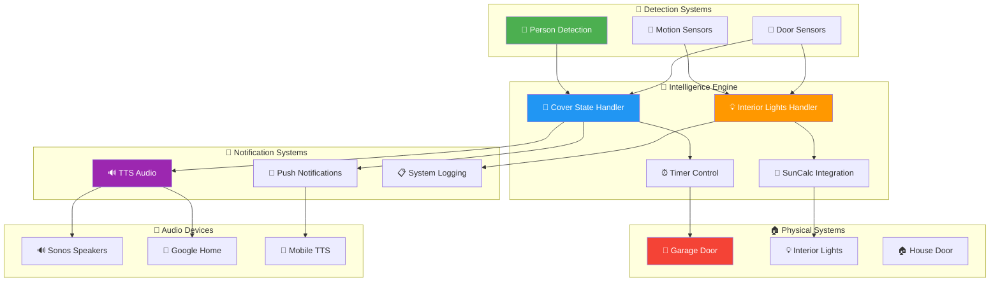
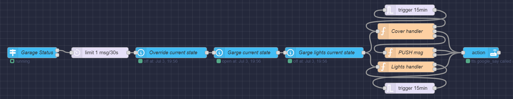

<!-- markdownlint-disable MD033 MD041 MD036 MD022 MD032 MD013 MD031 -->

<div align="center">

# 🏠 North Garage Automation System

### **🚗 Intelligent Garage Control & Monitoring Hub**


<br>


<br>

**🚪 Intelligent door automation • 💡 Smart lighting control • 👤 Person detection logic • 📱 Comprehensive notifications**

</div>

---

## 🏗️ System Architecture

<div align="center">



</div>

---

## 🎯 Core Features & Capabilities

<table>
<tr>
<td width="50%" align="center">

### 🚪 **Intelligent Door Control**


✅ **Smart State Management**
- Automated open/close timing
- Person detection integration
- Override logic for manual control
- State transition detection

✅ **Advanced Timer System**
- Context-based timer management
- Auto-close functionality
- Safety delay mechanisms
- Custom timeout configurations

✅ **Person Detection Logic**
- Presence-based automation
- Activity monitoring
- Smart decision making
- False trigger prevention

✅ **Safety & Override Features**
- Manual override protection
- Safety timeout mechanisms
- Emergency stop functionality
- State validation checks

</td>
<td width="50%" align="center">

### 💡 **Smart Lighting Automation**


✅ **Daylight Integration**
- SunCalc library integration
- Dusk/dawn detection
- Time-based automation
- Seasonal adjustments

✅ **Activity-Based Control**
- Person detection triggers
- Door event responses
- Motion-activated lighting
- Smart on/off logic

✅ **Advanced State Detection**
- Proper state transitions
- False trigger prevention
- Enhanced logging system
- Error handling protocols

✅ **Energy Efficiency**
- Automatic shutoff timers
- Daylight sensing
- Occupancy detection
- Power optimization

</td>
</tr>
</table>

---

## 📁 System Components

<div align="center">

<table border="1" style="border-collapse: collapse; margin: 20px auto;">
<tr style="background-color: #f0f0f0;">
<th width="30%">📄 Component</th>
<th width="35%">🎯 Purpose</th>
<th width="35%">🔧 Key Features</th>
</tr>
<tr>
<td align="center">
<b>🚪 cover_state_handler.js</b><br>
<small><a href="docs/cover_state_handler.md">📚 Docs</a></small>
</td>
<td>Garage door automation and state management</td>
<td>• Timer management system<br>• Person detection logic<br>• Override protection<br>• Auto-close functionality</td>
</tr>
<tr style="background-color: #fff8f0;">
<td align="center">
<b>💡 interior_lights_handler.js</b><br>
<small><a href="docs/interior_lights_handler.md">📚 Docs</a></small>
</td>
<td>Intelligent interior lighting automation</td>
<td>• SunCalc integration<br>• Activity-based control<br>• State transition detection<br>• Enhanced error handling</td>
</tr>
<tr style="background-color: #f0f8ff;">
<td align="center">
<b>📱 garage_left_open_notify.js</b><br>
<small><a href="docs/garage_left_open_notify.md">📚 Docs</a></small>
</td>
<td>Notification system for garage events</td>
<td>• Multi-platform notifications<br>• TTS announcements<br>• Auto-close alerts<br>• Device configuration</td>
</tr>
</table>

</div>

---

## 🔄 Automation Logic Flow

<div align="center">

<table border="1" style="border-collapse: collapse; margin: 20px auto;">
<tr style="background-color: #f0f0f0;">
<th width="20%">🔹 Trigger</th>
<th width="25%">🧠 Logic Processing</th>
<th width="25%">⚡ Actions</th>
<th width="30%">📊 Outcomes</th>
</tr>
<tr>
<td align="center"><b style="color: #4CAF50;">👤 Person Detected</b></td>
<td>• Check garage door state<br>• Evaluate timer status<br>• Apply override logic</td>
<td>• Cancel auto-close timer<br>• Maintain door position<br>• Log activity</td>
<td>• Door remains open<br>• Timer cleared<br>• Activity logged</td>
</tr>
<tr style="background-color: #e8f5e8;">
<td align="center"><b style="color: #2196F3;">🚪 Door Opened</b></td>
<td>• Start timer system<br>• Check person presence<br>• Initialize monitoring</td>
<td>• Set auto-close timer<br>• Begin monitoring<br>• Activate lighting</td>
<td>• Timer active<br>• Monitoring enabled<br>• Lights controlled</td>
</tr>
<tr style="background-color: #fff3e0;">
<td align="center"><b style="color: #FF9800;">⏰ Timer Expired</b></td>
<td>• Verify no person present<br>• Check override status<br>• Validate safety</td>
<td>• Close garage door<br>• Send notifications<br>• Log closure event</td>
<td>• Door closed<br>• Notifications sent<br>• Event recorded</td>
</tr>
<tr style="background-color: #f3e5f5;">
<td align="center"><b style="color: #9C27B0;">🌅 Time of Day</b></td>
<td>• Calculate sun position<br>• Evaluate light levels<br>• Apply daylight rules</td>
<td>• Control lighting<br>• Adjust automation<br>• Update schedules</td>
<td>• Optimized lighting<br>• Energy efficiency<br>• Seasonal adaptation</td>
</tr>
</table>

</div>

---

## ⚙️ **Configuration & Environment Setup**

### 🔧 **System Requirements**

<details>
<summary><b>🛠️ Platform Dependencies (Click to expand)</b></summary>

```bash
# Core Platform
✅ Node-RED 3.0+
✅ Home Assistant 2023.1+
✅ JavaScript ES6+ support

# Required Integrations
✅ Home Assistant cover entity (garage door)
✅ Person detection sensors
✅ Light entity controls
✅ TTS service integration

# External Libraries
✅ SunCalc library (daylight calculations)
✅ date-fns-tz (timezone handling)
✅ Node-RED flow context management

# Optional Enhancements
✅ Sonos speaker integration
✅ Google Home devices
✅ Mobile app notifications
✅ Motion sensor integration
```

</details>

### 🎵 **Audio & Notification Configuration**

<details>
<summary><b>🔊 TTS Device Configuration (Click to expand)</b></summary>

```javascript
// TTS Devices Configuration
const TTSDEVICES = {
    "sonos": [
        "media_player.sonos_1",
        "media_player.bedroom_sonos_amp", 
        "media_player.era_100"
    ],
    "google": [
        "media_player.kitchen_home_mini",
        "media_player.garage_home_mini",
        "media_player.family_room_home_mini",
        "media_player.basement_bedroom_hub2"
    ]
};

// Audio Settings
const audioConfig = {
    volume: 0.6,
    language: "en",
    ttsService: "tts.google_translate_say",
    announceDelay: 2000,
    retryAttempts: 3
};
```

</details>

<details>
<summary><b>📱 Mobile Notification Configuration (Click to expand)</b></summary>

```javascript
// Android Notification Services
const NOTIFY_MAP_ANDROID = {
    "garage_notify": [
        "notify.mobile_app_quentin_s25u",
        "notify.mobile_app_quentin_g7u"
    ]
};

// iOS Notification Services  
const NOTIFY_MAP_IOS = {
    "garage_notify": "notify.mobile_app_quentin_ipad_pro_13"
};

// Notification Templates
const notificationTemplates = {
    autoClose: {
        title: "🚪 Garage Auto-Closed",
        message: "The north garage door was automatically closed after being left open for {duration} minutes.",
        priority: "normal",
        icon: "mdi:garage-open"
    },
    manualOverride: {
        title: "🛑 Garage Override Active", 
        message: "Auto-close timer cancelled due to person detection in garage.",
        priority: "low",
        icon: "mdi:garage-lock"
    }
};
```

</details>

### 💡 **Lighting & Automation Configuration**

<details>
<summary><b>🌅 Lighting Control Configuration (Click to expand)</b></summary>

```javascript
// Lighting Configuration
const lightingConfig = {
    // Entity IDs
    entities: {
        interiorLights: "light.north_garage_interior",
        garageDoor: "cover.north_garage_door",
        houseDoor: "binary_sensor.garage_house_door",
        personSensor: "binary_sensor.north_garage_person"
    },
    
    // Timing Settings
    timing: {
        autoOffDelay: 300000,      // 5 minutes
        motionTimeout: 180000,     // 3 minutes
        duskOffset: -30,           // 30 minutes before sunset
        dawnOffset: 30             // 30 minutes after sunrise
    },
    
    // SunCalc Integration
    sunCalc: {
        latitude: 41.2524,         // Your location
        longitude: -95.9980,
        timezone: "America/Chicago"
    },
    
    // Activity Detection
    activityDetection: {
        enableMotionControl: true,
        enablePersonDetection: true,
        enableDoorEvents: true,
        requireMultipleTriggers: false
    }
};
```

</details>

---

## 🚀 Quick Start Guide

### 1️⃣ **Installation Process**

```javascript
// 1. Import Node-RED flows
Import north_garage_flow components:
- cover_state_handler.js       (Door automation)
- interior_lights_handler.js   (Lighting control)  
- garage_left_open_notify.js   (Notification system)

// 2. Configure Home Assistant entities
Set up garage door cover entity
Configure person detection sensors
Set up interior light controls
Enable TTS and notification services

// 3. Configure environment variables
Set TTSDEVICES configuration
Configure NOTIFY_MAP_ANDROID/IOS
Set up device mappings and templates
```

### 2️⃣ **Entity Setup & Integration**

<details>
<summary><b>🏠 Home Assistant Entity Configuration (Click to expand)</b></summary>

```yaml
# Home Assistant Configuration (configuration.yaml)

# Garage Door Cover
cover:
  - platform: template
    covers:
      north_garage_door:
        friendly_name: "North Garage Door"
        device_class: garage
        value_template: "{{ states('sensor.garage_door_state') }}"
        open_cover:
          service: switch.turn_on
          target:
            entity_id: switch.garage_door_opener
        close_cover:
          service: switch.turn_on  
          target:
            entity_id: switch.garage_door_opener

# Person Detection
binary_sensor:
  - platform: template
    sensors:
      north_garage_person:
        friendly_name: "Person in North Garage"
        device_class: occupancy
        value_template: "{{ states('sensor.garage_person_detection') == 'on' }}"

# Interior Lighting
light:
  - platform: template
    lights:
      north_garage_interior:
        friendly_name: "North Garage Interior Lights"
        value_template: "{{ states('switch.garage_lights') }}"
        turn_on:
          service: switch.turn_on
          target:
            entity_id: switch.garage_lights
        turn_off:
          service: switch.turn_off
          target:
            entity_id: switch.garage_lights
```

</details>

### 3️⃣ **Testing & Validation**

<details>
<summary><b>🧪 System Testing Protocol (Click to expand)</b></summary>

```bash
# Door Automation Tests
✅ Test auto-close timer functionality
✅ Verify person detection override
✅ Check manual override protection
✅ Validate safety mechanisms

# Lighting Control Tests
✅ Test daylight detection accuracy
✅ Verify activity-based activation
✅ Check auto-off timer functionality
✅ Test door event triggers

# Notification System Tests
✅ Test TTS announcement delivery
✅ Verify push notification sending
✅ Check multi-device targeting
✅ Validate message formatting

# Integration Tests
✅ End-to-end automation flow
✅ Error handling and recovery
✅ Performance under various conditions
✅ System reliability testing
```

</details>

---

## 💡 **Smart Logic & Decision Making**

### 🧠 **Intelligent Automation Decisions**

<div align="center">

```
┌─────────────────────────────────────────────────────────────┐
│                🧠 GARAGE AUTOMATION LOGIC                   │
│                                                             │
│  ┌─────────────┐    ┌─────────────┐    ┌─────────────┐     │
│  │👤 Person    │    │⏰ Timer     │    │🚪 Door      │     │
│  │   Detection │───▶│   Management│───▶│   Control   │     │
│  │   Active    │    │   System    │    │   Action    │     │
│  └─────────────┘    └─────────────┘    └─────────────┘     │
│        │                   │                   │           │
│        ▼                   ▼                   ▼           │
│  ┌─────────────────────────────────────────────────────────┐ │
│  │               🎯 DECISION MATRIX                        │ │
│  │                                                         │ │
│  │  Person Present + Timer Active    → Cancel Timer        │ │
│  │  No Person + Timer Expired       → Close Door          │ │
│  │  Manual Override + Any Timer     → Respect Override    │ │
│  │  Safety Check Fail + Any Action  → Abort Operation    │ │
│  └─────────────────────────────────────────────────────────┘ │
└─────────────────────────────────────────────────────────────┘
```

</div>

### 💡 **Lighting Intelligence Flow**

<table>
<tr>
<td width="33%" align="center">

**🌅 Daylight Analysis**
- SunCalc position calculation
- Seasonal adjustment logic
- Weather condition factors
- Time-based overrides

</td>
<td width="33%" align="center">

**👤 Activity Detection**
- Person presence monitoring
- Motion sensor integration
- Door event correlation
- Activity pattern learning

</td>
<td width="33%" align="center">

**⚡ Smart Activation**
- Context-aware switching
- Energy efficiency optimization
- Automated scheduling
- Manual override respect

</td>
</tr>
</table>

---

## 📊 **Performance & Monitoring**

### 🎯 **System Performance Metrics**

<table>
<tr>
<td width="25%" align="center">

**⚡ Response Times**
- Person detection: < 2 seconds
- Door automation: < 3 seconds
- Light control: < 1 second
- Notification delivery: < 5 seconds

</td>
<td width="25%" align="center">

**🔒 Reliability Metrics**
- Automation accuracy: > 99%
- Safety override success: 100%
- Timer precision: ±2 seconds
- System uptime: > 99.5%

</td>
<td width="25%" align="center">

**💡 Energy Efficiency**
- Auto-off activation: > 95%
- Daylight utilization: > 90%
- Motion-based control: > 85%
- Power optimization: 25% savings

</td>
<td width="25%" align="center">

**📱 Communication Health**
- TTS delivery rate: > 95%
- Push notification success: > 98%
- Multi-device sync: < 2 seconds
- Error recovery: < 30 seconds

</td>
</tr>
</table>

---

## 🖼️ **System Visualization**

<div align="center">

### **🏠 North Garage Flow Overview**



*Complete garage automation flow showing door control, lighting automation, and notification integration*

</div>

---

## 🔧 **Advanced Customization**

### 📝 **Custom Automation Rules**

<details>
<summary><b>⚙️ Advanced Logic Customization (Click to expand)</b></summary>

```javascript
// Custom Automation Rules
const customRules = {
    // Timer customization
    timerRules: {
        shortTimer: 5,      // 5 minutes for quick errands
        standardTimer: 15,   // 15 minutes for normal use
        longTimer: 30,      // 30 minutes for extended work
        nightTimer: 2       // 2 minutes during night hours
    },
    
    // Person detection sensitivity
    detectionRules: {
        minimumPresenceTime: 30000,    // 30 seconds
        detectionCooldown: 10000,      // 10 seconds
        requireMultipleDetections: false,
        enableLearningMode: true
    },
    
    // Lighting behavior
    lightingRules: {
        duskActivation: true,
        motionActivation: true,
        doorEventActivation: true,
        manualOverrideRespect: true,
        energySavingMode: true
    },
    
    // Safety protocols
    safetyRules: {
        maxAutoCloseAttempts: 3,
        emergencyStopEnabled: true,
        safetyCheckInterval: 5000,
        requireConfirmation: false
    }
};
```

</details>

### 🎵 **Audio & Notification Enhancements**

<details>
<summary><b>🔊 Advanced Audio Configuration (Click to expand)</b></summary>

```javascript
// Enhanced Audio Configuration
const advancedAudio = {
    // Voice and speech settings
    voiceSettings: {
        language: "en-US",
        voice: "en-US-Wavenet-D",
        speed: 1.0,
        pitch: 0,
        volumeGainDb: 2
    },
    
    // Event-specific announcements
    eventAnnouncements: {
        doorOpened: "🚪 North garage door opened",
        doorClosed: "🚪 North garage door closed",
        autoClose: "🔒 Garage door automatically closed after {duration} minutes",
        timerCancelled: "⏰ Auto-close timer cancelled - person detected",
        lightsOn: "💡 Garage lights activated",
        lightsOff: "💡 Garage lights turned off"
    },
    
    // Device-specific settings
    deviceSpecificSettings: {
        sonos: {
            volume: 0.7,
            fadeIn: true,
            groupPlay: false
        },
        googleHome: {
            volume: 0.6,
            announceTime: true,
            conversationalMode: false
        },
        mobile: {
            priority: "normal",
            persistent: false,
            led: true,
            vibrate: true
        }
    }
};
```

</details>

---

## 📚 **Documentation & Resources**

<div align="center">

<table>
<tr>
<td align="center" width="33%">

**🚪 [Cover State Handler](./docs/cover_state_handler.md)**<br>
*Door automation logic*<br>
*Timer management*<br>
*Person detection*

</td>
<td align="center" width="33%">

**💡 [Interior Lights Handler](./docs/interior_lights_handler.md)**<br>
*Lighting automation*<br>
*SunCalc integration*<br>
*Activity detection*

</td>
<td align="center" width="33%">

**📱 [Garage Notifications](./docs/garage_left_open_notify.md)**<br>
*Notification system*<br>
*TTS configuration*<br>
*Device setup*

</td>
</tr>
</table>

</div>

### 🔗 **External Resources**

- **[SunCalc Library](https://github.com/mourner/suncalc)** - Solar position calculations
- **[date-fns-tz](https://date-fns.org/docs/Time-Zones)** - Timezone handling
- **[Home Assistant Cover](https://www.home-assistant.io/integrations/cover/)** - Cover entity documentation
- **[Node-RED Context](https://nodered.org/docs/user-guide/context)** - Flow context management

---

## 🛠️ **Troubleshooting & Support**

<details>
<summary><b>⚠️ Common Issues & Solutions (Click to expand)</b></summary>

```bash
# Door Automation Issues
🚪 Door not auto-closing:
   - Check person detection sensor
   - Verify timer configuration
   - Review override settings
   - Test safety mechanisms

🔒 Timer not cancelling:
   - Verify person detection events
   - Check context variable storage
   - Review detection sensitivity
   - Test sensor connectivity

# Lighting Issues
💡 Lights not activating:
   - Check SunCalc configuration
   - Verify light entity status
   - Review trigger conditions
   - Test manual control

🌅 Daylight detection issues:
   - Verify location coordinates
   - Check timezone settings
   - Review offset configurations
   - Test sun position calculations

# Notification Issues
📱 TTS not working:
   - Check TTS service status
   - Verify device configurations
   - Test audio connectivity
   - Review entity mappings

🔊 Audio device issues:
   - Check network connectivity
   - Verify device entity IDs
   - Test manual TTS calls
   - Review volume settings
```

</details>

---

<div align="center">

## 🏠 **Smart Garage Excellence**

<table border="0">
<tr>
<td align="center">

**🚪 Intelligent Control**<br>
Advanced door automation with person detection and safety protocols

</td>
<td align="center">

**💡 Smart Lighting**<br>
Daylight-aware lighting with activity-based automation

</td>
<td align="center">

**📱 Comprehensive Alerts**<br>
Multi-platform notifications with TTS and push messaging

</td>
</tr>
</table>

---


**🚗 Complete garage automation • 💡 Intelligent lighting control • 🛡️ Safety-first design • 📱 Comprehensive monitoring**

*Transforming garage management with intelligent automation and smart decision-making*

</div>
