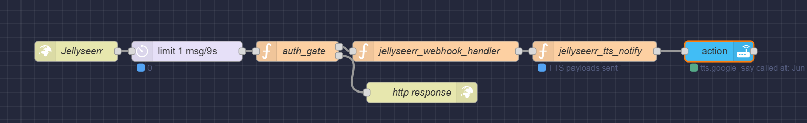

# requests_flow

This directory contains Node-RED function nodes and handlers for processing automation requests, notifications, and webhooks related to home automation and media events.

## Files

- **jellyseerr_tts_notify.js**
  - Generates Home Assistant TTS payloads for Sonos and Google speakers.
  - Handles various notification types (media events, issue events, comments, etc.)
  - Suppresses duplicate TTS for issue comments that immediately follow a status change.

- **jellyseerr_webhook_handler.js**
  - Normalizes incoming Jellyseerr-style webhook payloads for downstream processing.
  - Ensures all expected fields are present and logs key information for debugging.

- **auth_gate.js**
  - Authenticates POST requests using the Authorization header.
  - Supports CORS and returns appropriate HTTP status codes for authorized/unauthorized requests.

## Usage

These function nodes are designed to be used in Node-RED flows for:

- Handling and normalizing incoming webhooks (e.g., from Jellyseerr or similar services)
- Authenticating incoming requests
- Generating and sending TTS notifications to media players (Sonos, Google Home, etc.)

## Example Flow

1. **Auth Gate**: Validates the request using a shared secret and replies with status code 200 for authorized requests or 401 for unauthorized requests.
2. **Webhook Handler**: Receives and normalizes incoming webhook payloads.
3. **TTS Notify**: Generates and sends TTS notifications based on the event type and payload content.

## Notes

- The TTS logic is designed to avoid duplicate notifications for issue status changes followed by comments.
- All scripts use Node-RED's `node.log`, `node.warn`, and `node.status` APIs for debugging and status reporting.
- Update the list of media players and configuration constants as needed for your environment.

---

## Example Screenshots

### Request Flow Overview

This is just the start of the types of automation and integrations possible in this directory. More flows, event handlers, and automation logic will be added over time—the possibilities are endless!

For more details, see comments in each script file.
