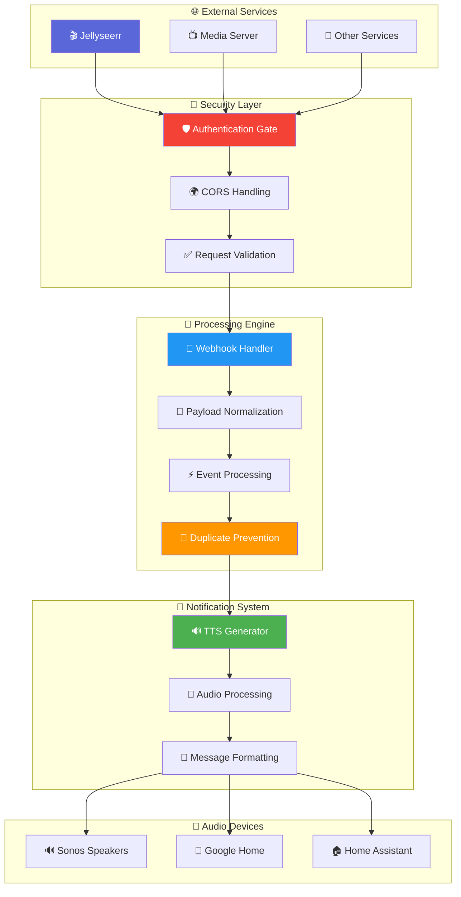

<!-- markdownlint-disable MD033 MD041 MD036 MD022 MD032 MD013 MD031 -->

<div align="center">

# 🎬 Media Requests & Automation Flow

### **📡 Intelligent Webhook Processing & Media Notification System**


<br>


<br>

**🔐 Secure webhook processing • 🎵 Intelligent TTS notifications • 📱 Media event automation • 🏠 Smart home integration**

</div>

---

## 🏗️ System Architecture

<div align="center">



</div>

---

## 🎯 Core Features & Capabilities

<table>
<tr>
<td width="50%" align="center">

### 🔐 **Security & Authentication**


✅ **Robust Authentication System**
- Authorization header validation
- Shared secret authentication
- CORS support for web integration

✅ **Request Validation**
- HTTP status code management
- Unauthorized request blocking
- Comprehensive logging system

✅ **Security Best Practices**
- Token-based authentication
- Request sanitization
- Access control enforcement

✅ **API Gateway Functionality**
- Centralized access control
- Request routing logic
- Error handling protocols

</td>
<td width="50%" align="center">

### 📡 **Intelligent Processing**


✅ **Advanced Webhook Handling**
- Jellyseerr payload normalization
- Multi-service webhook support
- Event type classification

✅ **Smart Duplicate Prevention**
- Issue comment deduplication
- Status change correlation
- Intelligent filtering logic

✅ **Event Processing**
- Media request notifications
- Issue status updates
- Comment event handling

✅ **TTS Intelligence**
- Context-aware messaging
- Media player targeting
- Audio format optimization

</td>
</tr>
</table>

---

## 📁 System Components

<div align="center">

<table border="1" style="border-collapse: collapse; margin: 20px auto;">
<tr style="background-color: #f0f0f0;">
<th width="30%">📄 Component</th>
<th width="35%">🎯 Purpose</th>
<th width="35%">🔧 Key Features</th>
</tr>
<tr>
<td align="center">
<b>🛡️ auth_gate.js</b><br>
<small>Security Gateway</small>
</td>
<td>Authentication and access control for incoming requests</td>
<td>• Authorization header validation<br>• CORS handling & preflight<br>• HTTP status management<br>• Security logging</td>
</tr>
<tr style="background-color: #f0f8ff;">
<td align="center">
<b>📡 jellyseerr_webhook_handler.js</b><br>
<small>Webhook Processor</small>
</td>
<td>Webhook payload normalization and processing</td>
<td>• Jellyseerr payload processing<br>• Field validation & normalization<br>• Event classification<br>• Debug logging</td>
</tr>
<tr style="background-color: #fff8f0;">
<td align="center">
<b>🔊 jellyseerr_tts_notify.js</b><br>
<small>TTS Notification Engine</small>
</td>
<td>Intelligent TTS generation and media player targeting</td>
<td>• Home Assistant TTS integration<br>• Sonos & Google Home support<br>• Duplicate suppression<br>• Context-aware messaging</td>
</tr>
</table>

</div>

---

## 🔄 Request Processing Flow

<div align="center">

<table border="1" style="border-collapse: collapse; margin: 20px auto;">
<tr style="background-color: #f0f0f0;">
<th width="15%">🔹 Stage</th>
<th width="25%">⚡ Process</th>
<th width="30%">🔧 Functions</th>
<th width="30%">📊 Output</th>
</tr>
<tr>
<td align="center"><b style="color: #F44336;">🔐 SECURITY</b></td>
<td>Request authentication and validation</td>
<td>• Authorization header check<br>• CORS preflight handling<br>• Token validation</td>
<td>• HTTP 200/401 status<br>• Access granted/denied<br>• Security audit logs</td>
</tr>
<tr style="background-color: #e3f2fd;">
<td align="center"><b style="color: #2196F3;">📡 INGESTION</b></td>
<td>Webhook payload processing</td>
<td>• Payload normalization<br>• Field validation<br>• Event classification</td>
<td>• Structured event data<br>• Event type identification<br>• Processing metadata</td>
</tr>
<tr style="background-color: #e8f5e8;">
<td align="center"><b style="color: #4CAF50;">🧠 INTELLIGENCE</b></td>
<td>Smart event processing and filtering</td>
<td>• Duplicate detection<br>• Context analysis<br>• Event correlation</td>
<td>• Filtered events<br>• Processing decisions<br>• Context metadata</td>
</tr>
<tr style="background-color: #fff3e0;">
<td align="center"><b style="color: #FF9800;">🔊 NOTIFICATION</b></td>
<td>TTS generation and audio delivery</td>
<td>• Message generation<br>• Device targeting<br>• Audio formatting</td>
<td>• TTS announcements<br>• Multi-device delivery<br>• Confirmation logs</td>
</tr>
</table>

</div>

---

## 🎬 Media Event Types & Handling

<div align="center">

<table border="1" style="border-collapse: collapse; margin: 20px auto;">
<tr style="background-color: #f0f0f0;">
<th width="20%">🎭 Event Type</th>
<th width="25%">📋 Description</th>
<th width="25%">🔊 TTS Behavior</th>
<th width="30%">📱 Notification Features</th>
</tr>
<tr>
<td align="center"><b style="color: #4CAF50;">📥 Media Request</b></td>
<td>New movie/TV show request submitted</td>
<td>• Immediate announcement<br>• Request details<br>• User information</td>
<td>• Title and user notification<br>• Request status updates<br>• Media type identification</td>
</tr>
<tr style="background-color: #e8f5e8;">
<td align="center"><b style="color: #2196F3;">✅ Request Approved</b></td>
<td>Media request has been approved</td>
<td>• Approval notification<br>• Media title<br>• Availability timeline</td>
<td>• Approval confirmation<br>• Processing status<br>• Estimated completion</td>
</tr>
<tr style="background-color: #fff3e0;">
<td align="center"><b style="color: #FF9800;">🎬 Media Available</b></td>
<td>Requested media is now available</td>
<td>• Availability announcement<br>• Media details<br>• Access instructions</td>
<td>• Ready-to-watch notification<br>• Platform information<br>• Quality details</td>
</tr>
<tr style="background-color: #ffebee;">
<td align="center"><b style="color: #F44336;">❌ Request Declined</b></td>
<td>Media request has been declined</td>
<td>• Decline notification<br>• Reason (if provided)<br>• Alternative suggestions</td>
<td>• Decline reasoning<br>• Feedback information<br>• Appeal process</td>
</tr>
<tr style="background-color: #f3e5f5;">
<td align="center"><b style="color: #9C27B0;">🗨️ Issue Comments</b></td>
<td>Comments on media issues or requests</td>
<td>• **Intelligent suppression**<br>• Context-aware filtering<br>• Duplicate prevention</td>
<td>• Comment notifications<br>• Issue context<br>• Smart deduplication</td>
</tr>
</table>

</div>

---

## 🛠️ Configuration & Setup

### 1️⃣ **Authentication Configuration**

<details>
<summary><b>🔐 Security Setup (Click to expand)</b></summary>

```javascript
// Authentication Configuration
const authConfig = {
    // Shared secret for webhook authentication
    secret: process.env.WEBHOOK_SECRET || "your-secure-secret-here",
    
    // Authorization header format
    headerName: "Authorization",
    tokenPrefix: "Bearer ",
    
    // CORS configuration
    corsSettings: {
        origin: ["https://jellyseerr.yourdomain.com"],
        methods: ["GET", "POST", "OPTIONS"],
        allowedHeaders: ["Content-Type", "Authorization"]
    },
    
    // Security logging
    logAccess: true,
    logFailures: true,
    auditTrail: true
};

// HTTP Status Codes
const statusCodes = {
    authorized: 200,
    unauthorized: 401,
    forbidden: 403,
    badRequest: 400,
    methodNotAllowed: 405
};
```

</details>

### 2️⃣ **Webhook Handler Configuration**

<details>
<summary><b>📡 Webhook Processing Setup (Click to expand)</b></summary>

```javascript
// Jellyseerr Webhook Configuration
const webhookConfig = {
    // Expected payload fields
    requiredFields: [
        "notification_type",
        "event_type", 
        "subject",
        "message"
    ],
    
    // Field normalization mapping
    fieldMapping: {
        "notification_type": "type",
        "event_type": "event",
        "subject": "title",
        "message": "description"
    },
    
    // Event type classification
    eventTypes: {
        MEDIA_PENDING: "request_pending",
        MEDIA_APPROVED: "request_approved", 
        MEDIA_AVAILABLE: "media_available",
        MEDIA_DECLINED: "request_declined",
        ISSUE_COMMENT: "issue_comment",
        ISSUE_CREATED: "issue_created",
        ISSUE_RESOLVED: "issue_resolved"
    },
    
    // Validation settings
    validation: {
        maxPayloadSize: "10MB",
        requireSSL: true,
        validateJSON: true,
        sanitizeInput: true
    }
};
```

</details>

### 3️⃣ **TTS Notification Configuration**

<details>
<summary><b>🔊 Audio System Setup (Click to expand)</b></summary>

```javascript
// TTS Configuration
const ttsConfig = {
    // Home Assistant TTS service
    ttsService: "tts.google_translate_say",
    
    // Media player targets
    mediaPlayers: {
        sonos: [
            "media_player.living_room_sonos",
            "media_player.kitchen_sonos",
            "media_player.bedroom_sonos"
        ],
        googleHome: [
            "media_player.living_room_display",
            "media_player.kitchen_home"
        ],
        mobile: [
            "media_player.mobile_phone"
        ]
    },
    
    // Message templates
    messageTemplates: {
        MEDIA_REQUEST: "🎬 New media request: {title} by {user}",
        MEDIA_APPROVED: "✅ {title} has been approved and is being processed",
        MEDIA_AVAILABLE: "🍿 {title} is now available to watch",
        MEDIA_DECLINED: "❌ Request for {title} has been declined",
        ISSUE_COMMENT: "💬 New comment on {issue}: {comment}"
    },
    
    // Duplicate suppression
    deduplication: {
        enabled: true,
        timeWindow: 300, // 5 minutes
        suppressComments: true,
        statusChangeBuffer: 60 // 1 minute
    },
    
    // Audio settings
    audioSettings: {
        volume: 0.6,
        language: "en",
        voice: "female",
        cache: false
    }
};
```

</details>

---

## 🚀 Quick Start Guide

### 1️⃣ **Installation Process**

```javascript
// 1. Import Node-RED flows
Import requests_flow components:
- auth_gate.js              (Security layer)
- jellyseerr_webhook_handler.js  (Webhook processing)
- jellyseerr_tts_notify.js       (TTS notifications)

// 2. Configure Node-RED flow
Connect components in processing order:
[External Service] → [Auth Gate] → [Webhook Handler] → [TTS Notify] → [Audio Devices]

// 3. Set up external service integration
Configure Jellyseerr webhooks
Set webhook endpoint URL
Configure authentication headers
```

### 2️⃣ **Jellyseerr Integration**

<details>
<summary><b>🔧 Jellyseerr Webhook Setup (Click to expand)</b></summary>

```bash
# Jellyseerr Configuration
1. Navigate to Settings → Notifications → Webhooks
2. Create new webhook with the following settings:

Webhook URL: https://your-nodered-instance.com/jellyseerr-webhook
Method: POST
Authorization Header: Bearer your-secure-secret-here

# Enable notifications for:
✅ Media Requested
✅ Media Approved  
✅ Media Available
✅ Media Declined
✅ Issue Created
✅ Issue Comment
✅ Issue Resolved

# Payload Template (JSON):
{
  "notification_type": "{{notification_type}}",
  "event_type": "{{event_type}}",
  "subject": "{{subject}}",
  "message": "{{message}}",
  "media": {
    "media_type": "{{media_type}}",
    "tmdbId": "{{media_tmdbid}}",
    "tvdbId": "{{media_tvdbid}}"
  },
  "request": {
    "request_id": "{{request_id}}",
    "requestedBy_email": "{{requestedBy_email}}",
    "requestedBy_username": "{{requestedBy_username}}"
  }
}
```

</details>

### 3️⃣ **Testing & Validation**

<details>
<summary><b>🧪 System Testing Protocol (Click to expand)</b></summary>

```bash
# Authentication Testing
✅ Test webhook with valid authorization header
✅ Verify rejection of unauthorized requests
✅ Check CORS preflight handling
✅ Validate HTTP status code responses

# Webhook Processing Tests
✅ Test Jellyseerr payload normalization
✅ Verify field validation and mapping
✅ Check event type classification
✅ Test malformed payload handling

# TTS Notification Tests
✅ Test media request announcements
✅ Verify duplicate suppression logic
✅ Check multi-device audio delivery
✅ Test message template rendering

# Integration Tests
✅ End-to-end webhook processing
✅ Audio device connectivity
✅ Error handling and recovery
✅ Performance under load
```

</details>

---

## 🎵 **Audio Integration & Smart Logic**

### 🧠 **Intelligent Duplicate Prevention**

<div align="center">

```
┌─────────────────────────────────────────────────────────────┐
│               🧠 SMART DEDUPLICATION LOGIC                  │
│                                                             │
│  ┌─────────────┐    ┌─────────────┐    ┌─────────────┐     │
│  │📋 Status    │    │⏱️ Time      │    │🗨️ Comment   │     │
│  │   Change    │───▶│   Buffer    │───▶│   Suppression│     │
│  │   Event     │    │ (60 seconds)│    │   Logic      │     │
│  └─────────────┘    └─────────────┘    └─────────────┘     │
│        │                   │                   │           │
│        ▼                   ▼                   ▼           │
│  ┌─────────────────────────────────────────────────────────┐ │
│  │          🔊 TTS ANNOUNCEMENT DECISION                   │ │
│  │                                                         │ │
│  │  • Status Change: Always announce                      │ │
│  │  • Comment after Status: Suppress if < 60s            │ │
│  │  │  • Comment only: Announce normally                  │ │
│  └─────────────────────────────────────────────────────────┘ │
└─────────────────────────────────────────────────────────────┘
```

</div>

### 🎵 **Multi-Device Audio Targeting**

<table>
<tr>
<td width="33%" align="center">

**🔊 Sonos Integration**
- Living room speakers
- Kitchen audio system
- Bedroom sound
- Synchronized playback

</td>
<td width="33%" align="center">

**🎵 Google Home Network**
- Smart displays
- Voice assistants
- Multi-room audio
- Cast-enabled devices

</td>
<td width="33%" align="center">

**📱 Mobile Integration**
- Home Assistant app
- TTS to phone speakers
- Push notifications
- Backup delivery method

</td>
</tr>
</table>

---

## 📊 **Performance & Monitoring**

### 🎯 **System Performance Metrics**

<table>
<tr>
<td width="25%" align="center">

**⚡ Processing Speed**
- Authentication: < 100ms
- Webhook processing: < 500ms
- TTS generation: < 2 seconds
- Audio delivery: < 5 seconds

</td>
<td width="25%" align="center">

**🔒 Security Metrics**
- Authentication success: > 99%
- Unauthorized blocks: 100%
- CORS compliance: Full
- Audit trail: Complete

</td>
<td width="25%" align="center">

**🎵 Audio Performance**
- TTS success rate: > 95%
- Multi-device sync: < 1s
- Message clarity: High
- Volume consistency: Stable

</td>
<td width="25%" align="center">

**📊 System Health**
- Uptime: > 99.5%
- Error rate: < 1%
- Duplicate suppression: > 90%
- Response time: < 3s

</td>
</tr>
</table>

---

## 🖼️ **System Screenshots**

<div align="center">

### **📱 Request Flow Overview**


*Complete request processing flow showing webhook ingestion, authentication, and TTS notification delivery*

</div>

---

## 🔧 **Advanced Customization**

### 📝 **Custom Message Templates**

<details>
<summary><b>✏️ Message Template Customization (Click to expand)</b></summary>

```javascript
// Advanced Message Templates
const customTemplates = {
    // Media request templates
    MEDIA_REQUEST: {
        template: "🎬 {user} has requested {media_type}: {title}",
        variables: ["user", "media_type", "title"],
        maxLength: 200,
        priority: "normal"
    },
    
    // Status change templates
    MEDIA_APPROVED: {
        template: "✅ Great news! {title} has been approved and will be available soon",
        variables: ["title"],
        maxLength: 150,
        priority: "high"
    },
    
    // Availability templates
    MEDIA_AVAILABLE: {
        template: "🍿 {title} is now ready to watch! Check your media server",
        variables: ["title"],
        maxLength: 180,
        priority: "high",
        repeatAnnouncement: false
    },
    
    // Issue templates
    ISSUE_COMMENT: {
        template: "💬 New comment on {issue_title}: {comment_preview}",
        variables: ["issue_title", "comment_preview"],
        maxLength: 220,
        priority: "low",
        suppressAfterStatusChange: true
    }
};
```

</details>

### 🎨 **Audio Enhancement Options**

<details>
<summary><b>🔊 Audio Customization Features (Click to expand)</b></summary>

```javascript
// Audio Enhancement Configuration
const audioEnhancements = {
    // Voice customization
    voiceSettings: {
        language: "en-US",
        voice: "en-US-Wavenet-D",
        speed: 1.0,
        pitch: 0,
        volumeGainDb: 0
    },
    
    // Event-specific audio settings
    eventAudioSettings: {
        MEDIA_REQUEST: {
            preTone: "/local/sounds/notification.mp3",
            volume: 0.6,
            speed: 1.0
        },
        MEDIA_AVAILABLE: {
            preTone: "/local/sounds/success.mp3",
            volume: 0.8,
            speed: 1.0
        },
        MEDIA_DECLINED: {
            preTone: "/local/sounds/error.mp3",
            volume: 0.5,
            speed: 0.9
        }
    },
    
    // Device-specific settings
    deviceSettings: {
        "sonos_speakers": {
            volume: 0.7,
            groupPlay: true,
            fadeIn: true
        },
        "google_home": {
            volume: 0.6,
            assistant_voice: true,
            conversational: false
        }
    }
};
```

</details>

---

## 📚 **Integration Examples & Documentation**

<div align="center">

<table>
<tr>
<td align="center" width="25%">

**🎬 [Jellyseerr Docs](https://docs.jellyseerr.dev/)**<br>
*Official documentation*<br>
*Webhook configuration*<br>
*API references*

</td>
<td align="center" width="25%">

**🏠 [Home Assistant TTS](https://www.home-assistant.io/integrations/tts/)**<br>
*TTS service setup*<br>
*Media player integration*<br>
*Voice configuration*

</td>
<td align="center" width="25%">

**🔊 [Sonos Integration](https://www.home-assistant.io/integrations/sonos/)**<br>
*Speaker configuration*<br>
*Multi-room audio*<br>
*Playback control*

</td>
<td align="center" width="25%">

**🎵 [Google Cast](https://www.home-assistant.io/integrations/cast/)**<br>
*Google Home setup*<br>
*Cast device management*<br>
*Audio streaming*

</td>
</tr>
</table>

</div>

---

## 🛠️ **Troubleshooting & Support**

<details>
<summary><b>⚠️ Common Issues & Solutions (Click to expand)</b></summary>

```bash
# Authentication Issues
🔐 Webhook authentication failures:
   - Verify Authorization header format
   - Check shared secret configuration
   - Review CORS settings
   - Test with curl/Postman

# Webhook Processing Issues
📡 Payload processing errors:
   - Validate JSON format
   - Check required fields
   - Review field mapping
   - Test with sample payloads

# TTS Issues
🔊 Audio announcements not working:
   - Verify Home Assistant TTS service
   - Check media player entity IDs
   - Test TTS service manually
   - Review device connectivity

# Duplicate Notifications
🔄 Multiple announcements:
   - Check deduplication settings
   - Review time window configuration
   - Verify event correlation logic
   - Monitor processing logs
```

</details>

---

<div align="center">

## 🎬 **Media Automation Excellence**

<table border="0">
<tr>
<td align="center">

**🔐 Secure Processing**<br>
Enterprise-grade authentication and validation for all webhook requests

</td>
<td align="center">

**🧠 Smart Logic**<br>
Intelligent duplicate prevention and context-aware notification decisions

</td>
<td align="center">

**🎵 Multi-Platform Audio**<br>
Seamless integration with Sonos, Google Home, and Home Assistant

</td>
</tr>
</table>

---


**🎬 Complete media automation • 🔐 Secure webhook processing • 🔊 Intelligent audio notifications • 📱 Smart home integration**

*Transforming media requests into seamless home automation experiences*

</div>
